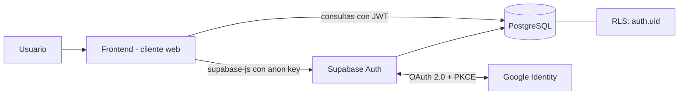
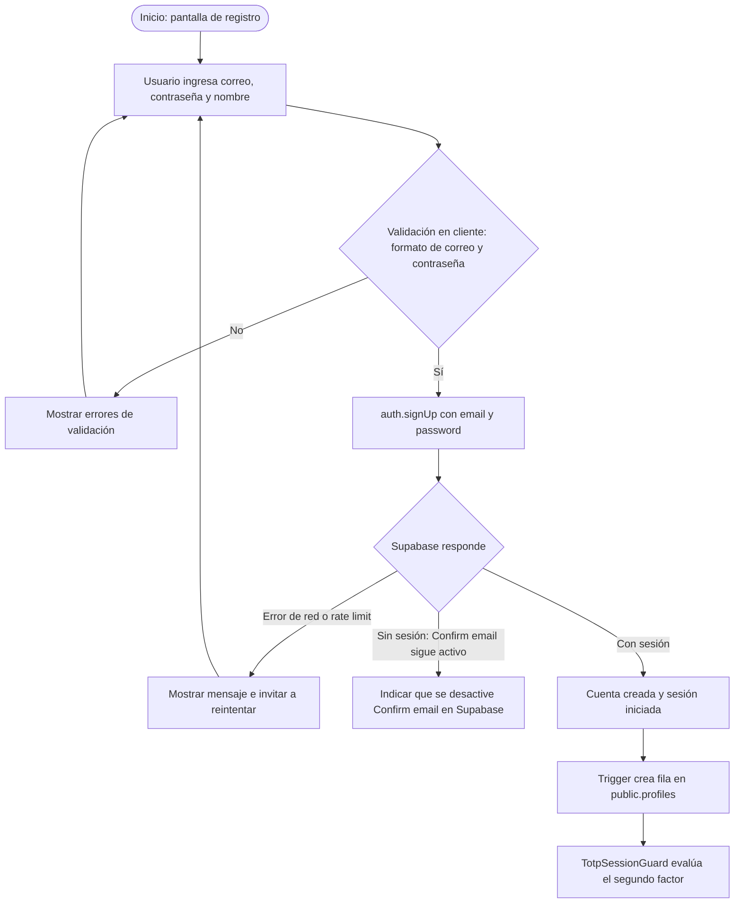
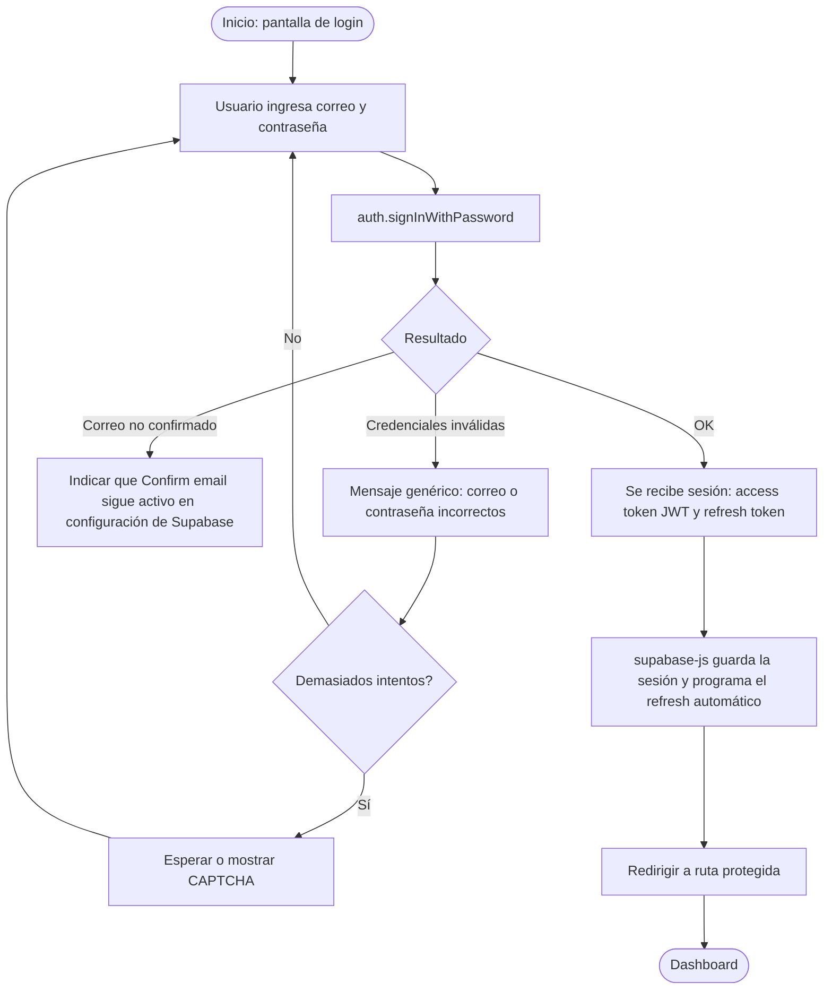
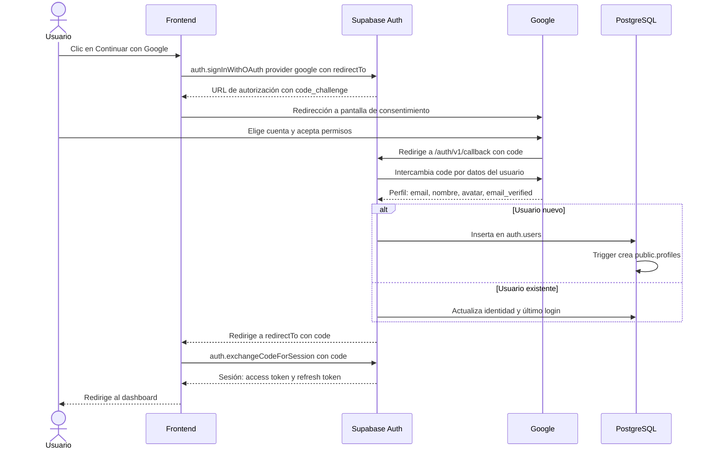
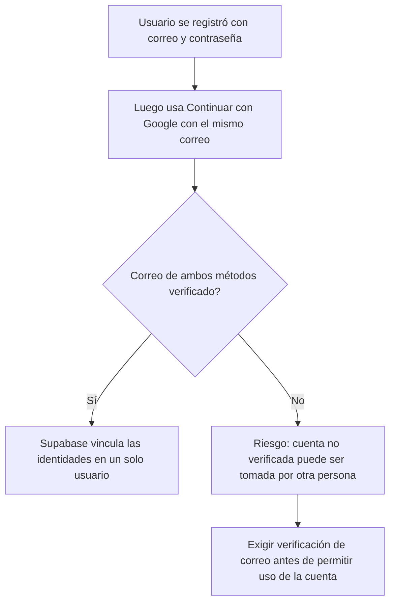
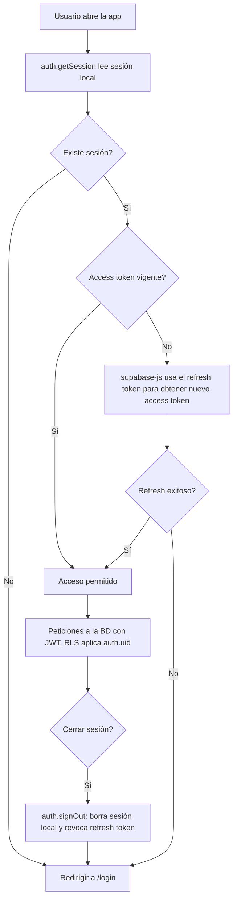
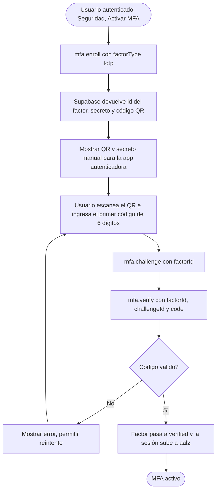
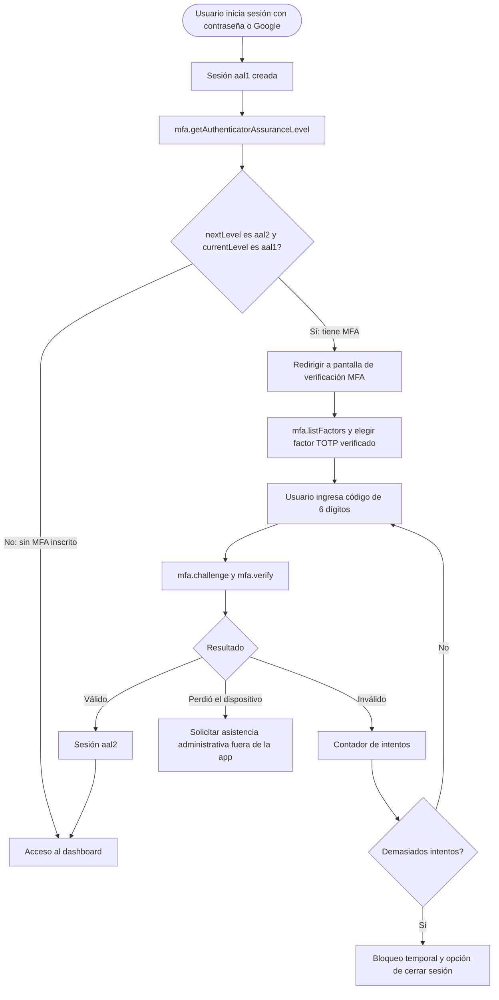

# Autenticación con Supabase: Login y Sign Up

Guía técnica del sistema de autenticación de Comunidad USAC con Supabase Auth, PostgreSQL y RLS. En el flujo actual, el registro no confirma el correo ni envía OTP; la app conserva Google OAuth y MFA con TOTP. La recuperación de contraseña por correo está retirada. Las secciones genéricas de verificación de correo que siguen se marcan como no aplicables al proyecto.

> Verifica los límites del plan gratuito en https://supabase.com/pricing antes de decidir, porque cambian con el tiempo.

---

## 1. Alcance y decisiones de arquitectura

| Decisión | Elección | Motivo |
|---|---|---|
| Backend | Supabase Auth (GoTrue) | Ya incluye registro, login, tokens, OAuth y recuperación |
| Base de datos | PostgreSQL de Supabase | Tabla `auth.users` administrada por Supabase + tabla propia `public.profiles` |
| Autorización | Row Level Security (RLS) | Sin backend propio, la seguridad vive en la BD |
| Proveedores | Email + contraseña, Google OAuth | Los dos pedidos |
| Confirmación por correo | Desactivada para el flujo actual | No se envía OTP ni enlace de confirmación |
| Segundo factor (MFA) | TOTP con app autenticadora | Incluido en todos los planes; el MFA por SMS requiere proveedor externo y genera costo |
| Flujo OAuth | PKCE (por defecto en `supabase-js` v2) | Más seguro que el flujo implícito |
| Correo transaccional | No configurado | El registro y la recuperación no envían correo |

### Componentes



**Regla clave:** el frontend solo usa la `anon key` (pública). La `service_role key` **nunca** va en el cliente ni en el repositorio.

---

## 2. Modelo de datos

`auth.users` lo gestiona Supabase; no la modifiques directamente. Crea tu propia tabla de perfil enlazada por `id`.

```sql
-- Perfil público del usuario
create table public.profiles (
  id          uuid primary key references auth.users (id) on delete cascade,
  email       text,
  full_name   text,
  avatar_url  text,
  provider    text,                       -- 'email' | 'google'
  created_at  timestamptz not null default now(),
  updated_at  timestamptz not null default now()
);

alter table public.profiles enable row level security;

-- Cada usuario solo ve y edita su propio perfil
create policy "perfil_select_propio" on public.profiles
  for select using (auth.uid() = id);

create policy "perfil_update_propio" on public.profiles
  for update using (auth.uid() = id) with check (auth.uid() = id);

-- Trigger: crear el perfil automáticamente al registrarse (email o Google)
create or replace function public.handle_new_user()
returns trigger
language plpgsql
security definer set search_path = ''
as $$
begin
  insert into public.profiles (id, email, full_name, avatar_url, provider)
  values (
    new.id,
    new.email,
    coalesce(new.raw_user_meta_data ->> 'full_name', new.raw_user_meta_data ->> 'name'),
    new.raw_user_meta_data ->> 'avatar_url',
    new.raw_app_meta_data ->> 'provider'
  );
  return new;
end;
$$;

create trigger on_auth_user_created
  after insert on auth.users
  for each row execute function public.handle_new_user();
```

**Por qué un trigger:** garantiza que siempre exista el perfil sin depender del cliente, y funciona igual para registro por correo y por Google.

---

## 3. Flujo de Sign Up (correo y contraseña)



**Notas del flujo actual**

- La app espera que `signUp` devuelva sesión y continúa a `TotpSessionGuard`.
- Si no devuelve sesión porque el proyecto aún requiere confirmación, hay que desactivar manualmente **Confirm email** en Authentication → Sign In / Providers → Email. La configuración local no modifica el proyecto alojado.
- El registro no envía correo ni ofrece reenviar/verificar OTP. Esto permite crear cuentas sin demostrar la propiedad de la dirección.
- Guarda metadatos del perfil en `options.data` si se necesitan para el trigger.

```ts
const { data, error } = await supabase.auth.signUp({
  email,
  password,
  options: {
    data: { full_name: nombre },
  },
});
```

---

## 4. Confirmación de correo [No aplica al flujo actual]

La aplicación no solicita confirmación de correo y no implementa envío,
verificación ni reenvío de OTP por correo. En `supabase/config.toml`, la
confirmación de Email está desactivada para el entorno local. En el proyecto
alojado debe desactivarse **Confirm email** manualmente; no se modificó la
configuración remota.

Esta decisión no demuestra que el usuario controle la dirección ingresada.
Google OAuth se conserva, y TOTP sigue siendo un segundo factor distinto de la
confirmación de correo.

---

## 5. Flujo de Login (correo y contraseña)



**Notas de lógica**

- Usa **mensaje genérico** para credenciales inválidas (no digas si falló el correo o la contraseña).
- Si aparece `email_not_confirmed`, el proyecto alojado probablemente conserva **Confirm email** activo; no se ofrece reenviar ni verificar un código.
- Si el usuario tiene un factor MFA inscrito, tras `signInWithPassword` la sesión queda en nivel `aal1` y debe pasar por el paso de verificación de la sección 9.
- Un usuario que se registró solo con Google no tiene contraseña; si intenta `signInWithPassword` recibirá credenciales inválidas. Sugiere en la UI "Continuar con Google".

---

## 6. Login / Sign Up con Google (OAuth 2.0 + PKCE)

En OAuth, **login y registro son el mismo flujo**: si el correo de Google no existe, Supabase crea el usuario; si existe, inicia sesión. Google ya entrega el correo verificado, por lo que **no hace falta token de correo**.



```ts
await supabase.auth.signInWithOAuth({
  provider: 'google',
  options: { redirectTo: `${window.location.origin}/auth/callback` },
});

// /auth/callback
const code = new URL(window.location.href).searchParams.get('code');
await supabase.auth.exchangeCodeForSession(code);
```

### Configuración paso a paso (gratis)

1. **Google Cloud Console** → crear proyecto → *APIs & Services* → *OAuth consent screen* (tipo External, agrega correos de prueba mientras esté en modo Testing).
2. *Credentials* → *Create credentials* → *OAuth client ID* → tipo **Web application**.
3. En *Authorized redirect URIs* agrega: `https://<TU-PROJECT-REF>.supabase.co/auth/v1/callback`
4. Copia **Client ID** y **Client Secret**.
5. En Supabase: *Authentication → Providers → Google* → activar y pegar ambos valores.
6. En Supabase: *Authentication → URL Configuration* → define **Site URL** y agrega en **Redirect URLs** tus rutas (`http://localhost:3000/**` para desarrollo y tu dominio de producción).

### Caso especial: mismo correo, dos métodos



Por eso es importante **mantener obligatoria la confirmación de correo**: evita que alguien "pre-registre" el correo de otra persona con una contraseña propia.

---

## 7. Sesión, rutas protegidas y cierre de sesión



Recomendaciones:

- Escucha cambios con `supabase.auth.onAuthStateChange((event, session) => ...)` (eventos `SIGNED_IN`, `SIGNED_OUT`, `TOKEN_REFRESHED`, `PASSWORD_RECOVERY`).
- Valida el usuario en el servidor con `auth.getUser()` (verifica contra Supabase) en lugar de confiar solo en `getSession()` para decisiones sensibles.
- La **protección real** son las políticas RLS; las rutas protegidas del frontend son solo experiencia de usuario.

---

## 8. Recuperación de contraseña — retirada de la app

La app no ofrece restablecimiento de contraseña por correo y no envía OTP de
recuperación. No se configuró SMTP ni un proveedor externo. Google OAuth se
conserva. TOTP es un segundo factor y no recupera contraseñas.

---

## 9. MFA con TOTP (segundo factor)

Se usa **TOTP** (códigos de 6 dígitos que cambian cada 30 s, con Google Authenticator, Authy, 1Password, etc.). Está incluido en todos los planes de Supabase. El MFA por SMS requiere un proveedor de SMS externo, por eso se descarta para costo cero.

### Conceptos

| Concepto | Significado |
|---|---|
| `aal1` | Sesión con un solo factor (contraseña o Google) |
| `aal2` | Sesión con segundo factor verificado |
| Factor | Un autenticador inscrito; Supabase guarda el secreto en `auth.mfa_factors` |
| Challenge | Intento de verificación asociado a un factor |

Supabase **no obliga** a usar MFA por sí mismo: tú decides en el frontend y en RLS cuándo exigir `aal2`.

### 9.1 Inscripción (activar MFA)



```ts
// 1. Inscribir
const { data, error } = await supabase.auth.mfa.enroll({
  factorType: 'totp',
  friendlyName: 'Mi celular',
});
// data.id -> factorId ; data.totp.qr_code -> imagen del QR ; data.totp.secret -> clave manual

// 2. Desafío y verificación
const { data: ch } = await supabase.auth.mfa.challenge({ factorId: data.id });
const { error: vErr } = await supabase.auth.mfa.verify({
  factorId: data.id,
  challengeId: ch.id,
  code: codigoIngresado,
});
```

Nota: un factor que no se verifica queda como no verificado; limpia los factores sin verificar cuando el usuario abandona la inscripción.

### 9.2 Login con paso de segundo factor

Aplica a los métodos de acceso habilitados (contraseña o Google): primero se autentica con el método elegido y después, si el usuario tiene MFA, se sube a `aal2`.



```ts
const { data: aal } = await supabase.auth.mfa.getAuthenticatorAssuranceLevel();

if (aal.nextLevel === 'aal2' && aal.currentLevel !== aal.nextLevel) {
  // redirigir a /mfa/verify
}
```

Guard de rutas: además de `ProtectedRoute` (hay sesión), agrega la condición "si `nextLevel` es `aal2`, entonces `currentLevel` debe ser `aal2`".

### 9.3 Aplicar MFA en la base de datos (RLS)

El frontend se puede saltar; **RLS no**. Esta política restrictiva exige `aal2` solo a los usuarios que ya tienen un factor verificado:

```sql
create policy "exigir_aal2_si_tiene_mfa"
on public.profiles
as restrictive
to authenticated
using (
  (select auth.jwt() ->> 'aal') = 'aal2'
  or (
    select count(*) = 0
    from auth.mfa_factors
    where user_id = (select auth.uid())
      and status = 'verified'
  )
);
```

Repite la política en cada tabla sensible. Si quieres MFA obligatorio para todos, usa solo `(select auth.jwt() ->> 'aal') = 'aal2'`.

### 9.4 Recuperación y desactivación

La app no ofrece códigos de recuperación ni un flujo para recuperar el acceso si se pierde el autenticador. La recuperación requiere asistencia administrativa fuera de la app; no se implementan códigos de respaldo ni factores alternativos.

- Desinscribir un factor (`mfa.unenroll`) requiere estar en `aal2`.
- TOTP protege la sesión como segundo factor; no sustituye la confirmación de correo ni permite recuperar una contraseña.

### 9.5 Lista de operaciones de la API

| Operación | Método |
|---|---|
| Inscribir | `supabase.auth.mfa.enroll({ factorType: 'totp' })` |
| Crear desafío | `supabase.auth.mfa.challenge({ factorId })` |
| Verificar | `supabase.auth.mfa.verify({ factorId, challengeId, code })` |
| Desafío y verificación juntos | `supabase.auth.mfa.challengeAndVerify({ factorId, code })` |
| Listar factores | `supabase.auth.mfa.listFactors()` |
| Nivel de aseguramiento | `supabase.auth.mfa.getAuthenticatorAssuranceLevel()` |
| Eliminar factor | `supabase.auth.mfa.unenroll({ factorId })` |

---

## 10. Cómo mantenerlo en costo cero

| Pieza | Opción gratuita | Cuidado |
|---|---|---|
| Supabase | Plan Free | Los proyectos inactivos se pausan tras un periodo sin actividad; hay límites de BD, almacenamiento y usuarios activos mensuales |
| Google OAuth | Google Cloud Console sin costo | En modo *Testing* solo funcionan los correos de prueba; para público general hay que publicar la app |
| Envío de correos | No configurado en el proyecto actual | La app no envía confirmaciones ni restablecimientos por correo |
| CAPTCHA | hCaptcha o Cloudflare Turnstile (ambos con capa gratuita) | Se activa en Authentication → Attack Protection |
| Hosting del frontend | Vercel, Netlify o Cloudflare Pages (capas gratuitas) | Opcional según tu proyecto |

**Estado actual:** no agregues SMTP para los flujos de registro o recuperación retirados. La configuración local desactiva Confirm email; el proyecto alojado aún requiere desactivar esa opción manualmente.

---

## 11. Recomendaciones para hacerlo más elaborado y seguro

### Seguridad

- **RLS activado en todas las tablas** del esquema `public`; sin políticas, nadie accede.
- **Nunca** exponer `service_role key`. Si necesitas lógica privilegiada, usa **Edge Functions** (también gratuitas dentro de los límites del plan).
- **Redirect URLs estrictas:** solo dominios propios, sin comodines amplios en producción.
- **Política de contraseñas:** mínimo 8 a 12 caracteres; configurable en Authentication → Providers → Email.
- **CAPTCHA** en registro y login para frenar bots y fuerza bruta.
- **Rate limits** de Auth: revisa y ajusta en Authentication → Rate Limits.
- **Mensajes genéricos** en login y registro (anti-enumeración).
- **`security definer set search_path = ''`** en funciones disparadas por triggers (como en la sección 2).
- **MFA con TOTP** (sección 9): obligatorio para roles administrador y opcional para usuarios normales, reforzado con RLS exigiendo `aal2`.

### UX

- Estados de carga y deshabilitar botones durante las peticiones.
- Medidor de fortaleza de contraseña y botón mostrar/ocultar.
- Mensajes de error traducidos y mapeados por `error.code`, no por texto.
- Recordar la ruta a la que quería ir el usuario y redirigirlo allí tras el login.

### Estructura de carpetas sugerida (frontend)

```
src/
├─ lib/
│  └─ supabaseClient.ts        // createClient con URL y anon key (variables de entorno)
├─ auth/
│  ├─ AuthProvider.tsx          // contexto + onAuthStateChange
│  ├─ useAuth.ts                // hook: user, session, loading
│  ├─ ProtectedRoute.tsx        // guard de rutas
│  └─ authService.ts            // signUp, signIn, signInGoogle, signOut
├─ pages/
│  ├─ Login.tsx
│  ├─ SignUp.tsx
│  └─ AuthCallback.tsx          // callback de Google OAuth con PKCE
└─ .env                         // VITE_SUPABASE_URL, VITE_SUPABASE_ANON_KEY (no subir a Git)
```

---

## 12. Checklist de implementación

- [ ] Crear proyecto en Supabase
- [ ] Ejecutar el SQL de `profiles`, RLS y trigger (sección 2)
- [ ] Desactivar *Confirm email* en Authentication → Sign In / Providers → Email para este flujo
- [ ] Configurar Site URL y Redirect URLs
- [ ] Crear credenciales OAuth en Google Cloud y activarlas en Supabase

- [ ] Activar CAPTCHA y revisar rate limits
- [ ] Implementar `AuthProvider`, rutas protegidas y callback
- [ ] Implementar inscripción TOTP (QR y verificación)
- [ ] Implementar pantalla de verificación MFA y guard por `aal2`
- [ ] Agregar políticas RLS restrictivas con `aal2` en tablas sensibles
- [ ] Probar: registro sin OTP, login, Google, MFA y cierre de sesión
- [ ] Verificar que ninguna tabla pública quede sin RLS (Supabase Security Advisor)

---

## 13. Casos de prueba mínimos

| # | Caso | Resultado esperado |
|---|---|---|
| 1 | Registro con correo válido y Confirm email desactivado | Se crea usuario y sesión sin enviar correo |
| 2 | Registro con Confirm email aún activo en remoto | No continúa; se informa que hay que desactivarlo en Supabase |
| 3 | Login con contraseña incorrecta | Mensaje genérico |
| 4 | Google con cuenta nueva | Usuario y perfil creados, sesión activa |
| 5 | Google con correo ya registrado | Se inicia sesión sin duplicar usuario |
| 6 | Acceso a datos de otro usuario por API | Bloqueado por RLS |
| 7 | Cerrar sesión y volver atrás | Redirige a login |
| 8 | Inscribir TOTP con código correcto | Factor verificado y sesión `aal2` |
| 9 | Inscribir TOTP con código incorrecto | Error y factor sin verificar |
| 10 | Login con MFA activo, solo primer factor | Redirige a verificación MFA, sin acceso a datos protegidos |
| 11 | Consulta a tabla protegida con sesión `aal1` y MFA inscrito | Bloqueada por la política RLS `aal2` |
| 12 | Login con Google y MFA inscrito | Exige también el código TOTP |
| 13 | Desinscribir un factor sin estar en `aal2` | Rechazado |
