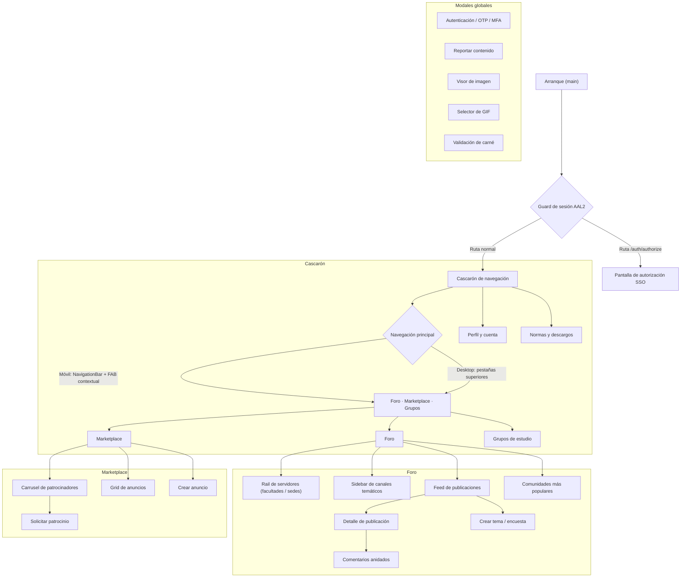

# 02 — Mapa de navegación

> Modelo de navegación, jerarquía de pantallas y puntos de entrada.
> Los requisitos del **cascarón** (AppBar, pestañas, barra inferior, FAB, tema)
> viven en [`08-navegacion-shell-y-reglas.md`](08-navegacion-shell-y-reglas.md)
> con prefijo `UX-NAV`; aquí se usa el prefijo `UX-MAP` para la estructura y el
> enrutado, evitando duplicar requisitos.

---

## 1. Mapa de pantallas

---

## 2. Jerarquía y puntos de entrada

| Destino | Se llega desde | Tipo |
|---|---|---|
| Foro | Navegación principal (pestaña por defecto) | raíz |
| Marketplace | Navegación principal | raíz |
| Grupos de estudio | Navegación principal | raíz |
| Detalle de publicación | Tarjeta del feed / actividad del perfil | push |
| Crear tema | Botón del feed | modal |
| Perfil y cuenta | Barra de usuario / badge de alias | push |
| Normas y descargos | AppBar / modal de aviso / perfil | push |
| Autorización SSO | Deep link `#/auth/authorize?...` | ruta nombrada |
| Autenticación | Cualquier acción de escritura sin sesión | modal |
| Validación de carné | Perfil / al publicar en marketplace | modal |
| Reportar | Acciones en publicaciones, comentarios, grupos, anuncios | modal |

**Requisitos que gobiernan estos destinos:** navegación principal y AppBar en
[`08-navegacion-shell-y-reglas.md`](08-navegacion-shell-y-reglas.md) (`UX-NAV`);
barra de usuario y canales en [`03-foro.md`](03-foro.md) (`UX-FORO-005`,
`UX-FORO-004`).

---

## 3. Requisitos de estructura de navegación (UX-MAP)

### UX-MAP-001 — Rutas profundas (deep links) y arranque correcto
- **Actor / rol:** Todos / integraciones (SSO)
- **Prioridad:** Must
- **Estado objetivo:** la app distingue la ruta de autorización SSO de la ruta
  raíz y resuelve enlaces profundos web (`#/auth/authorize?...`) sin pasar por el
  cascarón.
- **Precondiciones:** arranque en web o móvil con un enlace entrante.
- **Interacciones:** al recibir la ruta de autorización se abre la pantalla de
  consentimiento; cualquier otra ruta abre el cascarón en su destino por defecto.
- **Estados:** ruta válida → destino; ruta desconocida → destino raíz.
- **Validaciones y reglas de negocio:** los parámetros de la URL (`client_id`,
  `redirect_uri`, `state`) se leen también desde el *fragment* cuando el host los
  entrega ahí.
- **Accesibilidad:** sin efecto (enrutado).
- **Responsive:** idéntico en móvil y web.
- **Criterios de aceptación:**
  - **Given** una URL de autorización SSO válida, **When** se abre la app,
    **Then** se muestra la pantalla de consentimiento y no el cascarón.
  - **Given** una ruta desconocida, **When** se abre, **Then** se llega a un
    destino válido sin pantalla en blanco y con un aviso no intrusivo.

### UX-MAP-002 — Retorno consistente en subpantallas
- **Actor / rol:** Todos
- **Prioridad:** Must
- **Estado objetivo:** toda subpantalla (detalle de publicación, perfil, normas)
  ofrece un retorno claro y devuelve al punto de origen con su estado (scroll,
  canal activo) intacto.
- **Precondiciones:** haber navegado a la subpantalla desde un destino raíz.
- **Estados:** retorno estándar; retorno tras una acción que muta la lista
  (p. ej. eliminar un post) refresca el origen.
- **Accesibilidad:** el gesto/tecla de retroceso debe funcionar y anunciarse.
- **Responsive:** botón de retroceso en AppBar; gesto en móvil; `Esc`/`Alt+←`
  en web/desktop.
- **Criterios de aceptación:**
  - **Given** el detalle de una publicación abierto desde el feed, **When** el
    usuario vuelve, **Then** regresa al mismo punto del feed.
  - **Given** una publicación eliminada desde su detalle, **When** el usuario
    vuelve, **Then** el feed no muestra ya esa publicación.

### UX-MAP-003 — Manejo de enlaces externos y salida segura
- **Actor / rol:** Todos
- **Prioridad:** Should
- **Estado objetivo:** los enlaces que salen de la plataforma (WhatsApp,
  Telegram, Instagram, portales de facultades) se abren fuera de la app de forma
  segura; si no hay manejador disponible, se informa y se ofrece copiar el
  enlace.
- **Precondiciones:** un enlace externo accionado por el usuario.
- **Estados:** abre correctamente | no hay app/ventana disponible | error.
- **Validaciones y reglas de negocio:** nunca ejecutar URLs no validadas; los
  esquemas permitidos se restringen al dominio externo esperado.
- **Accesibilidad:** anunciar que el enlace se abrirá fuera de la aplicación.
- **Responsive:** igual en todas las plataformas.
- **Criterios de aceptación:**
  - **Given** un anuncio con botón de WhatsApp, **When** el usuario lo pulsa,
    **Then** se abre WhatsApp con el mensaje prellenado (o, si no está
    disponible, se ofrece copiar el enlace y se explica por qué).
  - **Given** un enlace con esquema no soportado, **When** se acciona, **Then**
    la app no falla y muestra un mensaje claro.

---

## 4. Trazabilidad
Ver [`11-metricas-y-trazabilidad.md`](11-metricas-y-trazabilidad.md).
