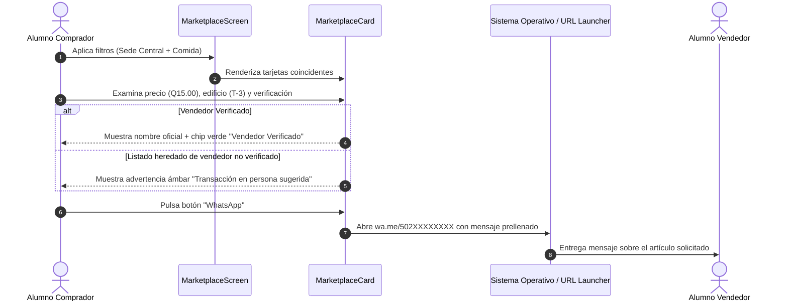
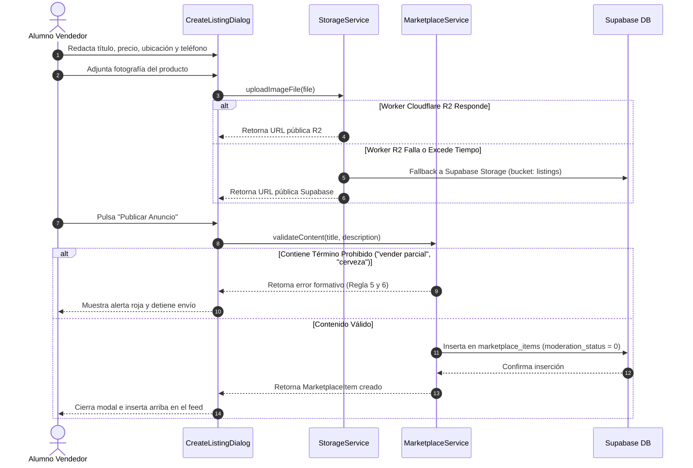
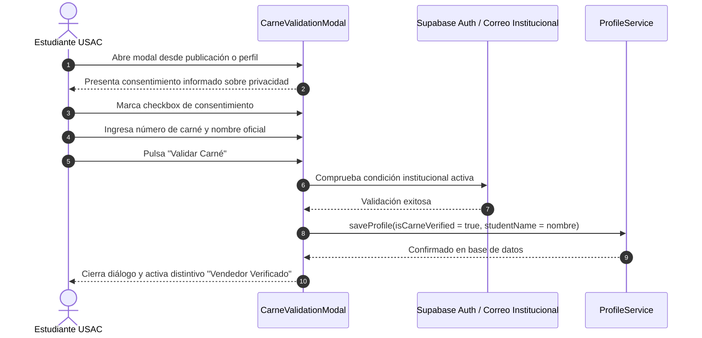
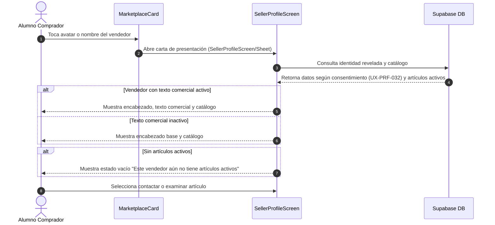

# 04 — Marketplace y tutorías

> Requisitos de experiencia de usuario para el catálogo comercial estudiantil,
> tutorías entre pares, patrocinios, confianza en transacciones y moderación.
> Convenciones, roles y plantilla en [`README.md`](README.md).
>
> Los patrocinios se rigen por el modelo transversal
> [`12-patrocinios.md`](12-patrocinios.md) (`UX-SPN`), que también alimenta las
> publicaciones patrocinadas del Foro (`UX-FORO-021`…) y las apariciones en
> Grupos (`UX-GRP-010`…).

---

## 1. Propósito y visión del área

El **Marketplace & Tutorías** de Comunidad USAC es una vitrina comercial y de
servicios académicos colaborativa entre estudiantes de la Universidad de San Carlos
de Guatemala ([`01-producto.md`](01-producto.md)). Su premisa fundamental es el
**trato directo sin comisiones intermediarias**, eliminando la custodia de fondos
por parte de la plataforma y organizando los intercambios que hoy ocurren de forma
desordenada en redes sociales y pasillos universitarios.

### 1.1 Pilares de experiencia del Marketplace
1. **Comercio directo y seguro en el campus:** Vinculación de cada publicación con
   referencias físicas concretas de la ciudad universitaria (edificios como *T-3*,
   *S-12*, *CUM*, plazas o cafeterías) y horarios habituales de entrega.
2. **Solidaridad académica:** Categoría dedicada para tutorías y asesorías de cursos,
   apoyada en un distintivo especial para aportes y materiales **GRATUITOS**.
3. **Dualidad de identidad y confianza informada:** Publicar exige carné universitario verificado para acreditar identidad y prevenir estafas. Los listados heredados publicados previamente por vendedores no verificados mantienen su aviso preventivo.
4. **Resiliencia de conexión y multimedia:** Carga optimizada de imágenes con
   redundancia de almacenamiento, garantizando disponibilidad incluso en redes móviles
   intermitentes dentro del campus.
5. **Autocuidado comunitario:** Filtros semánticos estrictos contra fraude en exámenes,
   comercio de sustancias ilícitas y herramientas ágiles de denuncia comunitaria.

---

## 2. Matriz de requisitos

| Identificador | Título del requisito | Prioridad | Actor principal | Estado / Tipo |
|---|---|:---:|---|:---:|
| [`UX-MKT-001`](#ux-mkt-001--banner-superior-e-identidad-de-comercio-seguro-estudiantil) | Banner superior e identidad de comercio seguro estudiantil | **Must** | Todos los roles | Objetivo |
| [`UX-MKT-002`](#ux-mkt-002--carrusel-de-primera-plana-para-patrocinadores-y-emprendimientos) | Carrusel de primera plana para patrocinadores y emprendimientos | **Should** | Todos / Patrocinador | Objetivo |
| [`UX-MKT-003`](#ux-mkt-003--solicitud-de-espacio-de-patrocinio-comercial) | Solicitud de espacio de patrocinio comercial | **Should** | Estudiante / Emprendedor | Objetivo |
| [`UX-MKT-004`](#ux-mkt-004--barra-de-búsqueda-textual-y-filtros-facetados-de-catálogo) | Barra de búsqueda textual y filtros facetados de catálogo | **Must** | Todos los roles | Objetivo |
| [`UX-MKT-005`](#ux-mkt-005--cuadrícula-responsiva-y-visualización-de-tarjetas-de-producto) | Cuadrícula responsiva y visualización de tarjetas de producto | **Must** | Todos los roles | Objetivo |
| [`UX-MKT-006`](#ux-mkt-006--galería-de-imágenes-integrada-y-visor-modal-con-zoom) | Galería de imágenes integrada y visor modal con zoom | **Should** | Todos los roles | Objetivo |
| [`UX-MKT-007`](#ux-mkt-007--visualización-de-precios-en-quetzales-y-distintivo-de-aportes-gratuitos) | Visualización de precios en Quetzales y distintivo de aportes gratuitos | **Must** | Todos los roles | Objetivo |
| [`UX-MKT-008`](#ux-mkt-008--gestión-de-ciclo-de-vida-del-artículo-disponible-reservado-vendido) | Gestión de ciclo de vida del artículo (disponible, reservado, vendido) | **Must** | Estudiante vendedor | **[Mejora]** |
| [`UX-MKT-009`](#ux-mkt-009--contacto-directo-multicanal-por-whatsapp-y-redes-sociales) | Contacto directo multicanal por WhatsApp y redes sociales | **Must** | Comprador / Vendedor | Objetivo |
| [`UX-MKT-010`](#ux-mkt-010--votación-comunitaria-de-utilidad-y-reputación-upvote) | Votación comunitaria de utilidad y reputación (Upvote) | **Should** | Estudiante registrado | Objetivo |
| [`UX-MKT-011`](#ux-mkt-011--reporte-comunitario-de-anuncios-irregulares-o-fraudulentos) | Reporte comunitario de anuncios irregulares o fraudulentos | **Must** | Todos los roles | Objetivo |
| [`UX-MKT-012`](#ux-mkt-012--formulario-de-publicación-y-creación-de-anuncios-comerciales) | Formulario de publicación y creación de anuncios comerciales | **Must** | Estudiante verificado / Vendedor externo | Objetivo |
| [`UX-MKT-013`](#ux-mkt-013--filtro-semántico-preventivo-de-términos-prohibidos-y-fraude-académico) | Filtro semántico preventivo de términos prohibidos y fraude académico | **Must** | Estudiante registrado | Objetivo |
| [`UX-MKT-014`](#ux-mkt-014--verificación-para-vender-carné-o-admisión-externa) | Verificación para vender (carné o admisión externa) | **Must** | Estudiante verificado / Vendedor externo | **[Mejora]** |
| [`UX-MKT-015`](#ux-mkt-015--almacenamiento-resiliente-de-fotografías-con-fallback-de-infraestructura) | Almacenamiento resiliente de fotografías con fallback de infraestructura | **Should** | Estudiante registrado | **[Mejora]** |
| [`UX-MKT-016`](#ux-mkt-016--carta-de-presentación-página-pública-del-vendedor) | Carta de presentación (página pública) del vendedor | **Must** | Vendedor verificado | **[Mejora]** |
| [`UX-MKT-017`](#ux-mkt-017--límites-del-vendedor-no-patrocinador-nuevo) | Límites del vendedor no patrocinador | **Must** | Vendedor verificado | Objetivo |

---

## 3. Especificación detallada de requisitos

### UX-MKT-001 — Banner superior e identidad de comercio seguro estudiantil
- **Actor / rol:** Visitante, Estudiante, Verificado, Moderador, Admin
- **Prioridad:** Must
- **Estado objetivo:** La pantalla de Marketplace debe recibir al usuario con un banner de bienvenida institucional de alto impacto visual con degradado azul USAC, que comunique con claridad la naturaleza sin comisiones del servicio, la independencia institucional y fomente el intercambio seguro en el campus. En pantallas desktop debe incluir un botón de acción primario destacado para "Publicar Anuncio", mientras que en móvil este acceso se delega al botón de acción flotante (FAB) para preservar espacio vertical.
- **Precondiciones:** El usuario accede a la pestaña de Marketplace (`/marketplace` o pestaña 1 del cascarón principal en [`app_shell.dart`](../../comunidad_universitaria/lib/features/navigation/app_shell.dart#L180-L194)).
- **UI / contenido:**
  - Contenedor con degradado lineal (`#004B87` a `#1E3A8A`), bordes redondeados (16px), padding interior de 20px.
  - Título `titleLarge` (20px, negrita, color `#FFFFFF`): "Marketplace & Tutorías Estudiantiles".
  - Subtítulo `bodyMedium` (13px, color `#FFFFFF` con opacidad 0.9): "Espacio libre para emprendimientos sancarlistas: comidas, postres, tutorías de cursos y materiales universitarios. Trato directo entre estudiantes, sin comisiones.".
  - Botón primario en desktop: `ElevatedButton.icon` con fondo amarillo oro USAC (`#EAB308`), texto en negro (`Colors.black87`): "Publicar Anuncio", icono `Icons.add_shopping_cart` (18px).
- **Interacciones:**
  - En desktop: pulsar "Publicar Anuncio" evalúa el estado de autenticación. Si el usuario cuenta con sesión AAL2, abre `CreateListingDialog`. Si es visitante o sesión AAL1, despliega `AuthModal` con el mensaje formativo correspondiente antes de abrir el formulario.
  - En móvil: el banner es puramente informativo; la acción de publicar se ejecuta a través del FAB visible en la esquina inferior derecha.
- **Estados:**
  - *Inicial / Con datos:* Banner estático renderizado de inmediato sin latencia.
  - *Carga:* No bloquea el render del encabezado mientras se consultan los ítems del catálogo.
  - *Sin conexión:* Permanece completamente visible e intacto.
- **Validaciones y reglas de negocio:** La plataforma no actúa como pasarela de pago, no debita fondos ni custodia transacciones [ver UX-PRD-001 en `01-producto.md`]. Recuerda al usuario la Regla 5 (trato directo) y la Regla 7 (seguridad en puntos de encuentro físicos) [ver `08-navegacion-shell-y-reglas.md`].
- **Accesibilidad:** Ratio de contraste de texto blanco sobre degradado azul superior a 7:1 (nivel AAA). Botón de contraste superior a 10:1. Encabezado semántico `Semantics(header: true)`. Tamaño táctil del botón >= 48dp de altura.
- **Responsive:** En móvil (< 700px), el botón de publicar se oculta de la fila del banner para evitar saltos de línea y desbordes (*overflow*). En desktop (>= 1100px), el banner se acota dentro de `MaxWidthContainer` (máximo 1100px) alineando el botón a la derecha.
- **Criterios de aceptación (Gherkin):**
  - **Given** un estudiante navegando en desktop (pantalla >= 1100px), **When** carga la pestaña Marketplace, **Then** visualiza el banner superior con el título "Marketplace & Tutorías Estudiantiles" y el botón "Publicar Anuncio" en color amarillo oro a la derecha.
  - **Given** un visitante en un dispositivo móvil (< 700px), **When** visualiza el banner superior, **Then** el banner se adapta verticalmente sin mostrar el botón de cabecera y sin producir desbordamiento horizontal (*overflow*).

---

### UX-MKT-002 — Carrusel de primera plana para patrocinadores y emprendimientos
- **Actor / rol:** Visitante, Estudiante, Patrocinador, Moderador, Admin
- **Prioridad:** Should
- **Estado objetivo:** La parte superior del catálogo debe exhibir una sección VIP ("Primera Plana") dedicada a emprendimientos y marcas estudiantiles patrocinadas (`is_sponsored = true`). Si existen anuncios patrocinados activos, se presenta una tarjeta destacada con borde dorado, badge "PATROCINADOR DESTACADO", carrusel de hasta 3 fotografías, acceso a video demostrativo y botón de contacto inmediato. Si no existen patrocinadores activos, el componente debe transformarse automáticamente en un banner de invitación formativa ("Espacio para Patrocinadores y Emprendimientos") con un botón "Anunciarme" para captar nuevos patrocinadores.
- **Precondiciones:** Consulta de datos en Supabase a `marketplace_items` con filtro `is_sponsored = true` y `moderation_status < 2`.
- **UI / contenido:**
  - *Modo activo (con patrocinadores):* Contenedor con degradado sutil (`#FFFDF5` a `#FEF3C7` en modo claro, `#1E293B` a `#0F172A` en modo oscuro), borde dorado de 1.5px (`#F59E0B`), sombra con tinte dorado. Insignia superior con icono de estrella `Icons.star`, fondo ámbar (`#D97706`) y texto en mayúsculas: "PATROCINADOR DESTACADO". Enlace secundario "Anunciarme aquí". Fotografía destacada (100x100px con esquinas de 10px), título del negocio (`titleMedium` en negrita), descripción (máximo 3 líneas), chip de edificio (`buildingCode`), chip de video "Ver Video" con icono rojo `Icons.play_circle_fill` y botón verde de WhatsApp (`#25D366`) "Contactar por WhatsApp".
  - *Modo vacío (sin patrocinadores):* Banner informativo con fondo crema (`#FFFBEB` / `#1E293B`), icono de megáfono `Icons.campaign_outlined` en ámbar, título "Espacio para Patrocinadores y Emprendimientos", descripción "Llega a miles de estudiantes en primera plana con video y fotos ampliadas." y botón `ElevatedButton` "Anunciarme".
- **Interacciones:**
  - Pulsar "Anunciarme" o "Anunciarme aquí" abre `SponsorRequestDialog`.
  - Pulsar "Ver Video" invoca `UrlUtils.openUrl()`, abriendo el enlace externo en YouTube o TikTok.
  - Pulsar "Contactar por WhatsApp" abre directamente el chat con el comerciante.
- **Estados:**
  - *Carga:* Shimmer/skeleton suave de 120px de alto.
  - *Vacío:* Despliega el banner de invitación comercial sin dejar huecos en blanco.
  - *Éxito con datos:* Tarjeta VIP activa con carrusel y botones de acción.
  - *Sin conexión:* Muestra el último patrocinador persistido en caché local sin bloquear la pantalla.
- **Validaciones y reglas de negocio:** Solo artículos con `is_sponsored = true` y `moderation_status = 0` pueden mostrarse en el carrusel de primera plana ([`marketplace_screen.dart:67-73`](../../comunidad_universitaria/lib/features/marketplace/screens/marketplace_screen.dart#L67-L73)). La asignación del rol de patrocinador exige aprobación previa del equipo administrador.
- **Accesibilidad:** Textos con contraste verificado en ambos modos de tema. Lectores de pantalla leen: "Anuncio patrocinado: [Título del negocio]. Contactar por WhatsApp.". Tamaño de pulsación de botones >= 48dp.
- **Responsive:** En móvil se organiza en columna fluida con el botón de WhatsApp ocupando el ancho disponible. En desktop se presenta horizontalmente aprovechando los 1100px de ancho máximo.
- **Criterios de aceptación (Gherkin):**
  - **Given** que existen anuncios con `is_sponsored = true`, **When** un estudiante entra a Marketplace, **Then** ve el carrusel en primera plana con borde dorado, la etiqueta "PATROCINADOR DESTACADO", las fotos del negocio y el botón "Contactar por WhatsApp".
  - **Given** que no hay ningún patrocinador activo registrado en la base de datos, **When** el usuario visualiza el área superior, **Then** el carrusel muestra el banner promocional "Espacio para Patrocinadores y Emprendimientos" con el botón accionable "Anunciarme".

---

### UX-MKT-003 — Solicitud de espacio de patrocinio comercial
- **Actor / rol:** Estudiante registrado, Emprendedor, Patrocinador
- **Prioridad:** Should
- **Estado objetivo:** Cualquier emprendedor o estudiante que desee anunciar su marca en primera plana o en espacios destacados de la plataforma debe contar con un formulario guiado accesible desde el carrusel. La solicitud debe recopilar la información comercial básica, la ubicación deseada y la propuesta de valor sin requerir pagos automáticos dentro de la app, derivando la coordinación a contacto directo con el equipo de soporte de la plataforma.
- **Precondiciones:** El usuario pulsa "Anunciarme" o "Anunciarme aquí" desde el carrusel de patrocinadores. Requiere sesión iniciada; si es visitante se le solicita autenticación previa [ver UX-PRD-010 en `01-producto.md`].
- **UI / contenido:** Diálogo modal adaptativo (`SponsorRequestDialog`):
  - Encabezado con icono estelar dorado (`Icons.star_outline`), título "Solicitar Espacio de Patrocinador", subtítulo "Anúnciate en primera plana con video y mayor alcance".
  - Campo "Nombre del Emprendimiento, Marca o Negocio" (obligatorio).
  - Fila con "Nombre del Encargado" (obligatorio) y "WhatsApp" (obligatorio, teclado numérico).
  - Campo "Correo Electrónico de Contacto" (opcional).
  - Selector desplegable "Espacio Deseado": opciones "Primera Plana — Marketplace con Video y Fotos", "Banner Destacado en Foro Universitario", "Patrocinio Integral Multisección".
  - Área de texto "Detalle de la propuesta o productos a promocionar" (obligatorio, mínimo 10 caracteres).
  - Nota legal explicativa: "Nota: Los patrocinios ayudan al sostenimiento autónomo de la plataforma estudiantil. No se admiten productos no autorizados por las normas comunitarias.".
  - Botones inferiores: "Cancelar" y "Enviar Solicitud" (color ámbar `#D97706`).
- **Interacciones:** Al pulsar "Enviar Solicitud", el formulario valida la completitud de los campos obligatorios. Se invoca `MarketplaceService.requestSponsorship()`. Al finalizar con éxito, se cierra el diálogo y se notifica con un SnackBar: "¡Solicitud enviada con éxito! El equipo se comunicará contigo por WhatsApp.".
- **Estados:**
  - *Inicial:* Formulario limpio con valores por defecto.
  - *Enviando:* Botón deshabilitado con spinner de progreso y texto "Enviando...".
  - *Éxito:* Cierre del diálogo y SnackBar verde/azul institucional.
  - *Error:* Mensaje en rojo con el motivo del fallo y persistencia de los datos ya ingresados en el formulario.
- **Validaciones y reglas de negocio:** No solicita números de tarjetas de crédito ni realiza transacciones bancarias dentro de la aplicación [ver UX-PRD-001]. Valida formato telefónico guatemalteco de 8 dígitos.
- **Accesibilidad:** Modal con trampa de foco accesible. Cierre con tecla Escape en web/desktop. Manejo de teclado virtual con `viewInsets.bottom` en dispositivos móviles.
- **Responsive:** En móvil (< 700px) se despliega como `showModalBottomSheet` con esquinas redondeadas superiores (20px). En desktop se presenta como `Dialog` centrado de 560px de ancho máximo.
- **Criterios de aceptación (Gherkin):**
  - **Given** un estudiante emprendedor autenticado que abre el modal de patrocinio, **When** completa el nombre de su negocio, su contacto de WhatsApp y su propuesta y pulsa "Enviar Solicitud", **Then** el modal se cierra y aparece un mensaje verde indicando que el equipo se comunicará con él por WhatsApp.
  - **Given** un usuario que intenta enviar la solicitud dejando el campo de WhatsApp o el nombre del negocio vacío, **When** presiona "Enviar Solicitud", **Then** el formulario marca los campos en rojo con mensajes de validación y la solicitud no se envía.

---

### UX-MKT-004 — Barra de búsqueda textual y filtros facetados de catálogo
- **Actor / rol:** Visitante, Estudiante, Verificado, Moderador, Admin
- **Prioridad:** Must
- **Estado objetivo:** La plataforma debe permitir una exploración rápida, facetada y precisa del catálogo comercial mediante búsqueda textual en tiempo real combinada con filtros de sede/campus, facultad/unidad académica, selector rápido de aportes gratuitos y chips de categorías temáticas. Los filtros deben actualizar los resultados de manera reactiva y no destructiva, permitiendo limpiar criterios fácilmente.
- **Precondiciones:** Pantalla de Marketplace inicializada ([`marketplace_screen.dart:45-55`](../../comunidad_universitaria/lib/features/marketplace/screens/marketplace_screen.dart#L45-L55)).
- **UI / contenido:**
  - Campo de texto `TextField` con icono de búsqueda `Icons.search`, sugerencia "Buscar postres, almuerzos, tutorías o libros...", y botón de borrado `Icons.clear` cuando hay texto ingresado.
  - Selector desplegable de Sede/Campus (`USACConstants.sedes`: "Todas las Sedes", "Campus Central", "CUM", "CUNOC", etc.).
  - Selector desplegable de Facultad/Unidad (`USACConstants.facultades`: "Todas las Facultades", "Ingeniería", "Medicina", "Ciencias Económicas", "Humanidades", etc.).
  - Chip de filtro rápido "Solo Gratuitos" con icono `Icons.volunteer_activism_outlined` (o `Icons.check_circle` al seleccionarse), color verde (`#16A34A`).
  - Fila horizontal con desplazamiento de `FilterChip` para categorías temáticas: "Todas", "Comida & Postres", "Tutorías & Asesoría", "Libros & Materiales", "Servicios Estudiantiles", "Otros Artículos".
- **Interacciones:**
  - Escribir en el campo de búsqueda o presionar Enter ejecuta la consulta combinada evaluando coincidencias en título, descripción y código de edificio (`building_code`).
  - Cambiar el selector de Sede o Facultad refresca inmediatamente el catálogo aplicando la condición AND.
  - Activar el chip "Solo Gratuitos" filtra la consulta por `is_free = true` o `price <= 0`.
  - Tocar el icono 'X' en la barra de búsqueda borra el texto y restaura los resultados base.
- **Estados:**
  - *Inicial:* Filtros en "Todas" y búsqueda vacía.
  - *Cargando:* Reemplazo del feed por esqueletos `SkeletonCard` animados.
  - *Con resultados:* Cuadrícula actualizada con las coincidencias.
  - *Vacío tras filtro:* `EmptyStateWidget` indicando: "No hay publicaciones en esta categoría aún" con sugerencia de crear la primera o limpiar filtros.
  - *Sin conexión:* Filtrado ejecutado localmente sobre los datos en memoria o caché.
- **Validaciones y reglas de negocio:** La combinación de filtros opera con lógica AND entre facetas. La búsqueda textual es insensible a mayúsculas, minúsculas y tildes (`ilike`).
- **Accesibilidad:** Selectores y chips con etiquetas de accesibilidad explícitas. Notificación audible del total de artículos encontrados al cambiar un filtro.
- **Responsive:**
  - En móvil: buscador en línea superior, fila con los 2 selectores (Sede y Facultad) compactos y carrusel horizontal de chips.
  - En desktop: buscador y selectores en una única fila horizontal con anchos máximos acotados (180px por selector) previa a la barra de chips.
- **Criterios de aceptación (Gherkin):**
  - **Given** un estudiante buscando comida en el campus central, **When** selecciona la categoría "Comida & Postres" y la sede "Campus Central", **Then** el catálogo se actualiza mostrando únicamente anuncios que cumplan con ambos criterios simultáneamente.
  - **Given** un estudiante que activa el chip "Solo Gratuitos", **When** se actualiza el catálogo, **Then** solo se muestran publicaciones con precio Q0.00 o marcadas explícitamente como gratuitas, ocultando cualquier artículo con costo comercial.

---

### UX-MKT-005 — Cuadrícula responsiva y visualización de tarjetas de producto
- **Actor / rol:** Visitante, Estudiante, Verificado, Moderador, Admin
- **Prioridad:** Must
- **Estado objetivo:** Los productos deben exhibirse en un diseño responsivo de alta densidad visual y legibilidad: lista vertical fluida en pantallas móviles y cuadrícula de 3 columnas en pantallas de escritorio dentro del contenedor máximo de 1100px. Cada tarjeta (`MarketplaceCard`) debe sintetizar de un vistazo la imagen principal, el precio en Quetzales, la categoría, la ubicación física en el campus (edificio y punto), el seudónimo o nombre del vendedor, su estado de verificación y sus accesos rápidos de contacto.
- **Precondiciones:** Artículos obtenidos desde Supabase o desde la memoria caché ([`marketplace_screen.dart:58-77`](../../comunidad_universitaria/lib/features/marketplace/screens/marketplace_screen.dart#L58-L77)).
- **UI / contenido:**
  - Tarjeta Material 3 con bordes redondeados (14px), elevación sutil (1dp, o 2dp con borde dorado si es patrocinado).
  - Zona superior fotográfica con altura fija de 140px.
  - Insignia superior izquierda con icono y etiqueta de categoría.
  - Insignia superior derecha con precio formateado o etiqueta "GRATIS".
  - Bloque de texto: título (máximo 2 líneas con puntos suspensivos), descripción (máximo 2 líneas), ubicación física con icono de pin `Icons.place_outlined` (ej. "T-3 · Frente a Cafetería"), enlaces externos reconocidos (Instagram, Facebook, menú en Drive).
  - Fila de autor: avatar circular, nombre del estudiante o seudónimo, distintivo de verificación de carné si aplica y tiempo relativo ("hace 2 horas"). En listados heredados de vendedores no verificados, se muestra el banner preventivo ámbar.
  - Pie de tarjeta: botón de Upvote con recuento, botones directos de contacto (WhatsApp, redes) y menú de opciones adicionales (reportar, ciclo de vida).
- **Interacciones:** Las zonas interactivas de la tarjeta están claramente delimitadas (tocar foto abre visor, tocar enlaces abre redes, tocar contacto abre chat). Soporta actualización manual tirando hacia abajo (*Pull-to-refresh*) en toda la pantalla. Tocar el avatar o el nombre del vendedor abre la carta de presentación del vendedor ([ver UX-MKT-016](#ux-mkt-016--carta-de-presentación-página-pública-del-vendedor)); el nombre verificado y los canales de contacto solo aparecen si el dueño los aceptó explícitamente en contexto Marketplace.
- **Estados:**
  - *Carga:* Cuadrícula o lista con 4 tarjetas `SkeletonCard` de 220px de alto.
  - *Vacío:* `EmptyStateWidget` con icono `Icons.storefront_outlined`, título "No hay publicaciones en esta categoría aún", descripción formativa y botón "Crear Primera Publicación".
  - *Error de red:* `OfflineBanner` con botón "Reintentar".
- **Validaciones y reglas de negocio:** Artículos con `moderation_status >= 2` (ocultos o bloqueados) quedan excluidos del catálogo público. Artículos con `moderation_status == 1` (en revisión) solo son visibles para su autor y para moderadores comunitarios.
- **Accesibilidad:** Cada tarjeta conforma un grupo semántico accesible (`Semantics(container: true)`). Acciones secundarias alcanzables mediante navegación por teclado sin requerir gestos táctiles complejos.
- **Responsive:**
  - Móvil (< 700px): `ListView.builder` vertical a ancho completo con separación de 12px.
  - Tablet (700px a 1100px): cuadrícula de 2 columnas.
  - Desktop (>= 1100px): `GridView.builder` de 3 columnas con relación de aspecto 0.78, separación de 16px y contenedor central limitado a 1100px.
- **Criterios de aceptación (Gherkin):**
  - **Given** un usuario en pantalla de escritorio (ancho >= 1100px), **When** carga el catálogo de Marketplace, **Then** los artículos se organizan en una cuadrícula de 3 columnas uniforme dentro del contenedor central de 1100px.
  - **Given** un usuario que navega en un teléfono móvil con pantalla pequeña, **When** visualiza el catálogo, **Then** las tarjetas se presentan en una lista vertical ordenada, manteniendo visibles todos los botones de contacto sin que se corten los textos.

---

### UX-MKT-006 — Galería de imágenes integrada y visor modal con zoom
- **Actor / rol:** Visitante, Estudiante, Verificado, Moderador, Admin
- **Prioridad:** Should
- **Estado objetivo:** La cabecera visual de cada tarjeta de producto debe admitir navegación fluida por carrusel entre las diferentes imágenes publicadas por el vendedor (hasta 1 para usuarios regulares, hasta 3 para patrocinadores), con indicador de conteo fotográfico (`1/N`). Al pulsar cualquier fotografía, la app debe abrir un visor modal a pantalla completa (`ImageViewerDialog`) que permita examinar los detalles del producto mediante gestos de pellizco, doble toque o rueda del ratón con zoom interactivo (de 0.8x a 4.0x).
- **Precondiciones:** El artículo posee al menos una URL de imagen válida en su lista `imageUrls` ([`marketplace_card.dart:96-126`](../../comunidad_universitaria/lib/features/marketplace/widgets/marketplace_card.dart#L96-L126)).
- **UI / contenido:**
  - Contenedor de 140px de alto con `PageView.builder`.
  - Píldora indicadora en esquina inferior derecha con fondo negro semitransparente (65% opacidad) y texto en blanco en negrita: `X/Y` (ej. `1/3`), visible cuando `imageUrls.length > 1`.
  - Visor modal (`ImageViewerDialog`): fondo oscurecido al 85% (`Colors.black87`), barra superior con título del anuncio, botón de cierre (`Icons.close`), imagen centrada con `InteractiveViewer` que soporta zoom y desplazamiento panorámico.
- **Interacciones:**
  - Deslizar horizontalmente con el dedo o arrastrar con el ratón cambia de fotografía en la tarjeta y actualiza el contador.
  - Tocar la fotografía abre el visor modal interactivo.
  - Doble toque en el visor amplía al 2.0x; pellizcar permite hacer zoom entre 0.8x y 4.0x.
  - Tocar el botón de cerrar o presionar tecla Escape/retroceso cierra el modal.
- **Estados:**
  - *Cargando imagen:* Fondo neutro con spinner circular sutil.
  - *Imagen cargada:* Visualización nítida con ajuste `BoxFit.cover`.
  - *Error de imagen:* Marcador de posición estilizado con el icono temático de la categoría [ver UX-MKT-015].
  - *Visor activo:* Fondo oscuro y foco modal bloqueante.
- **Validaciones y reglas de negocio:** La navegación por la galería fotográfica no causa re-renderizado del cuerpo de la tarjeta. Las URLs de imagen deben contar con esquema seguro HTTPS.
- **Accesibilidad:** Etiqueta semántica: "Fotografía 1 de [N] de [Título del producto]". El visor modal captura el foco y permite cierre inmediato mediante teclado.
- **Responsive:** Altura fija de 140px para la zona fotográfica en todas las densidades de pantalla. El visor modal aprovecha el 100% de la ventana en móvil, tablet y escritorio.
- **Criterios de aceptación (Gherkin):**
  - **Given** una tarjeta con 3 fotografías, **When** el usuario desliza la imagen hacia la izquierda, **Then** la imagen cambia a la segunda foto y el indicador de conteo se actualiza a "2/3".
  - **Given** un estudiante que toca la foto de un producto, **When** se abre el visor modal, **Then** puede hacer zoom táctil de hasta 4x sobre la imagen y cerrarlo pulsando el botón de salida sin perder su posición de scroll en el catálogo.

---

### UX-MKT-007 — Visualización de precios en Quetzales y distintivo de aportes gratuitos
- **Actor / rol:** Visitante, Estudiante, Verificado, Moderador, Admin
- **Prioridad:** Must
- **Estado objetivo:** La economía del Marketplace opera en moneda de curso legal de Guatemala (Quetzal, GTQ). Los precios deben presentarse de manera estandarizada y visible con el prefijo `Q` y dos cifras decimales (`QXX.XX`). Cuando un artículo o tutoría sea ofrecido sin costo (`is_free = true` o precio `0.0`), el sistema debe sustituir la etiqueta de precio por una insignia verde destacada con la palabra `GRATIS`, reconociendo la solidaridad y colaboración estudiantil.
- **Precondiciones:** El artículo cuenta con un valor numérico en el campo `price` o la bandera booleana `is_free` ([`marketplace_item.dart:117-122`](../../comunidad_universitaria/lib/core/models/marketplace_item.dart#L117-L122)).
- **UI / contenido:**
  - Badge flotante en la esquina superior derecha de la tarjeta con esquinas redondeadas (20px) y sombra proyectada.
  - Para artículos con precio mayor a 0: fondo azul institucional (`#004B87`) o fondo ámbar (`#D97706`) si es patrocinado; texto en color blanco en negrita: `Q` seguido del precio con dos decimales (ej. "Q15.00", "Q120.50").
  - Para artículos gratuitos: fondo verde esmeralda (`#16A34A`), texto en color blanco en negrita: "GRATIS".
  - Para artículos vendidos: fondo gris oscuro (`Colors.grey.shade700`), texto "VENDIDO".
- **Interacciones:** Elemento visual informativo de lectura directa.
- **Estados:**
  - *Con precio:* Badge azul/ámbar con formato de moneda.
  - *Gratuito:* Badge verde esmeralda "GRATIS".
  - *Vendido:* Badge gris "VENDIDO" (reemplaza el precio para evitar confusiones comerciales).
- **Validaciones y reglas de negocio:** Precios siempre positivos. La plataforma no cobra comisiones; el valor exhibido es el precio acordado entre pares. La función formativa `formattedPrice` garantiza que valores `<= 0.0` devuelvan "GRATIS".
- **Accesibilidad:** Contraste de texto blanco sobre verde esmeralda (`#16A34A`) > 4.5:1 (AA) y sobre azul (`#004B87`) > 7:1 (AAA). Lectores de pantalla verbalizan: "Precio: [N] quetzales exactos" o "Publicación gratuita".
- **Responsive:** Tamaño de fuente de 12px con padding horizontal de 10px y vertical de 4px, diseñado para no solaparse con las insignias de categoría en pantallas pequeñas.
- **Criterios de aceptación (Gherkin):**
  - **Given** un libro publicado con precio numérico de 45.0, **When** se renderiza su tarjeta, **Then** el badge superior derecho muestra exactamente el texto "Q45.00" con fondo azul institucional.
  - **Given** una tutoría solidaria registrada con precio 0.0 o marcada como gratuita, **When** se presenta en el catálogo, **Then** el badge muestra el texto "GRATIS" con fondo verde esmeralda.

---

### UX-MKT-008 — Gestión de ciclo de vida del artículo (disponible, reservado, vendido)
- **Actor / rol:** Estudiante vendedor, Vendedor verificado, Comprador
- **Prioridad:** Must
- **Estado objetivo:** Un vendedor debe poder gestionar el ciclo de vida de sus artículos en tiempo real mediante botones de acción inmediata de un solo toque (*1-touch lifecycle chips*): marcar como reservado cuando un comprador confirme interés, reanudar a disponible si la venta no se concreta, pausar la publicación temporalmente o marcar como vendido cuando se complete la transacción. El catálogo debe reflejar estos estados de manera contundente para evitar contactos innecesarios a publicaciones que ya no están disponibles.
- **Problema actual [Mejora]:** En [`marketplace_screen.dart:512,551`](../../comunidad_universitaria/lib/features/marketplace/screens/marketplace_screen.dart#L512), la propiedad `isOwner: true` está asignada de manera fija y estática para cualquier usuario en la llamada a `MarketplaceCard`, permitiendo que usuarios ajenos visualicen indebidamente los botones de control de estado. El estado objetivo exige condicionar `isOwner` estrictamente a que el identificador del usuario autenticado coincida con el autor del anuncio (`item.userId == SupabaseService.currentUserId`).
- **Precondiciones:** El usuario debe ser el propietario legítimo del artículo (`item.userId == currentUserId`) y contar con sesión AAL2 activa.
- **UI / contenido:**
  - Capa sobrepuesta en la imagen:
    - Si está vendido (`isSold`): capa oscura al 60% con sello rectangular central rojo (`Colors.red.shade700`), borde blanco de 2px y texto "VENDIDO" con letras espaciadas (`letterSpacing: 2`).
    - Si está reservado (`isReserved`): cintillo horizontal ámbar (`Colors.amber.shade700`) con texto blanco "ARTÍCULO RESERVADO".
  - Fila de chips de ciclo de vida (exclusiva del propietario):
    - "Marcar Reservado" (`Icons.bookmark_outline`, color ámbar) si está disponible.
    - "Disponible" (`Icons.check_circle_outline`, color azul) si está reservado o pausado.
    - "Marcar Vendido" (`Icons.done_all`, color verde) si aún no está vendido.
    - "Pausar" / "Reanudar" (`Icons.pause_circle_outline` / `Icons.play_circle_outline`).
- **Interacciones:** Al pulsar un chip de estado, la UI aplica un cambio optimista inmediato y ejecuta `MarketplaceService.updateItemStatus()`. Al confirmarse, despliega un SnackBar verde: "Estado actualizado a: [ESTADO]". Si la red falla, revierte el estado visualmente y muestra un mensaje de error.
- **Estados:**
  - *Disponible (`available`):* Tarjeta normal con insignias de precio y botones de contacto activos.
  - *Reservado (`reserved`):* Cintillo ámbar sobre la imagen y advertencia de reserva.
  - *Vendido (`sold`):* Marca de agua roja "VENDIDO", botones de contacto deshabilitados.
  - *Pausado (`paused`):* Oculto para compradores, visible para el autor con opción de reactivar.
- **Validaciones y reglas de negocio:** Políticas RLS en PostgreSQL impiden actualizar filas de `marketplace_items` donde `user_id != auth.uid()`. El estado vendido inhabilita el inicio de nuevos chats de compra.
- **Accesibilidad:** Chips con etiquetas semánticas claras ("Cambiar estado a reservado"). Lectores de pantalla anuncian "Artículo vendido" o "Artículo reservado" inmediatamente al enfocar la tarjeta.
- **Responsive:** Los chips de ciclo de vida se agrupan en un contenedor `Wrap` fluido para no desbordar en resoluciones móviles.
- **Criterios de aceptación (Gherkin):**
  - **Given** un estudiante que visualiza un artículo propio en el catálogo, **When** pulsa el chip "Marcar Reservado", **Then** la foto del producto muestra de inmediato el cintillo ámbar "ARTÍCULO RESERVADO" y el chip conmuta a "Disponible".
  - **Given** un estudiante que examina publicaciones de otros compañeros, **When** inspecciona una tarjeta ajena, **Then** no se muestran los chips de cambio de estado ("Marcar Reservado", "Marcar Vendido"), visualizando únicamente las opciones de compra y contacto.

---

### UX-MKT-009 — Contacto directo multicanal por WhatsApp y redes sociales
- **Actor / rol:** Visitante, Estudiante, Verificado
- **Prioridad:** Must
- **Estado objetivo:** La plataforma debe propiciar una comunicación directa y expedita entre comprador y vendedor sin intermediarios ni mensajería interna propietaria. Al pulsar el botón de WhatsApp, el sistema debe limpiar el número telefónico, anteponer de forma transparente el prefijo internacional de Guatemala (`+502`), codificar un mensaje contextual de saludo prellenado con el título del artículo y abrir la aplicación de WhatsApp mediante `url_launcher`. Asimismo, debe admitir botones directos hacia Instagram, Facebook Messenger, Telegram y enlaces web asociados (como menús digitales en Google Drive o perfiles comerciales).
- **Precondiciones:** El anuncio contiene al menos un canal de contacto configurado (`hasAnyContact == true` en [`marketplace_item.dart:131-135`](../../comunidad_universitaria/lib/core/models/marketplace_item.dart#L131-L135)).
- **UI / contenido:**
  - Fila horizontal de botones de contacto con desplazamiento horizontal si existen múltiples redes:
    - WhatsApp: botón verde (`#25D366`) con icono `Icons.chat` y texto "WhatsApp".
    - Instagram: botón fucsia (`#E1306C`) con icono de cámara `Icons.camera_alt_outlined` y texto "Instagram".
    - Messenger: botón azul (`#0084FF`) con icono de mensaje `Icons.message_outlined` y texto "Messenger".
    - Telegram: botón celeste (`#229ED9`) con icono de avión `Icons.send_outlined` y texto "Telegram".
  - Chips para enlaces web adicionales: icono representativo según dominio (`_getDomainIcon`) y texto ("Drive / Menú", "Facebook", "TikTok", "Enlace").
- **Interacciones:** Al tocar un botón de contacto, el sistema lanza la URL externa. Si la aplicación nativa está instalada, se abre directamente en el chat correspondiente; si no, se abre la versión web en el navegador.
- **Estados:**
  - *Activo:* Botón habilitado con color de marca correspondiente.
  - *Vendido:* Botones de contacto deshabilitados y atenuados con mensaje "Este artículo ya fue vendido".
- **Validaciones y reglas de negocio:**
  - Teléfono WhatsApp: el getter `whatsappUrl` limpia caracteres no numéricos; si tiene 8 dígitos, antepone `502`. Mensaje autogenerado: `"¡Hola! Vi tu publicación en Comunidad USAC sobre '[Título]'. ¿Sigue disponible?"`.
  - Instagram y Messenger admiten nombres de usuario con `@` o URLs directas, normalizándolas automáticamente.
  - Obligatorio registrar al menos un canal de contacto al crear el anuncio.
- **Accesibilidad:** Botones con área táctil mínima de 48dp de altura o padding generoso. Etiqueta para lector de pantalla: "Contactar a [Vendedor] por WhatsApp sobre [Título del producto]".
- **Responsive:** Fila con scroll horizontal en móviles para evitar saltos de línea antiestéticos. En desktop se distribuyen de manera ordenada en el pie de la tarjeta.
- **Criterios de aceptación (Gherkin):**
  - **Given** un estudiante interesado en un anuncio de pasteles que tiene configurado el WhatsApp "55551234", **When** pulsa el botón "WhatsApp", **Then** el dispositivo abre WhatsApp hacia el número "50255551234" con el mensaje "¡Hola! Vi tu publicación en Comunidad USAC sobre 'Pastel de Zanahoria'. ¿Sigue disponible?".
  - **Given** un anuncio que ya fue marcado con estado "VENDIDO", **When** un comprador visualiza la tarjeta, **Then** los botones de contacto se deshabilitan para evitar mensajes a vendedores de productos no disponibles.

---

### UX-MKT-010 — Votación comunitaria de utilidad y reputación (Upvote)
- **Actor / rol:** Visitante, Estudiante registrado, Vendedor verificado
- **Prioridad:** Should
- **Estado objetivo:** La comunidad debe contar con un mecanismo descentralizado de reputación y validación social mediante votación positiva (*Upvotes*) en cada publicación. El botón de upvote debe responder con actualización optimista inmediata en la interfaz (+1 / -1 y cambio cromático del icono de corazón), persistiendo la preferencia en la base de datos y revirtiendo el estado de forma transparente ante fallos de conexión. Si un visitante intenta votar, debe ser interceptado educadamente para iniciar sesión antes de registrar su voto.
- **Precondiciones:** Anuncio visible en el catálogo. Requiere sesión iniciada para persistir el voto ([`marketplace_screen.dart:108-132`](../../comunidad_universitaria/lib/features/marketplace/screens/marketplace_screen.dart#L108-L132)).
- **UI / contenido:**
  - Píldora interactiva redondeada (16px) ubicada al inicio de la barra de acciones de la tarjeta.
  - Icono de corazón: `Icons.favorite` rojo si el usuario ya votó (`isUpvotedByMe == true`), o `Icons.favorite_border` gris neutro si no ha votado.
  - Texto numérico con el total acumulado de votos (`item.upvotes`).
  - Fondo azul primario sutil (`alpha: 0.12`) si está activo; gris pizarra (`#F1F5F9` / `#1E293B`) si está inactivo.
- **Interacciones:**
  - Si es visitante: se abre `AuthModal` indicando "Inicia sesión para apoyar esta publicación". Al autenticarse, se reanuda el voto.
  - Si está autenticado: la UI conmuta de inmediato el contador y el color. En segundo plano ejecuta `MarketplaceService.toggleUpvote()`. Si la petición falla, revierte el contador y notifica con un mensaje discreto.
- **Estados:**
  - *No votado:* Corazón vacío en gris neutro.
  - *Votado:* Corazón relleno en rojo con fondo de acento.
  - *Actualización optimista:* Respuesta visual inmediata (< 16ms).
  - *Reversión por error:* Restauración del valor previo si la red no responde.
- **Validaciones y reglas de negocio:** Un voto por usuario por cada anuncio (clave compuesta `user_id` + `item_id`). Los votos no pueden ser negativos (`clamp(0, 999999)`).
- **Accesibilidad:** Etiqueta dinámica: "Votar publicación útil, actualmente [N] votos" o "Quitar voto de publicación útil". Foco accesible por teclado y activación con barra espaciadora.
- **Responsive:** Ancho adaptativo al número de dígitos del contador para encajar fluidamente tanto en móvil como en columnas de escritorio.
- **Criterios de aceptación (Gherkin):**
  - **Given** un estudiante autenticado frente a un anuncio con 5 votos que no ha votado antes, **When** pulsa el botón de upvote, **Then** el contador cambia inmediatamente a 6, el corazón se colorea de rojo y la preferencia queda registrada en el backend.
  - **Given** un visitante sin sesión iniciada que pulsa el botón de upvote, **When** interactúa con el componente, **Then** se abre el modal de autenticación sin modificar el contador de votos hasta que inicie sesión.

---

### UX-MKT-011 — Reporte comunitario de anuncios irregulares o fraudulentos
- **Actor / rol:** Visitante, Estudiante, Vendedor verificado, Moderador
- **Prioridad:** Must
- **Estado objetivo:** La seguridad comercial y académica del Marketplace requiere un canal de denuncia comunitario ágil, accesible y protector. Cualquier usuario debe poder reportar publicaciones que infrinjan las normas (fraude económico, venta de exámenes, productos ilícitos o datos personales expuestos). Al enviar el reporte, la interfaz debe ofrecer retroalimentación de protección inmediata al denunciante, colapsando y ocultando localmente el anuncio de su feed para que no continúe viéndolo, mientras el backend enruta el caso a la bandeja de moderación.
- **Precondiciones:** Anuncio visible en el catálogo.
- **UI / contenido:**
  - Botón de opciones `Icons.more_vert` en la esquina inferior derecha de la tarjeta.
  - Menú emergente con la opción "Reportar contenido" acompañada de un icono de bandera roja `Icons.flag_outlined`.
  - Diálogo modal `ReportDialog`: título "Reportar Publicación", subtítulo "Anuncio: [Título del anuncio]".
  - Motivos predefinidos: "Fraude o estafa económica", "Venta de exámenes o fraude académico", "Venta de productos ilícitos (armas/drogas/alcohol)", "Acoso o contenido ofensivo", "Información privada expuesta", "Otro motivo".
  - Campo de texto opcional para detalles adicionales.
  - Botones "Cancelar" y "Enviar Denuncia".
  - SnackBar de confirmación: "Publicación ocultada para ti. Gracias por cuidar la comunidad.".
- **Interacciones:** El usuario selecciona "Reportar contenido", elige el motivo y presiona "Enviar Denuncia". El sistema registra el reporte en `MarketplaceService.reportListing()`, remueve inmediatamente el anuncio de la vista local (`_listings.removeWhere()`) y muestra el SnackBar informativo.
- **Estados:**
  - *Abriendo reporte:* Modal centrado con opciones de denuncia.
  - *Enviando:* Indicador de actividad no bloqueante.
  - *Reportado:* Desaparición inmediata del anuncio en la pantalla del denunciante y confirmación SnackBar.
- **Validaciones y reglas de negocio:** Al acumular 3 reportes independientes, el sistema actualiza automáticamente el anuncio a `moderation_status = 1` (En revisión), ocultándolo del catálogo público hasta la resolución de un moderador [ver `20261002000100_harden_moderation_rls.sql`].
- **Accesibilidad:** Modal accesible por lectores de pantalla con anuncio de opciones de denuncia. Trampa de foco activa y cierre accesible con tecla Escape.
- **Responsive:** Se adapta a BottomSheet en móvil y Dialog en escritorio mediante `Responsive.isMobile(context)`.
- **Criterios de aceptación (Gherkin):**
  - **Given** un estudiante que encuentra un anuncio sospechoso de estafa en el catálogo, **When** selecciona "Reportar contenido", elige "Fraude o estafa económica" y confirma el reporte, **Then** el anuncio desaparece inmediatamente de su pantalla y se muestra el mensaje "Publicación ocultada para ti. Gracias por cuidar la comunidad.".
  - **Given** un anuncio que recibe su tercer reporte comunitario por parte de distintos usuarios, **When** se procesa la denuncia, **Then** el sistema actualiza el estado de moderación del anuncio a "En revisión" y deja de mostrarse a toda la comunidad.

---

### UX-MKT-012 — Formulario de publicación y creación de anuncios comerciales
- **Actor / rol:** Vendedor verificado (Estudiante o Externo), Patrocinador
- **Prioridad:** Must
- **Estado objetivo:** La creación de anuncios de productos o tutorías debe realizarse a través de un formulario guiado, estructurado y seguro (`CreateListingDialog`), accesible desde el botón superior o el FAB móvil. El formulario debe recopilar datos claros sobre categoría, título, descripción, precio o gratuidad, ubicación física en el campus, canales de contacto y fotografías. Toda publicación exige que el vendedor esté verificado (carné para estudiantes, o admisión externa para no estudiantes).
- **Precondiciones:** Sesión activa con MFA TOTP verificado (nivel AAL2). Si el usuario no está verificado para vender, se aplica el gate: estudiante sin carné abre `CarneValidationModal` (UX-PRF-013); no estudiante abre el flujo de admisión externa (UX-PRF-035). No se permite continuar al formulario hasta estar verificado.
- **UI / contenido:** Diálogo modal adaptativo (`CreateListingDialog`):
  - Encabezado con icono de tienda verde esmeralda (`#059669`), título "Publicar Producto o Servicio", subtítulo "Marketplace Universitario · Entorno Seguro".
  - Componente de identidad `IdentityBadgeChip`: muestra el alias o nombre del usuario y su distintivo de verificación.
  - Selector desplegable de Categoría (Comida & Postres, Tutorías, Libros, Servicios, Otros).
  - Casilla de verificación "Aporte o tutoría GRATUITA".
  - Campo "Título del producto o servicio" (mínimo 4 caracteres).
  - Campo "Precio en Quetzales" con prefijo `Q` (oculto si se marca como gratuita).
  - Sección "Canales de Contacto": campos para WhatsApp, Instagram, Messenger y Telegram (valida que al menos uno contenga información).
  - Sección "Ubicación en Campus": selectores de Sede, Facultad, Edificio (`campusBuildings`: T-3, S-12, CUM, etc.) y campo para punto específico u horarios (ej. "Frente a cafetería de 11:00 a 13:00 hrs").
  - Campo "Descripción detallada" (mínimo 10 caracteres).
  - Sección de fotos: botón para subir imagen (1 para no patrocinadores, hasta 3 para patrocinadores, ver UX-MKT-017) con miniaturas y botón de eliminar (`Icons.close`).
  - Botón de envío "Publicar Anuncio".
- **Interacciones:** Al presionar "Publicar Anuncio", el sistema valida los campos requeridos, la existencia de al menos un canal de contacto y el filtro semántico de términos prohibidos. Al completarse con éxito, se cierra el diálogo, se inserta inmediatamente el nuevo ítem en la primera posición del feed (`_listings.insert(0, newItem)`) y se muestra un SnackBar de confirmación.
- **Estados:**
  - *Inicial:* Formulario limpio con canales de contacto precargados del perfil de usuario si existen.
  - *Subiendo imagen:* Botón con spinner y texto "Subiendo...".
  - *Enviando formulario:* Botón deshabilitado con indicador de carga.
  - *Éxito:* Cierre del modal e inserción instantánea en la parte superior del feed.
  - *Error:* Alerta roja sin cerrar el diálogo ni borrar los datos redactados por el usuario.
- **Validaciones y reglas de negocio:** Título >= 4 caracteres; descripción >= 10 caracteres; al menos un canal de contacto diligenciado; precio numérico >= 0.0; validación de términos prohibidos obligatoria [ver UX-MKT-013]. Sesión obligatoria AAL2 [ver UX-AUTH en `07-autenticacion.md`]. Obligatorio estar verificado para vender (UX-MKT-014). Límites según estado de patrocinio (UX-MKT-017).
- **Accesibilidad:** Soporte completo de navegación por teclado y foco secuencial. Desplazamiento automático para que ningún campo quede oculto tras el teclado virtual en dispositivos móviles (`viewInsets.bottom`). Errores anunciados explícitamente a lectores de pantalla.
- **Responsive:**
  - Móvil: `showModalBottomSheet` a pantalla casi completa (90% de altura) con esquinas superiores redondeadas (20px).
  - Desktop: `showDialog` con ancho máximo de 580px y desplazamiento interno.
- **Criterios de aceptación (Gherkin):**
  - **Given** un vendedor verificado con AAL2 que llena el formulario correctamente, **When** presiona "Publicar Anuncio", **Then** el diálogo se cierra y el nuevo producto aparece inmediatamente en la primera posición del catálogo.
  - **Given** un estudiante no verificado, **When** intenta publicar, **Then** se abre `CarneValidationModal`.
  - **Given** un no estudiante no admitido, **When** intenta publicar, **Then** se le redirige al flujo de admisión externa.
  - **Given** un usuario que intenta publicar sin llenar canales de contacto, **When** presiona "Publicar Anuncio", **Then** el formulario muestra una alerta de requerir al menos un canal.

---

### UX-MKT-013 — Filtro semántico preventivo de términos prohibidos y fraude académico
- **Actor / rol:** Estudiante registrado, Vendedor verificado
- **Prioridad:** Must
- **Estado objetivo:** Para proteger la integridad académica y la seguridad del campus de acuerdo con las Reglas 3, 5 y 6 de la comunidad, la plataforma debe someter todo intento de publicación comercial a un análisis semántico preventivo obligatorio en el cliente y en el servicio (`MarketplaceService.validateContent`). Si el título o la descripción contienen términos vinculados a fraude en evaluaciones (p. ej., "hacer exámenes", "vender parcial", "suplantación", "resuelvo examen"), sustancias ilícitas ("armas", "drogas", "marihuana", "alcohol", "cerveza") o fraudes financieros ("estafa piramidal"), la acción debe bloquearse de forma inmediata con una explicación formativa que cite las normas correspondientes.
- **Precondiciones:** Usuario en `CreateListingDialog` intentando enviar un nuevo anuncio ([`marketplace_service.dart:11-41`](../../comunidad_universitaria/lib/core/services/marketplace_service.dart#L11-L41)).
- **UI / contenido:**
  - Mensaje de advertencia destacado en SnackBar o banner rojo: `"Tu publicación contiene términos restringidos ("[término]"). No se permiten productos o servicios contrarios a las normas comunitarias (Regla 5 y 6)."`.
  - Resaltado visual en color rojo del campo que contiene el término observado (título o descripción).
  - Enlace secundario para consultar las "Normas de Convivencia" [ver `08-navegacion-shell-y-reglas.md`].
- **Interacciones:** Al pulsar "Publicar Anuncio", antes de realizar cualquier petición HTTP o inserción remota, el servicio evalúa la cadena concatenada de título y descripción contra `_prohibitedKeywords`. Si detecta coincidencia, detiene el envío, mantiene el formulario intacto para que el usuario pueda corregir su redacción y despliega el mensaje formativo.
- **Estados:**
  - *Validación superada:* Continúa con la creación del anuncio.
  - *Infracción detectada:* Detención del envío, foco en el campo observado y despliegue del mensaje pedagógico.
- **Validaciones y reglas de negocio:** Lista canónica de palabras y frases restringidas en [`marketplace_service.dart:11-31`](../../comunidad_universitaria/lib/core/services/marketplace_service.dart#L11-L31). Detección insensible a mayúsculas y minúsculas (`toLowerCase()`). Se ejecuta en el cliente antes de la subida y se revalida en el backend mediante triggers / constraints de base de datos para impedir evasiones por API directa.
- **Accesibilidad:** El mensaje de error se anuncia inmediatamente con `SemanticsService.announce` o rol `alert` para que los usuarios con lectores de pantalla comprendan con exactitud qué palabra causó la detención.
- **Responsive:** Notificación adaptable que no oculta el botón de acción ni los campos de texto en pantallas pequeñas.
- **Criterios de aceptación (Gherkin):**
  - **Given** un estudiante que redacta un anuncio de tutoría con el título "Resuelvo examen de Cálculo 1", **When** presiona el botón "Publicar Anuncio", **Then** el envío se cancela y se muestra una alerta roja indicando que contiene términos restringidos ("resuelvo examen") contrarios a las normas comunitarias.
  - **Given** un estudiante que redacta un anuncio legítimo "Tutoría y repaso de temas para examen de Cálculo 1", **When** envía el formulario, **Then** el filtro semántico valida que no constituye fraude y permite la publicación exitosa del anuncio.

---

### UX-MKT-014 — Verificación para vender (carné o admisión externa)
- **Actor / rol:** Vendedor verificado (Estudiante o Externo)
- **Prioridad:** Must
- **Estado objetivo:** Para garantizar un comercio seguro, la verificación de identidad es requisito obligatorio para publicar artículos nuevos. Para estudiantes, implica la validación del carné (UX-PRF-013). Para no estudiantes, implica la admisión por documentos mediante un administrador (UX-PRF-035). La interfaz exhibe de forma transparente el estado de verificación, solicita consentimiento informado previo y, al validarse, muestra el distintivo verde "Vendedor Verificado" o "Vendedor externo verificado". El banner preventivo ámbar de "Vendedor no validado" se conserva únicamente para listados heredados publicados antes de que esta regla entrara en vigencia.
- **Problema actual [Mejora]:** En [`carne_validation_modal.dart:73-85`](../../comunidad_universitaria/lib/features/profile/widgets/carne_validation_modal.dart#L73-L85) e inventario 8.3, la validación de carné actual es una simulación en el cliente con un retardo estático de 700 ms (`Future.delayed`). La solución exige una verificación auténtica (ya sea por dominio institucional, comprobante de matrícula o documentos externos) con un descargo honesto en la tarjeta que especifique el nivel real de verificación y su origen.
- **Precondiciones:** Usuario con cuenta registrada.
- **UI / contenido:**
  - En la tarjeta del vendedor verificado:
    - Chip verde esmeralda (`#059669`) con icono de verificación blanco `Icons.verified` y texto "Vendedor Verificado" o "Vendedor externo verificado".
    - Nombre del vendedor mostrando el nombre validado en lugar del alias genérico (ej. "Carlos Gómez" en vez de "Estudiante USAC #482").
  - En la tarjeta del vendedor no verificado (listados heredados):
    - Banner preventivo en caja ámbar suave (`#FEF3C7` / `#451A03`) con borde fino (`#F59E0B`), icono de advertencia `Icons.warning_amber_rounded` y texto: "Listado heredado: Vendedor no verificado. Se sugiere realizar la transacción en persona dentro del campus.".
- **Interacciones:** El usuario accede a la validación desde el formulario de publicación (interceptado como puerta) o desde su perfil ([`06-perfil-y-cuenta.md`](06-perfil-y-cuenta.md)). El estudiante diligencia su carné (UX-PRF-013); el no estudiante aplica a admisión (UX-PRF-035).
- **Estados:**
  - *No verificado (listado heredado):* Muestra advertencia preventiva en anuncios antiguos.
  - *Verificado:* Confirmación con SnackBar verde y activación permanente del distintivo permitiendo publicar.
- **Validaciones y reglas de negocio:** Estar verificado es obligatorio para publicar. Una vez verificado, los anuncios futuros se publican con el nombre oficial si se reveló (UX-PRF-033).
- **Accesibilidad:** El chip de verificación y el banner preventivo poseen etiquetas semánticas completas leídas por lectores de pantalla antes de los botones de contacto, garantizando que el comprador conozca el nivel de confianza del vendedor.
- **Responsive:** El banner preventivo y el distintivo se adaptan fluidamente a una sola columna en pantallas móviles sin ocultar el tiempo de publicación.
- **Criterios de aceptación (Gherkin):**
  - **Given** un usuario que completó la verificación (carné o externa), **When** publica un producto en Marketplace, **Then** la tarjeta exhibe su nombre acompañado del distintivo de verificación que corresponda.
  - **Given** un comprador que examina un listado heredado de un vendedor no verificado, **When** visualiza la tarjeta, **Then** aparece un recuadro ámbar advirtiendo "Listado heredado: Vendedor no verificado...".

---

### UX-MKT-015 — Almacenamiento resiliente de fotografías con fallback de infraestructura
- **Actor / rol:** Estudiante registrado, Vendedor verificado, Patrocinador
- **Prioridad:** Should
- **Estado objetivo:** La subida y visualización de imágenes de productos y tutorías no debe depender exclusivamente de un único proveedor de almacenamiento ni fallar de manera silenciosa. El servicio de almacenamiento (`StorageService`) debe implementar una estrategia resiliente en dos niveles: intento primario de carga hacia Cloudflare R2 vía Worker optimizado, y reintento automático transparente (*fallback*) hacia los buckets nativos de Supabase Storage (`bucket: listings`) si el worker no responde, arroja error HTTP o experimenta bloqueo de dominio. En la interfaz de usuario, la carga debe exhibir barra de porcentaje de progreso, compresión previa en el cliente para ahorrar datos móviles, y en caso de fallo absoluto, ofrecer retroalimentación clara con opción de "Reintentar subida" o "Publicar sin foto temporalmente". Asimismo, si una imagen alojada falla al renderizarse en el catálogo, debe mostrar un marcador de posición (*placeholder*) elegante con el icono temático de su categoría.
- **Problema actual [Mejora]:** En [`storage_service.dart:16-107`](../../comunidad_universitaria/lib/core/services/storage_service.dart#L16-L107), [`create_listing_dialog.dart:154-171`](../../comunidad_universitaria/lib/features/marketplace/widgets/create_listing_dialog.dart#L154-L171) e inventario 8.5, la carga fotográfica se realiza únicamente contra una URL personal de Cloudflare Worker (`workers.dev`). Si la petición falla (código distinto de 200) o lanza excepción, el método retorna `null` silenciosamente y el diálogo muestra un error genérico o se queda sin imagen, sin intentar un fallback secundario a Supabase Storage ni proporcionar opciones de recuperación al alumno.
- **Precondiciones:** Usuario seleccionando una imagen desde galería o cámara en el diálogo de publicación.
- **UI / contenido:**
  - Selector de imagen con botón "Subir Foto" e icono `Icons.add_photo_alternate_outlined`.
  - Durante la subida: indicador de progreso circular o lineal con porcentaje numérico (ej. "Subiendo foto: 65%...").
  - En caso de contingencia con el worker R2: mensaje transitorio discreto "Cambiando a servidor secundario de respaldo..." sin interrumpir la experiencia.
  - Si la subida falla en ambos servidores: diálogo o mensaje explicativo con dos botones: "Reintentar" y "Continuar sin imagen".
  - En la tarjeta del catálogo: si una imagen no carga en la red, `Image.network` utiliza un `errorBuilder` que presenta un contenedor estilizado con fondo suave y el icono temático de su categoría (`_getCategoryIcon`: pastel para comidas, birrete para tutorías, libro para materiales).
- **Interacciones:** Al seleccionar una imagen, el cliente la comprime a resolución máxima de 1000x1000px y calidad 75% (`ImagePicker`). Intenta el guardado en Cloudflare R2; si falla o supera un tiempo límite de 5 segundos, conmuta automáticamente al bucket de Supabase Storage. Al completarse, añade la URL a la lista `_imageUrls` y muestra la miniatura con botón para removerla si el usuario se equivocó.
- **Estados:**
  - *Seleccionando:* Interfaz normal de selección de archivo.
  - *Comprimiendo y subiendo:* Indicador de progreso activo con botón deshabilitado.
  - *Fallback activo:* Indicador con aviso de respaldo secundario.
  - *Completado:* Miniatura con check verde y opción de borrado.
  - *Fallo total:* Aviso explicativo con botón de reintento.
- **Validaciones y reglas de negocio:** Formatos admitidos: JPEG, PNG y WebP. Tamaño máximo de archivo tras compresión: 2 MB. Límite estricto de 1 foto para anuncios regulares y 3 fotos para patrocinadores destacados.
- **Accesibilidad:** Anuncios audibles de inicio, progreso y finalización de subida. Los botones de reintento son fácilmente alcanzables y cuentan con etiquetas descriptivas.
- **Responsive:** Miniaturas cuadradas de 70x70px con botón de eliminar accesible con área táctil adecuada.
- **Criterios de aceptación (Gherkin):**
  - **Given** un estudiante adjuntando una foto a su anuncio cuando el servicio de Cloudflare R2 no está disponible, **When** el sistema detecta el error del worker primario, **Then** conmuta automáticamente al bucket de respaldo de Supabase Storage y completa la subida sin cancelar la publicación del usuario.
  - **Given** una imagen publicada en el catálogo cuya URL se encuentra temporalmente caída o sin conexión, **When** la tarjeta intenta renderizar la fotografía, **Then** en lugar de mostrar un icono roto o pantalla en blanco, renderiza un contenedor con el icono temático de la categoría del producto (ej. icono de libro para libros y materiales).

---

### UX-MKT-016 — Carta de presentación (página pública) del vendedor
- **Actor / rol:** Vendedor verificado; visible para Visitante, Estudiante, Verificado, Moderador, Admin
- **Prioridad:** Must
- **Problema actual [Mejora]:** Hoy el vendedor solo existe como fila de autor dentro de cada `MarketplaceCard`; no hay una página pública que agrupe su identidad y todo su catálogo, de modo que el comprador no puede ver qué más ofrece una persona ni el vendedor puede presentarse comercialmente.
- **Estado objetivo:** Cada vendedor verificado tiene una página pública ("carta de presentación") que reúne su identidad visible y su catálogo de artículos activos; es el destino de "Ver sus anuncios" de la tarjeta de perfil (UX-PRF-031 / UX-PRF-033 en `06-perfil-y-cuenta.md`) y el equivalente del perfil público de patrocinador (UX-SPN-001) para estudiantes vendedores.
- **Precondiciones:** El vendedor debe ser un Vendedor verificado con carné universitario (UX-MKT-014).
- **UI / contenido:**
  - Encabezado: avatar/logo, nombre visible (seudónimo por defecto; nombre verificado solo si lo aceptó explícitamente), chip con el origen de verificación ("Vendedor Verificado (carné)" o "Vendedor externo verificado"), badge "Patrocinador" (si aplica), sede/ubicación habitual y categorías/servicios.
  - Texto de presentación comercial: campo breve opcional y opt-in (máximo 280 caracteres) editable por el dueño; aclara que NO es una biografía personal; por defecto está vacío y no se muestra.
  - Reputación: upvotes acumulados, número de artículos activos y antigüedad (opcionales, opt-in). Si es un vendedor no patrocinador, un aviso del límite de anuncios activos (UX-MKT-017) visible solo para él.
  - Contacto: solo los canales que el vendedor aceptó revelar (UX-MKT-009, UX-PRF-033).
  - Catálogo: cuadrícula de sus artículos con estados "disponible" y "reservado"; los "vendidos" se ocultan por defecto (con opción de mostrarlos). Filtro por categoría. Estado vacío: "Este vendedor aún no tiene artículos activos".
  - Anclas: `SellerProfileScreen` (nuevo), `SellerPresentationCard` (nuevo). Se reutilizan `MarketplaceCard`, `MarketplaceService`, `profiles` y `marketplace_items` (catálogo). Datos opt-in se almacenan en una estructura nueva (p. ej. `seller_presentation` o columnas de visibilidad).
- **Interacciones:**
  - Acciones: contactar (UX-MKT-009), reportar (UX-MKT-011) y compartir la página (copiar enlace/URL).
- **Estados:**
  - *Carga:* esqueleto del encabezado y de la cuadrícula del catálogo.
  - *Con datos:* encabezado con la identidad revelada (según consentimiento) y catálogo con los artículos activos.
  - *Vacío:* "Este vendedor aún no tiene artículos activos".
  - *Sin conexión:* muestra la última identidad y catálogo persistidos en caché con un aviso de reconexión.
- **Validaciones y reglas de negocio:**
  - Privacidad: consentimiento por campo (UX-PRF-032); por defecto solo avatar + seudónimo + chip verificado y patrocinador; nada más se muestra sin aceptación explícita. Sin grafo social (sin seguir/seguidores).
  - Un vendedor no patrocinador refleja en su interfaz los límites (UX-MKT-017).
- **Accesibilidad:** Los lectores de pantalla deben enunciar la identidad y reputación. El foco debe ser lógico entre el encabezado y el catálogo de artículos.
- **Responsive:** En móvil se presenta como vista de pantalla completa con desplazamiento vertical (encabezado, presentación y catálogo en una columna). En desktop (>= 1100px) el encabezado ocupa una columna lateral y el catálogo una cuadrícula de 3 columnas, dentro del contenedor máximo de 1100px.
- **Criterios de aceptación (Gherkin):**
  - **Given** un estudiante toca el avatar del vendedor, **When** selecciona "Ver sus anuncios", **Then** ve la carta con su catálogo activo, origen de verificación y status de patrocinador si aplica.
  - **Given** un vendedor que no activó el texto de presentación, **When** un usuario visita su carta, **Then** el texto no se muestra.
  - **Given** un vendedor que no otorgó consentimiento sobre ningún campo opcional, **When** un comprador abre su carta de presentación, **Then** la página muestra únicamente avatar, seudónimo, el chip de origen verificado y patrocinio.
  - **Given** un visitante en la página de un vendedor sin artículos activos, **When** visualiza el catálogo, **Then** ve el estado vacío "Este vendedor aún no tiene artículos activos".

---

### UX-MKT-017 — Límites del vendedor no patrocinador (nuevo)
- **Actor/rol:** Vendedor verificado sin patrocinio.
- **Estado objetivo:** el vendedor verificado que no es patrocinador publica con límites: máximo 1 fotografía por anuncio, sin presencia en la primera plana ni destacados, sin anuncios en Foro/Grupos y hasta 5 anuncios activos simultáneos. Los patrocinadores (UX-SPN en 12-patrocinios.md) quedan exentos: hasta 3 fotografías, primera plana y anuncios en Foro/Grupos.
- **UI/contenido:** aviso claro en CreateListingDialog y en la carta del vendedor ("Estás publicando como vendedor no patrocinador: hasta 1 foto y 5 anuncios activos. Conviértete en patrocinador para destacar."); contador de anuncios activos.
- **Validaciones y reglas de negocio:** bloquear la carga de una segunda foto y la publicación número 6; ofrecer el enlace a la solicitud de patrocinio.
- **Criterios de aceptación (Gherkin):**
  - **Given** un no patrocinador con 5 anuncios, **When** intenta publicar el sexto, **Then** no puede publicar.
  - **Given** un no patrocinador, **When** intenta subir una segunda foto, **Then** el sistema lo bloquea.
  - **Given** un patrocinador, **When** intenta subir una segunda foto, **Then** el sistema lo permite (hasta 3).

---

## 4. Flujos de usuario principales

### 4.1 Flujo de contacto directo para compra de producto o tutoría

### 4.2 Flujo de publicación con validación semántica y fallback de multimedia

### 4.3 Flujo de verificación de carné para vendedor

### 4.4 Flujo de consulta de la carta de presentación del vendedor

---

## 5. Reglas de negocio y moderación comunitaria

1. **Sin intermediación financiera:** La plataforma no procesa cobros ni retiene porcentajes de ventas. Los acuerdos monetarios son responsabilidad exclusiva de los estudiantes.
2. **Exclusividad comunitaria:** Solo se admiten productos, servicios y tutorías lícitas orientadas a la vida universitaria (comida casera, materiales odontológicos/médicos, libros, calculadoras, asesorías de materias).
3. **Cero tolerancia al fraude académico:** Queda prohibida la oferta de elaboración de tesis, resolución remunerada de exámenes parciales/finales, suplantación de identidad en evaluaciones y comercialización de reactivos académicos.
4. **Moderación automática por denuncias:** Cualquier publicación que reciba 3 o más reportes comunitarios pasa automáticamente a estado `moderation_status = 1` (En revisión), ocultándose de la vista pública hasta que un moderador la apruebe o elimine.
5. **No reescritura de autoría:** Las acciones de moderación pueden cambiar el estado de visualización (`moderation_status`), pero nunca alterar el autor, precio o contenido original del estudiante.
6. **Verificación para vender:** solo los vendedores verificados (carné para estudiantes o admisión externa) pueden publicar.
7. **Límites del no patrocinador:** 1 foto, sin destacado ni anuncios y hasta 5 anuncios activos; el patrocinador está exento.

---

## 6. Trazabilidad con código y base de datos

| Requisito | Componentes y Servicios Dart | Tablas / Columnas Supabase | Archivos de prueba |
|---|---|---|---|
| `UX-MKT-001` | `MarketplaceScreen`, `MaxWidthContainer` | N/A (UI estática y navegación) | `test/features/marketplace/marketplace_screen_test.dart` |
| `UX-MKT-002` | `SponsorCarousel`, `UrlUtils` | `marketplace_items.is_sponsored`, `sponsor_badge_text`, `video_url` | `test/features/marketplace/sponsor_carousel_test.dart` |
| `UX-MKT-003` | `SponsorRequestDialog`, `MarketplaceService` | `sponsor_requests` (tabla de solicitudes) | `test/features/marketplace/sponsor_request_test.dart` |
| `UX-MKT-004` | `MarketplaceScreen`, `USACConstants` | `marketplace_items.category`, `sede`, `facultad`, `is_free` | `test/features/marketplace/marketplace_filters_test.dart` |
| `UX-MKT-005` | `MarketplaceCard`, `SkeletonCard`, `EmptyStateWidget` | `marketplace_items.*`, `moderation_status` | `test/features/marketplace/marketplace_card_test.dart` |
| `UX-MKT-006` | `PageView`, `ImageViewerDialog` | `marketplace_items.image_urls` | `test/features/marketplace/image_viewer_test.dart` |
| `UX-MKT-007` | `MarketplaceItem.formattedPrice`, `MarketplaceCard` | `marketplace_items.price`, `is_free` | `test/core/models/marketplace_item_test.dart` |
| `UX-MKT-008` | `MarketplaceCard`, `MarketplaceService.updateItemStatus` | `marketplace_items.status`, `user_id` | `test/features/marketplace/item_lifecycle_test.dart` |
| `UX-MKT-009` | `MarketplaceCard`, `UrlUtils`, `MarketplaceItem.whatsappUrl` | `marketplace_items.contact_whatsapp`, `social_links` | `test/core/utils/url_utils_test.dart` |
| `UX-MKT-010` | `MarketplaceCard`, `MarketplaceService.toggleUpvote` | `marketplace_upvotes` (clave compuesta `item_id`, `user_id`) | `test/features/marketplace/upvote_test.dart` |
| `UX-MKT-011` | `ReportDialog`, `MarketplaceService.reportListing` | `marketplace_reports`, `marketplace_items.reported_count` | `test/features/marketplace/report_dialog_test.dart` |
| `UX-MKT-012` | `CreateListingDialog`, `MarketplaceService.createListing` | `marketplace_items` (insert), `profiles.carne` | `test/features/marketplace/create_listing_test.dart` |
| `UX-MKT-013` | `MarketplaceService.validateContent`, `_prohibitedKeywords` | Validado en cliente + trigger de seguridad en BD | `test/core/services/marketplace_service_test.dart` |
| `UX-MKT-014` | `CarneValidationModal`, `IdentityBadgeChip` | `profiles.carne`, `is_carne_verified`, `student_name` | `test/features/profile/carne_validation_test.dart` |
| `UX-MKT-015` | `StorageService.uploadImageFile`, Worker R2 + Supabase Storage | Bucket `listings` en Supabase Storage / Cloudflare R2 | `test/core/services/storage_service_test.dart` |
| `UX-MKT-016` | `SellerProfileScreen`, `SellerPresentationCard` | `profile_card_visibility`, `seller_presentation` | (nuevo) |
| `UX-MKT-017` | `CreateListingDialog`, `MarketplaceService.checkLimits` | `marketplace_items.count` | (nuevo) |
