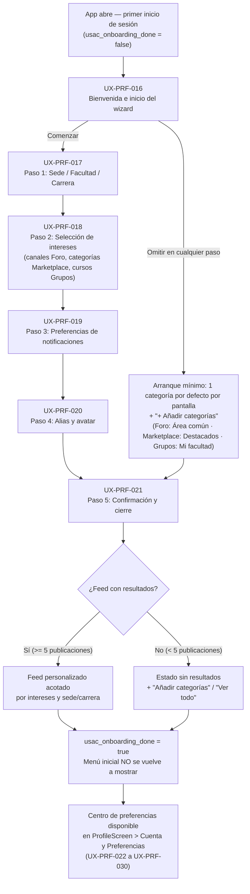

# 06 — Perfil y cuenta de usuario

> Requisitos de experiencia de usuario para la gestión de identidad, seudónimos,
> datos académicos, canales de contacto, historial de actividad propia,
> transparencia de privacidad y preferencias de la cuenta. Incluye el
> **menu inicial de nuevos usuarios** (pasos guiados UX-PRF-016 a UX-PRF-021)
> y el **centro de intereses y preferencias** (hub unificado UX-PRF-022 a
> UX-PRF-026) que reduce la saturacion de informacion no deseada. Convenciones
> y plantilla en [`README.md`](README.md).

---

## 1. Modelo de identidad y propósito del perfil

La pantalla de **Perfil y Cuenta** (`ProfileScreen`) materializa el pilar central
de **dualidad de identidad** de la plataforma ([ver `01-producto.md`](01-producto.md#11-pilares-de-valor)):

1. **Privacidad estudiantil en el Foro:** Todo aporte comunitario (temas,
   comentarios, encuestas, grupos compartidos) se publica bajo un **alias o
   seudónimo editable** (p. ej. `Estudiante USAC #482`), protegiendo al alumno
   frente a represalias académicas, sesgos docentes o exposición indeseada.
2. **Confianza verificable en el Marketplace:** En el intercambio comercial
   y de tutorías, el estudiante puede autenticar voluntariamente su identidad
   mediante validación de carné universitario. Al publicar en Marketplace, su
   nombre validado y el distintivo institucional reemplazan al seudónimo para
   prevenir fraudes y estafas.
3. **Autonomía y control de datos:** El estudiante mantiene soberanía completa
   sobre sus publicaciones, pudiendo auditar y eliminar en cualquier momento sus
   temas de discusión, grupos compartidos y artículos de venta.

---

## 2. Estructura visual y componentes de la pantalla

```mermaid
flowchart TD
    ProfileSc["ProfileScreen (Contenedor Principal)"] --> AppBar["AppBar: Regresar + Título de Preferencias"]
    ProfileSc --> HeaderCard["Tarjeta de Cabecera: Identidad Visual"]
    ProfileSc --> LayoutGrid{"¿Desktop (>= 1100px) o Móvil?"}

    subgraph Header_Area ["Cabecera de Identidad"]
        HeaderCard --> Avatar["Avatar Circular + Botón Editar"]
        Avatar --> AvatarModal["AvatarPickerModal (Color & Icono)"]
        HeaderCard --> RoleBadge["Insignia de Rol (Estudiante / Moderador / Admin)"]
        HeaderCard --> AliasField["Campo de Seudónimo + Botón Aleatorizar (Shuffle)"]
        HeaderCard --> CarneCard["Banner de Validación de Carné Universitario"]
        CarneCard --> CarneModal["CarneValidationModal"]
    end

    subgraph Forms_Area ["Configuración Académica y Contacto"]
        LayoutGrid -->|"Desktop: 2 Columnas"| RowConfig["Fila Paralela"]
        LayoutGrid -->|"Móvil: Apilado Vertical"| ColConfig["Columna Vertical"]
        RowConfig --> AcademicCard["Información Académica (Facultad, Carrera, Sede)"]
        RowConfig --> ContactCard["Canales de Contacto (WhatsApp, IG, Telegram)"]
        ColConfig --> AcademicCard
        ColConfig --> ContactCard
    end

    subgraph Activity_Area ["Sección de Actividad Propia"]
        ProfileSc --> ActivitySec["Mi Actividad y Contenidos (TabBar)"]
        ActivitySec --> TabPosts["Pestaña 1: Mis Posts (Feed del Foro)"]
        ActivitySec --> TabGroups["Pestaña 2: Mis Grupos (Enlaces Compartidos)"]
        ActivitySec --> TabMkt["Pestaña 3: Mis Anuncios (Marketplace)"]
        TabPosts --> ConfirmDelPost["Diálogo Confirmar Eliminación Post"]
        TabGroups --> ConfirmDelGroup["Diálogo Confirmar Eliminación Grupo"]
        TabMkt --> ConfirmDelMkt["Diálogo Confirmar Retiro Anuncio"]
    end

    subgraph Privacy_Account_Area ["Transparencia y Preferencias"]
        ProfileSc --> PrivacyCard["Uso de Datos y Privacidad (4 Pilares Informativos)"]
        ProfileSc --> AccountSec["Cuenta y Preferencias"]
        AccountSec --> ThemeSwitch["Conmutador Tema Claro / Oscuro"]
        AccountSec --> CardPrivacyLink["Privacidad de mi tarjeta (visibilidad de la tarjeta de presentación)"]
        AccountSec --> RulesLink["Acceso a Normas de Convivencia (RulesScreen)"]
        AccountSec --> TotpLink["Autenticación en Dos Pasos (TotpEnrollmentScreen)"]
        AccountSec --> AuthAction["Acción de Sesión (Acceder / Cerrar Sesión)"]
    end
```

---

## 3. Requisitos de experiencia de usuario (UX-PRF)

### UX-PRF-001 — Cabecera de identidad visual (avatar, alias y rol de usuario)
- **Actor / rol:** Todos (Visitante, Estudiante registrado, Estudiante verificado, Moderador, Administrador)
- **Prioridad:** Must
- **Estado objetivo:** La cabecera del perfil muestra de manera destacada y legible el avatar circular del usuario con su icono e insignia cromática seleccionada, su alias seudónimo público en tipografía destacada (`titleLarge`), la insignia oficial de rol (`Estudiante`, `Moderador` o `Administrador`), y un indicador del estado de autenticación de la cuenta ("Cuenta Verificada · correo" o "Perfil Estudiantil").
- **Precondiciones:** La pantalla `ProfileScreen` carga la entidad `UserProfile` desde almacenamiento local o servicio central.
- **UI / contenido:**
  - `CircleAvatar` interactivo (radio de 36px) con icono central blanco y botón flotante de edición circular (`Icons.edit`, 12px) en la esquina inferior derecha.
  - Texto de alias titular en negrita con truncamiento por elipsis.
  - Insignia de rol redondeada (`_buildRoleBadge`):
    - Estudiante: fondo azul `#004B87` al 12%, borde sutil, icono `Icons.school`.
    - Moderador: fondo ámbar `#D97706` al 12%, borde sutil, icono `Icons.shield`.
    - Administrador: fondo rojo `#DC2626` al 12%, borde sutil, icono `Icons.verified_user`.
  - Subtítulo de estado de autenticación con icono de nube verificada (`Icons.cloud_done_outlined`) o candado local (`Icons.lock_open_outlined`).
- **Interacciones:**
  - Pulsar sobre el avatar o su icono de edición despliega `AvatarPickerModal`.
  - La cabecera responde visualmente sin parpadeos ni desplazamientos de contenido al cambiar el tema o actualizar datos.
- **Estados:**
  - *Inicial / Carga:* Indicador circular centrado mientras se obtienen los datos de perfil.
  - *Éxito:* Cabecera renderizada con los valores actuales del usuario.
  - *Sin conexión:* Presenta los datos cacheados en el cliente sin bloquear la navegación.
- **Validaciones y reglas de negocio:** El rol se obtiene mediante `SupabaseService.getUserRole()` desde la tabla `user_roles`. Los usuarios en modo visitante adoptan rol predeterminado de estudiante.
- **Accesibilidad:** El avatar declara etiqueta semántica "Avatar de usuario, pulsa para personalizar". El rol y estado cuentan con contraste cromático superior a 4.5:1 respecto al fondo.
- **Responsive:** En móvil, el alias se adapta al ancho disponible truncando con elipsis; en pantallas grandes (ancho máximo 1000px), los elementos se distribuyen en una fila horizontal espaciosa.
- **Criterios de aceptación (Gherkin):**
  - **Given** un estudiante autenticado con rol de moderador, **When** accede a su perfil, **Then** visualiza su avatar configurado, su alias y la insignia dorada "Moderador" junto a su correo verificado.
  - **Given** un usuario visitante sin sesión iniciada, **When** abre el perfil, **Then** visualiza un avatar estándar, su alias autogenerado y el indicador "Perfil Estudiantil".

---

### UX-PRF-002 — Edición de alias con generador de seudónimos aleatorios
- **Actor / rol:** Todos (Visitante, Estudiante registrado, Estudiante verificado, Moderador, Administrador)
- **Prioridad:** Must
- **Estado objetivo:** El usuario puede modificar libremente su seudónimo público estudiantil mediante un campo de texto con límite de 35 caracteres, o bien pulsar un botón de aleatorización (`Icons.shuffle`) para generar al instante un identificador en formato `"Estudiante USAC #XXX"` (donde XXX es un número entre 100 y 999), garantizando anonimato inmediato sin esfuerzo cognitivo.
- **Precondiciones:** Acceso a `ProfileScreen` o apertura de `AliasModal`.
- **UI / contenido:**
  - Campo `TextField` con etiqueta `"Seudónimo Visible en la Comunidad"`, texto sugerido `"Ej. Estudiante USAC #402"`, icono prefijo `Icons.badge_outlined` (18px) y padding denso.
  - Botón sufijo interactivo `IconButton` con `Icons.shuffle` y tooltip descriptivo `"Generar seudónimo aleatorio"`.
  - Contador de caracteres configurado a un máximo de 35 (`maxLength: 35`).
- **Interacciones:**
  - Escribir en el campo actualiza reactivamente el título de la cabecera en tiempo real (`onChanged`).
  - Pulsar el botón de barajar genera un nuevo valor aleatorio `"Estudiante USAC #<num>"` y lo coloca de inmediato en el controlador del campo.
  - Al pulsar `"Guardar Perfil"`, el nuevo alias se persiste y notifica a las pantallas activas mediante el callback `onAliasChanged`.
- **Estados:**
  - *Inicial:* Campo poblado con el alias vigente.
  - *Editando:* Texto en modificación sin pérdida de foco.
  - *Error:* Borde rojo y SnackBar informativo si el usuario intenta guardar una cadena vacía o compuesta únicamente por espacios en blanco.
  - *Guardado:* Mensaje emergente `"Perfil guardado exitosamente."` con fondo azul USAC.
- **Validaciones y reglas de negocio:**
  - Longitud permitida: entre 3 y 35 caracteres.
  - El alias no puede ser nulo ni contener solo espacios en blanco.
  - Se sanitizan etiquetas HTML o caracteres de inyección.
- **Accesibilidad:** El botón de aleatorizar dispone de etiqueta accesible para lectores de pantalla (`tooltip`). El campo anuncia la cantidad máxima de caracteres permitidos.
- **Responsive:** Ocupa el ancho completo disponible en móvil y se alinea en el bloque superior de cabecera en escritorio.
- **Criterios de aceptación (Gherkin):**
  - **Given** un estudiante en la pantalla de perfil, **When** presiona el botón de aleatorizar (`Icons.shuffle`), **Then** el campo de texto se actualiza con un nuevo alias con el prefijo "Estudiante USAC #" seguido de un número de tres dígitos.
  - **Given** un usuario que borra todo el contenido de su alias, **When** presiona "Guardar Perfil", **Then** el sistema bloquea el guardado y muestra el mensaje "El seudónimo no puede estar vacío."

---

### UX-PRF-003 — Persistencia y sincronización del alias en la nube [Mejora]
- **Actor / rol:** Estudiante registrado, Estudiante verificado, Moderador, Administrador
- **Prioridad:** Must
- **Estado objetivo:** Cuando un usuario autenticado guarda su alias u otros datos de perfil, los cambios se persisten de manera simultánea en el almacenamiento local (`SharedPreferences`) y en la base de datos central de Supabase (`public.profiles`). Al iniciar sesión en otro dispositivo o en una ventana de incógnito, la aplicación descarga y restaura automáticamente el seudónimo remoto en lugar de sobreescribirlo con uno aleatorio local.
- **Problema actual [Mejora]:** En la implementación de `comunidad_universitaria/lib/core/services/local_storage_service.dart:23-40` y `profile_service.dart:16-18`, el seudónimo se genera y guarda exclusivamente en `SharedPreferences` del cliente (`usac_forum_alias`). Si el estudiante cambia de dispositivo o borra la caché del navegador, el sistema le asigna un seudónimo nuevo (`Estudiante USAC #XXX`), desvinculando visualmente sus publicaciones previas y quebrando el sentido de pertenencia de su identidad seudónima.
- **Precondiciones:** Sesión de usuario autenticada activa (Supabase Auth).
- **UI / contenido:**
  - Botón `"Guardar Perfil"` con indicador de progreso integrado (`_isSaving`).
  - Indicador sutil de sincronización: texto `"Sincronizado con tu cuenta"` en la tarjeta de cabecera.
  - Mensaje SnackBar `"Perfil guardado exitosamente."` tras completar la persistencia dual.
- **Interacciones:**
  - Al presionar `"Guardar Perfil"`, se actualiza `LocalStorageService` e inmediatamente se envía un comando `UPDATE` a `public.profiles` con `alias`, `bio`, `avatar_color`, `avatar_icon`, `facultad_id`, `carrera_id` y `sede_id`.
  - Al completar un inicio de sesión en `AuthModal`, el servicio consulta la fila del usuario en `public.profiles` y actualiza la caché local del dispositivo.
- **Estados:**
  - *Sincronizando:* Botón de guardado deshabilitado temporalmente con spinner circular.
  - *Éxito:* Datos confirmados en local y remoto.
  - *Error de red:* Si no hay conexión o falla la nube, los datos se preservan en local con un aviso: `"Guardado localmente. Se sincronizará al conectar."` y se encola reintento.
- **Validaciones y reglas de negocio:**
  - Respaldado por RLS en Postgres: solo el usuario autenticado puede actualizar su propia fila (`id = auth.uid()`, validado en `supabase/tests/profiles_rls_test.sql:55`).
  - Si existen diferencias entre local y remoto durante el inicio de sesión, prevalece el registro con el `updated_at` más reciente.
- **Accesibilidad:** Se emite anuncio sonoro o textual para lectores de pantalla al concluir la sincronización remota.
- **Responsive:** Comportamiento transparente e indistinguible entre Flutter Web, Android, iOS y Desktop.
- **Criterios de aceptación (Gherkin):**
  - **Given** un estudiante registrado que cambia su alias a "Auditor Nocturno" en su teléfono móvil, **When** inicia sesión con su cuenta en la versión web desde su computadora, **Then** visualiza automáticamente "Auditor Nocturno" como su alias activo sin necesidad de reconfigurarlo.
  - **Given** un estudiante que edita su perfil sin conexión a internet, **When** presiona "Guardar Perfil", **Then** el cambio se almacena localmente y se despliega un mensaje indicando que la sincronización en la nube se completará al reanudar la conexión.

---

### UX-PRF-004 — Personalización visual del avatar (color e icono estudiantil)
- **Actor / rol:** Todos (Visitante, Estudiante registrado, Estudiante verificado, Moderador, Administrador)
- **Prioridad:** Should
- **Estado objetivo:** El estudiante puede personalizar la identidad gráfica de su avatar público seleccionando entre una paleta de 7 colores institucionales/estudiantiles y un catálogo de iconos representativos de la vida universitaria (academia, persona, libro, ciencia, tecnología, arte, deportes). La previsualización es instantánea.
- **Precondiciones:** Acceso a `ProfileScreen`.
- **UI / contenido:**
  - Modal adaptativo `AvatarPickerModal` (`showModalBottomSheet` en móvil, `Dialog` en desktop) con título `"Personaliza tu Avatar Estudiantil"`.
  - Sección de color: Fila envolvente (`Wrap`) con 7 muestras circulares de 36x36px:
    - Azul USAC Primario (`#004B87`)
    - Verde Azulado Teal (`#0D9488`)
    - Púrpura Humanidades (`#7C3AED`)
    - Ámbar Arquitectura / Agronomía (`#D97706`)
    - Azul Real Ingeniería (`#2563EB`)
    - Esmeralda Salud / Odontología (`#059669`)
    - Pizarra Neutro (`#475569`)
    - Indicador de selección activa mediante check blanco o borde contrastado.
  - Sección de iconos: Cuadrícula con opciones (`Icons.school`, `Icons.person`, `Icons.menu_book`, `Icons.science`, `Icons.computer`, `Icons.palette`, `Icons.sports_soccer`).
  - Botón `"Listo"` para cerrar el selector.
- **Interacciones:**
  - Pulsar una muestra cromática actualiza el color del avatar en tiempo real en la pantalla base y en el modal.
  - Pulsar un icono actualiza la silueta del avatar de forma inmediata.
  - Pulsar `"Listo"` o cerrar el modal conserva los valores seleccionados para ser persistidos con el formulario general.
- **Estados:**
  - *Modal abierto:* Elementos interactivos destacados.
  - *Seleccionado:* Resaltado visual en el elemento activo.
- **Validaciones y reglas de negocio:** Los índices de color e icono se almacenan como enteros acotados mediante `.clamp(0, length - 1)`, garantizando que índices inválidos nunca rompan el renderizado.
- **Accesibilidad:** Cada muestra de color e icono cuenta con etiqueta semántica de accesibilidad (p. ej. `"Color azul universitario seleccionado"`, `"Icono de libro de estudio"`). El objetivo táctil cumple la pauta mínima de 44x44px.
- **Responsive:** Despliega hoja inferior con esquinas redondeadas (radio 20px) en dispositivos móviles; ventana modal centrada y restringida a 420px de ancho en pantallas de escritorio.
- **Criterios de aceptación (Gherkin):**
  - **Given** un estudiante en el modal de avatar, **When** selecciona el color Púrpura y el icono de Ciencia, **Then** el avatar de la cabecera actualiza su fondo e icono de forma inmediata.
  - **Given** un usuario que cierra el selector de avatar tras modificarlo, **When** presiona "Guardar Perfil", **Then** los nuevos índices de color e icono se conservan al recargar la pantalla.

---

### UX-PRF-005 — Biografía del estudiante (obsoleto)
> Requisito retirado el 2026-10-08. El usuario no tendrá campo de biografía en su
> perfil, por lo que se elimina esta funcionalidad de la especificación.
> El ID `UX-PRF-005` se conserva marcado como `(obsoleto)` para no romper la
> numeración ni la trazabilidad del resto de los requisitos.

---

### UX-PRF-006 — Selección de información académica (Facultad, Carrera y Sede)
- **Actor / rol:** Todos (Visitante, Estudiante registrado, Estudiante verificado, Moderador, Administrador)
- **Prioridad:** Must
- **Estado objetivo:** El estudiante configura su contexto universitario seleccionando su Facultad o Unidad Académica, Carrera y Sede/Centro Universitario desde catálogos estandarizados de la USAC. Los selectores están interconectados: al cambiar de facultad, el catálogo de carreras se actualiza dinámicamente y la carrera seleccionada se reajusta automáticamente al primer elemento válido, evitando inconsistencias de datos.
- **Precondiciones:** Catálogos cargados en memoria desde `USACConstants.facultades` y `USACConstants.sedes`.
- **UI / contenido:**
  - Tarjeta `"Información Académica"` con icono `Icons.school_outlined` (azul USAC `#004B87`).
  - Tres campos desplegables `DropdownButtonFormField`:
    1. `"Facultad / Unidad Académica"` (`Icons.account_balance_outlined`): listado de las 10 facultades y escuelas no facultativas.
    2. `"Carrera"` (`Icons.menu_book_outlined`): carreras pertenecientes a la facultad activa.
    3. `"Sede / Centro Universitario"` (`Icons.location_on_outlined`): listado de sedes con formato `"Nombre (Departamento)"` (ej. `Campus Central (Guatemala)`, `CUNOC (Quetzaltenango)`).
- **Interacciones:**
  - Seleccionar una nueva facultad filtra inmediatamente el desplegable de carreras; si la carrera previa no pertenece a la nueva facultad, el sistema selecciona automáticamente la primera carrera del listado.
  - Seleccionar sede ajusta el contexto geográfico por defecto para los puntos de encuentro en el Marketplace.
- **Estados:**
  - *Inicial:* Selectores configurados con los valores vigentes o predeterminados (`Facultad de Ingeniería`, `Ingeniería en Sistemas`, `Campus Central`).
  - *Actualización en cascada:* Transición fluida al cambiar de unidad académica.
- **Validaciones y reglas de negocio:** No se permiten valores nulos. La combinación `(facultad, carrera)` debe existir en la estructura canónica de la base de datos de facultades.
- **Accesibilidad:** Menús desplegables navegables con teclado físico (flechas arriba/abajo y Enter). Etiquetas asociadas para lectores de pantalla.
- **Responsive:** En móvil se apilan verticalmente; en escritorio integran la columna izquierda del bloque de configuración.
- **Criterios de aceptación (Gherkin):**
  - **Given** un estudiante con Facultad de Ingeniería y carrera Sistemas seleccionada, **When** cambia la facultad a Ciencias Médicas, **Then** el desplegable de carreras se actualiza mostrando las carreras de medicina y selecciona automáticamente la primera carrera médica sin errores.
  - **Given** un estudiante de Quetzaltenango, **When** selecciona la sede CUNOC, **Then** la sede se guarda y se utiliza como filtro preferente en Marketplace.

---

### UX-PRF-007 — Canales de contacto para Marketplace y tutorías
- **Actor / rol:** Estudiante registrado, Estudiante verificado, Moderador, Administrador
- **Prioridad:** Should
- **Estado objetivo:** El estudiante puede registrar sus canales de contacto directo (WhatsApp, Instagram, Telegram) en su perfil para que se autocompleten de manera cómoda al crear publicaciones en el Marketplace o anunciar tutorías académicas, evitando la reescritura repetitiva de datos en cada anuncio.
- **Precondiciones:** `ProfileScreen` activa.
- **UI / contenido:**
  - Tarjeta `"Canales de Contacto"` con icono `Icons.contact_phone_outlined` (verde azulado `#0D9488`).
  - Leyenda explicativa: `"Se autocompletarán al publicar en Marketplace o coordinar tutorías"`.
  - Tres campos de texto con iconos:
    - `"WhatsApp Predeterminado"`: teclado numérico telefónico, formato sugerido `"502 12345678"`, icono `Icons.chat_outlined`.
    - `"Instagram"`: formato sugerido `"usuario_estudiante"`, icono `Icons.camera_alt_outlined`.
    - `"Telegram"`: formato sugerido `"usuario_telegram"`, icono `Icons.send_outlined`.
- **Interacciones:**
  - Edición libre de números y nombres de usuario.
  - Los canales guardados se asocian al perfil local y a la nube si el usuario está autenticado.
- **Estados:**
  - *Vacío:* Campos limpios sin validación obligatoria.
  - *Lleno:* Canales almacenados listos para precarga en formularios de venta.
- **Validaciones y reglas de negocio:**
  - Los canales son opcionales en el perfil (ninguno es obligatorio para guardar el perfil).
  - Al ingresar el número de WhatsApp, se normaliza automáticamente eliminando guiones o espacios para su posterior codificación en enlaces `wa.me/502...`.
  - Los canales **nunca** se muestran en el Foro Estudiantil público para salvaguardar la privacidad del estudiante.
- **Accesibilidad:** El campo de WhatsApp invoca teclado semántico de teléfono (`TextInputType.phone`). Contrastes de texto acordes a WCAG AA.
- **Responsive:** Se apila en móvil; en escritorio conforma la columna derecha emparejada con la información académica.
- **Criterios de aceptación (Gherkin):**
  - **Given** un estudiante que ingresa su número de WhatsApp "55551234" en su perfil y lo guarda, **When** abre el diálogo de publicar anuncio en Marketplace, **Then** el campo de WhatsApp del anuncio aparece prellenado con "55551234".
  - **Given** un usuario que decide no ingresar redes sociales en su perfil, **When** presiona "Guardar Perfil", **Then** el perfil se guarda exitosamente sin exigir datos de contacto.

---

### UX-PRF-008 — Historial de actividad: Gestión y eliminación de publicaciones del foro
- **Actor / rol:** Estudiante registrado, Estudiante verificado, Moderador, Administrador
- **Prioridad:** Must
- **Estado objetivo:** La pestaña `"Mis Posts"` dentro de la sección de actividad lista en orden cronológico inverso todos los temas y preguntas creados por el estudiante en el Foro Estudiantil, mostrando su título, antigüedad relativa, recuento de votos y comentarios, permitiendo visualizarlos en detalle o eliminarlos de forma irreversible mediante confirmación explícita.
- **Precondiciones:** El servicio `ProfileService.fetchUserPosts` consulta las publicaciones asociadas al `userId` o al `alias` del estudiante.
- **UI / contenido:**
  - Pestaña `Tab` con icono `Icons.forum_outlined` y contador dinámico: `"Mis Posts · N"`.
  - Lista de elementos con separadores:
    - Título del post truncado a 1 línea en negrita.
    - Subtítulo con metadatos: tiempo relativo (`TimeUtils.timeAgo`), recuento de votos (`likes`) y recuento de comentarios.
    - Botón de navegación `Icons.open_in_new` (tooltip `"Ver detalle de post"`).
    - Botón de eliminación destructiva `Icons.delete_outline` en rojo `#DC2626` (tooltip `"Eliminar tema"`).
  - Estado vacío interactivo `EmptyStateWidget` si el usuario no tiene posts: icono `Icons.forum_outlined`, título `"Sin publicaciones en el foro"`, descripción pedagógica.
- **Interacciones:**
  - Pulsar el botón de abrir navega a `PostDetailScreen` con el post cargado.
  - Pulsar el botón de papelera despliega un diálogo de confirmación `_showConfirmDialog` con título `"Eliminar Publicación"` y mensaje `"¿Estás seguro de que deseas eliminar este tema del foro? Esta acción no se puede deshacer."`.
  - Al pulsar `"Eliminar"` en el diálogo, se invoca `ProfileService.deletePost`, se remueve el elemento de la lista en memoria con animación, se decrementa el contador de la pestaña y se despliega un SnackBar `"Publicación eliminada."`.
  - Al pulsar `"Cancelar"` en el diálogo, este se cierra sin alterar los datos.
- **Estados:**
  - *Cargando:* Indicador circular en el contenedor de pestañas.
  - *Con contenido:* Lista scrolleable con altura acotada (350px).
  - *Vacío:* Ilustración y mensaje motivacional de participación.
  - *Eliminando:* Deshabilitación momentánea mientras concluye la petición.
  - *Error:* SnackBar notificando fallo en la eliminación.
- **Validaciones y reglas de negocio:** Respaldado por RLS: solo el autor legítimo del post o un administrador tienen permiso para borrar la fila en la tabla `posts`. La eliminación remueve en cascada los votos asociados.
- **Accesibilidad:** Los botones de acción cuentan con etiquetas descriptivas para lectores de pantalla (`"Ver post: <título>"`, `"Eliminar post: <título>"`). El diálogo modal atrapa el foco del teclado.
- **Responsive:** Altura contenida con scroll independiente que funciona de forma idéntica en pantallas táctiles y escritorios con rueda de ratón.
- **Criterios de aceptación (Gherkin):**
  - **Given** un estudiante que tiene 3 publicaciones en el foro, **When** pulsa el icono de eliminar en una de ellas y confirma en el diálogo, **Then** la publicación se elimina de Supabase, desaparece de la lista y la pestaña se actualiza a "Mis Posts · 2".
  - **Given** un estudiante que pulsa eliminar en un post, **When** pulsa "Cancelar" en el diálogo de advertencia, **Then** la publicación permanece en la lista y no se ejecuta ninguna operación en la base de datos.

---

### UX-PRF-009 — Historial de actividad: Gestión y retiro de grupos de estudio
- **Actor / rol:** Estudiante registrado, Estudiante verificado, Moderador, Administrador
- **Prioridad:** Must
- **Estado objetivo:** La pestaña `"Mis Grupos"` lista todos los enlaces de grupos de WhatsApp, Telegram o Discord compartidos por el estudiante en el directorio colaborativo, indicando el curso, sección y votos de reputación, permitiendo retirar enlaces obsoletos o finalizados.
- **Precondiciones:** Consulta ejecutada mediante `ProfileService.fetchUserGroups`.
- **UI / contenido:**
  - Pestaña `Tab` con icono `Icons.groups_outlined` y contador: `"Mis Grupos · N"`.
  - Tarjeta de grupo en lista:
    - Título del grupo en negrita (máximo 1 línea).
    - Metadatos: curso, sección (`"Curso (Sección)"`) y cantidad de upvotes.
    - Botón de eliminación `Icons.delete_outline` en rojo `#DC2626` (tooltip `"Eliminar grupo"`).
  - Estado vacío `EmptyStateWidget`: icono `Icons.groups_outlined`, título `"Sin grupos de estudio compartidos"`, mensaje descriptivo sobre cómo compartir grupos.
- **Interacciones:**
  - Pulsar eliminar abre diálogo modal `"Eliminar Grupo"` con mensaje `"¿Estás seguro de que deseas retirar este grupo de estudio compartido?"`.
  - Confirmar ejecuta `ProfileService.deleteGroup`, borra el enlace de la tabla `student_groups`, actualiza la lista local y muestra SnackBar `"Grupo eliminado."`.
- **Estados:** Carga | Con grupos | Vacío | Confirmación | Eliminación exitosa.
- **Validaciones y reglas de negocio:** Solo el usuario creador del registro puede retirarlo (validado por `user_id` en Supabase RLS).
- **Accesibilidad:** Enlaces y acciones con áreas táctiles mínimas de 44x44px. El diálogo cuenta con anuncio sonoro del título y contenido.
- **Responsive:** Integrado en el contenedor de pestañas adaptable a pantallas móviles y escritorios.
- **Criterios de aceptación (Gherkin):**
  - **Given** un estudiante que compartió un enlace de grupo para "Física 1 Sección A", **When** decide retirarlo y confirma en el diálogo, **Then** el grupo se borra del directorio comunitario y desaparece de su pestaña de actividad.
  - **Given** un estudiante que aún no ha compartido grupos, **When** accede a la pestaña "Mis Grupos", **Then** observa el estado vacío invitándolo a aportar el primer enlace del ciclo lectivo.

---

### UX-PRF-010 — Historial de actividad: Gestión y retiro de anuncios del Marketplace
- **Actor / rol:** Estudiante registrado, Estudiante verificado, Moderador, Administrador
- **Prioridad:** Must
- **Estado objetivo:** La pestaña `"Mis Anuncios"` exhibe los artículos, productos o servicios de tutoría publicados por el estudiante en el Marketplace, mostrando el precio formateado en Quetzales o la etiqueta "Gratuito", el edificio del campus y la antigüedad, facilitando la eliminación o retiro de artículos ya vendidos.
- **Precondiciones:** Consulta ejecutada por `ProfileService.fetchUserMarketplaceItems`.
- **UI / contenido:**
  - Pestaña `Tab` con icono `Icons.storefront_outlined` y contador: `"Mis Anuncios · N"`.
  - Fila de anuncio en lista:
    - Título del producto o servicio en negrita.
    - Subtítulo: precio formateado (`"QXX.XX"` o `"Gratuito"`), código de edificio (ej. `"T-3"`, `"S-12"`) y tiempo relativo.
    - Botón de eliminación `Icons.delete_outline` en color rojo `#DC2626` con tooltip `"Eliminar anuncio"`.
  - Estado vacío `EmptyStateWidget`: icono `Icons.storefront_outlined`, título `"Sin anuncios en el Marketplace"`.
- **Interacciones:**
  - Pulsar eliminar despliega diálogo modal `"Eliminar Anuncio"` con texto `"¿Estás seguro de que deseas retirar este artículo o servicio del Marketplace?"`.
  - Al confirmar, `ProfileService.deleteMarketplaceItem` elimina el registro en `marketplace_items` y emite SnackBar `"Anuncio retirado del Marketplace."`.
- **Estados:** Carga | Con anuncios | Vacío | Confirmación | Eliminado.
- **Validaciones y reglas de negocio:** Se valida la autoría del ítem mediante `user_id = auth.uid()` en las políticas de seguridad de Postgres.
- **Accesibilidad:** Los precios y ubicaciones se anuncian con claridad a lectores de pantalla. Foco garantizado en los botones del diálogo modal.
- **Responsive:** Perfectamente integrado en el sistema de scroll del cascarón en cualquier resolución.
- **Criterios de aceptación (Gherkin):**
  - **Given** un estudiante con un libro de cálculo publicado en el Marketplace, **When** presiona eliminar y confirma la acción tras concretar la venta, **Then** el anuncio se retira inmediatamente del catálogo público.
  - **Given** un estudiante que pulsa "Mis Anuncios" sin haber publicado ítems, **When** carga la pestaña, **Then** visualiza el mensaje descriptivo que indica que sus publicaciones de productos o tutorías aparecerán en esa sección.

---

### UX-PRF-011 — Transparencia de privacidad y uso de datos estudiantiles
- **Actor / rol:** Todos (Visitante, Estudiante registrado, Estudiante verificado, Moderador, Administrador)
- **Prioridad:** Must
- **Estado objetivo:** La tarjeta `"Uso de Datos y Privacidad"` expone de forma abierta, didáctica y verificable los principios éticos y técnicos bajo los cuales se trata la información del estudiante, detallando el rol del seudónimo en el foro, el propósito de los datos académicos, el almacenamiento local de contactos y el compromiso estricto de no comercialización ni transferencia de datos a autoridades.
- **Precondiciones:** `ProfileScreen` activa.
- **UI / contenido:**
  - Tarjeta con fondo diferenciado y borde sutil, icono titular `Icons.privacy_tip_outlined` en azul cielo (`#0284C7`), título `"Uso de Datos y Privacidad"` y subtítulo `"¿Cómo y por qué se utiliza tu información en la plataforma?"`.
  - Cuatro módulos estructurados (`_buildDataUsageItem`):
    1. **Seudónimo y Protección de Identidad:** icono `Icons.badge_outlined` (azul USAC `#004B87`). Explica que el alias es el único dato visible en el foro para evitar represalias o exposición de nombres reales.
    2. **Información Académica:** icono `Icons.school_outlined` (teal `#0D9488`). Explica que la facultad y carrera solo se usan para filtrar contenido relevante.
    3. **Canales de Contacto:** icono `Icons.chat_outlined` (verde `#16A34A`). Aclara que residen en el dispositivo y solo se adjuntan a anuncios que el propio usuario decide publicar en Marketplace.
    4. **Control Total y No Comercialización:** icono `Icons.shield_outlined` (púrpura `#7C3AED`). Declara que el proyecto no tiene fines de lucro y se financia mediante patrocinios y donaciones; no vende datos, no usa rastreadores publicitarios y no reporta a las autoridades de la USAC salvo obligación legal [ver UX-PRD-026 en `01-producto.md`].
  - Cuadro inferior de reafirmación con candado (`Icons.lock_outline`): `"Tus aportes colaborativos fortalecen la red estudiantil manteniendo la autonomía y privacidad de cada compañero."`.
- **Interacciones:** Componente informativo de lectura continua; no requiere pulsaciones para visualizar los 4 bloques.
- **Estados:** Renderizado continuo optimizado para modo claro y modo oscuro.
- **Validaciones y reglas de negocio:** Alineación total con las normas de convivencia de [`08-navegacion-shell-y-reglas.md`](08-navegacion-shell-y-reglas.md).
- **Accesibilidad:** Estructura de títulos y descripciones semánticas. Razón de contraste de texto superior a 4.5:1.
- **Responsive:** En móvil se adapta a columna con espaciado vertical de 12px; en desktop mantiene un ancho equilibrado dentro del contenedor de 1000px.
- **Criterios de aceptación (Gherkin):**
  - **Given** cualquier estudiante que lee la sección de privacidad, **When** revisa el módulo de canales de contacto, **Then** comprende explícitamente que sus redes no se expondrán en el foro y solo se usarán si publica en Marketplace.
  - **Given** un usuario que activa el modo oscuro, **When** visualiza los 4 bloques de privacidad, **Then** los colores de fondo y las fuentes mantienen legibilidad óptima sin contrastes forzados.

---

### UX-PRF-012 — Preferencias de aplicación: Tema visual y acceso a normas
- **Actor / rol:** Todos (Visitante, Estudiante registrado, Estudiante verificado, Moderador, Administrador)
- **Prioridad:** Must
- **Estado objetivo:** La sección `"Cuenta y Preferencias"` permite conmutar de inmediato el tema visual de la aplicación (Claro/Oscuro) mediante un switch persistente, y ofrece un punto de acceso directo y señalizado hacia las Normas de Convivencia y Descargo Legal de Responsabilidad (`RulesScreen`).
- **Precondiciones:** `ProfileScreen` activa; parámetro `isDarkMode` y callback `onToggleTheme` disponibles.
- **UI / contenido:**
  - Encabezado con icono `Icons.settings_outlined` en violeta (`#7C3AED`) y título `"Cuenta y Preferencias"`.
  - Opción de tema en `ListTile`:
    - Icono interactivo `Icons.dark_mode_outlined` o `Icons.light_mode_outlined` (22px).
    - Título `"Tema de la Aplicación"` en negrita.
    - Subtítulo descriptivo: `"Modo Oscuro activado"` o `"Modo Claro activado"`.
    - Conmutador `Switch` alineado a la derecha.
  - Opción de normas en `ListTile`:
    - Icono `Icons.shield_outlined` (22px).
    - Título `"Normas de Convivencia y Descargo"`.
    - Subtítulo `"Conoce los lineamientos de respeto y privacidad"`.
    - Icono de flecha `Icons.chevron_right`.
- **Interacciones:**
  - Alternar el switch ejecuta `onToggleTheme`, transformando la paleta de la aplicación en caliente y persistiendo la preferencia en `LocalStorageService.saveThemeMode`.
  - Tocar la opción de normas ejecuta un `Navigator.push` hacia `RulesScreen`. Al volver con el botón de retroceso, la posición de scroll en el perfil se conserva intacta.
- **Estados:** Modo claro activo | Modo oscuro activo | Transición de tema.
- **Validaciones y reglas de negocio:** El tema se conserva entre reinicios de la aplicación mediante la clave `usac_theme_mode` en `SharedPreferences`.
- **Accesibilidad:** El switch comunica auditivamente su estado ("activado/desactivado"). El enlace a normas expone semántica de botón de navegación. Altura mínima de fila de 48px.
- **Responsive:** Adaptación fluida a lo ancho de la pantalla sin solapamiento de textos o switches.
- **Criterios de aceptación (Gherkin):**
  - **Given** un estudiante navegando en modo claro, **When** acciona el switch de tema en su perfil, **Then** la app cambia inmediatamente a modo oscuro y la preferencia queda guardada para futuras sesiones.
  - **Given** un usuario en la sección de preferencias, **When** presiona "Normas de Convivencia y Descargo", **Then** se abre la pantalla RulesScreen con las 7 reglas de la comunidad y enlaces institucionales.

---

### UX-PRF-013 — Verificación de identidad estudiantil con carné universitario
- **Actor / rol:** Estudiante registrado, Estudiante verificado, Moderador, Administrador
- **Prioridad:** Must
- **Estado objetivo:** El estudiante puede validar voluntariamente su carné universitario para acreditarse como vendedor confiable en el Marketplace. La interfaz exhibe de forma transparente el estado actual (validado vs. pendiente), solicita consentimiento informado previo para la comprobación y, al validarse, muestra con orgullo el distintivo verde `"Estudiante Validado"` junto al nombre oficial y número de carné.
- **Precondiciones:** Acceso al perfil desde `ProfileScreen` o desde el flujo de publicación de Marketplace.
- **UI / contenido:**
  - Tarjeta de validación en la cabecera:
    - *Estado no verificado:* Borde azul cielo (`#0284C7` al 30%), fondo azul sutil, icono `Icons.verified_user_outlined`, título `"Validación con Carné Universitario"`, texto explicativo de privacidad (`"Solo consultaremos tu nombre y estado activo en Registro y Estadística. Tus notas y datos personales privados nunca son leídos ni almacenados."`) y botón azul `"Validar"`.
    - *Estado verificado:* Borde verde esmeralda (`#059669` al 30%), fondo verde sutil, icono `Icons.verified`, título `"Estudiante Validado: <Nombre> · <Carné>"`, texto explicativo (`"Tu nombre y badge de verificado se muestran en Marketplace. En el Foro se mantiene tu perfil estudiantil."`) y botón verde `"Verificar"`.
  - Modal `CarneValidationModal`: cuadro de consentimiento obligatorio, campo de número de carné (mínimo 6 dígitos), campo de nombre completo del estudiante y botón de validación.
- **Interacciones:**
  - Pulsar `"Validar"` abre `CarneValidationModal`.
  - Al completar la validación y pulsar aceptar, el perfil actualiza `isCarneVerified = true`, guarda los datos y reconfigura la tarjeta de cabecera a verde esmeralda.
- **Estados:** Sin verificar | Modal abierto | Verificando (con animación) | Verificado exitosamente | Error en formato de carné.
- **Validaciones y reglas de negocio:**
  - Requiere aceptación explícita del consentimiento informado antes de habilitar la verificación.
  - El carné debe ser numérico y tener al menos 6 dígitos.
  - El nombre validado **únicamente** se publica en anuncios comerciales de Marketplace ([ver `04-marketplace.md`](04-marketplace.md)); en el Foro Estudiantil el usuario continúa participando bajo su seudónimo anónimo.
- **Accesibilidad:** Contrastes reforzados para los estados azul y verde. Lectura accesible del estado de validación. Foco automático en el modal.
- **Responsive:** En móvil se apila el botón bajo el texto descriptivo si el ancho es insuficiente; en pantallas anchas se distribuye en una fila horizontal compacta.
- **Criterios de aceptación (Gherkin):**
  - **Given** un estudiante no validado en la pantalla de perfil, **When** abre el diálogo de carné, acepta el consentimiento informado e ingresa su carné y nombre, **Then** su perfil pasa al estado "Estudiante Validado" con distintivo verde institucional.
  - **Given** un estudiante que ingresa un carné de menos de 6 dígitos o no marca el consentimiento, **When** intenta validar, **Then** el sistema deshabilita el botón de acción e impide la validación.

---

### UX-PRF-014 — Administración de autenticación multifactor (MFA TOTP)
- **Actor / rol:** Estudiante registrado, Estudiante verificado, Moderador, Administrador
- **Prioridad:** Must
- **Estado objetivo:** Todo estudiante autenticado cuenta con un acceso directo y permanente dentro de sus preferencias de perfil para configurar, administrar o dar de baja su autenticación de dos factores (MFA TOTP), visualizando el estado de su factor de seguridad y pudiendo gestionar sus códigos de recuperación sin perderse en menús recónditos.
- **Precondiciones:** Sesión de usuario autenticada (`SupabaseService.isAuthenticated == true`). Si el usuario es visitante, esta opción no se muestra.
- **UI / contenido:**
  - Elemento `ListTile` en la sección de cuenta:
    - Icono de escudo de seguridad `Icons.security_outlined` (22px) en azul `#004B87`.
    - Título `"Autenticación en dos pasos"` en negrita.
    - Subtítulo descriptivo: `"Configura un autenticador TOTP para proteger tu cuenta"`.
    - Icono indicador `Icons.chevron_right`.
- **Interacciones:**
  - Al presionar la opción, se realiza navegación a `TotpEnrollmentScreen(isRequired: false)` ([ver detalle en `07-autenticacion.md`](07-autenticacion.md#ux-auth-005)).
  - Si el usuario no tiene TOTP activo, la pantalla le permite generar un nuevo secreto alfanumérico y código QR.
  - Si ya cuenta con TOTP, la pantalla le permite consultar la cantidad de códigos de respaldo restantes, regenerarlos o desactivar el factor.
  - Al regresar a `ProfileScreen`, el perfil recarga el estado de sesión sin anomalías.
- **Estados:** Visible para autenticados | Oculto para visitantes | Navegación activa hacia enrolamiento.
- **Validaciones y reglas de negocio:**
  - Las acciones críticas sobre el factor (desactivar, regenerar códigos de respaldo) exigen una sesión elevada a nivel AAL2.
  - Si el usuario desactiva su factor TOTP, Supabase cierra la sesión para obligar a una reautenticación limpia.
- **Accesibilidad:** Etiqueta semántica completa para lectores de pantalla. Altura de toque conforme a estándares de accesibilidad (mínimo 48px).
- **Responsive:** Fila uniforme y consistente en dispositivos móviles y de escritorio.
- **Criterios de aceptación (Gherkin):**
  - **Given** un estudiante con sesión iniciada en la pantalla de perfil, **When** presiona "Autenticación en dos pasos", **Then** navega a la pantalla TotpEnrollmentScreen para gestionar su autenticador o códigos de recuperación.
  - **Given** un visitante sin sesión iniciada en la app, **When** revisa la sección Cuenta y Preferencias de su perfil, **Then** la opción de autenticación en dos pasos no se muestra, presentando en su lugar la invitación a iniciar sesión.

---

### UX-PRF-015 — Control de sesión: Inicio, vinculación y cierre de sesión (Logout)
- **Actor / rol:** Todos (Visitante, Estudiante registrado, Estudiante verificado, Moderador, Administrador)
- **Prioridad:** Must
- **Estado objetivo:** La plataforma ofrece una experiencia clara y segura para el ciclo de vida de la sesión: a los visitantes les brinda una invitación clara a iniciar sesión o registrarse para sincronizar sus aportes entre dispositivos abriendo `AuthModal`; a los usuarios autenticados les permite cerrar su sesión con un botón visible y diferenciado, desvinculando credenciales de forma limpia y retornando al perfil en modo local sin bloqueos ni errores.
- **Precondiciones:** `ProfileScreen` activa.
- **UI / contenido:**
  - **Para visitantes (no autenticados):**
    - En escritorio: `ListTile` con icono `Icons.login` en azul `#004B87`, título `"Iniciar Sesión o Registrarse"`, subtítulo explicativo (`"Vincular con Google o Correo para sincronizar tus publicaciones en otros dispositivos"`) y botón primario `"Acceder"`.
    - En móvil: bloque apilado con icono, títulos y botón de acceso de ancho completo.
  - **Para usuarios autenticados:**
    - `ListTile` con icono `Icons.logout` en rojo `#DC2626`.
    - Título `"Cerrar Sesión"` en negrita.
    - Subtítulo: `"Sesión iniciada como <correo_del_usuario>"`.
    - Botón contorneado `OutlinedButton` en color rojo: `"Cerrar Sesión"`.
- **Interacciones:**
  - Pulsar `"Acceder"` despliega `AuthModal` configurado para login/registro; tras autenticarse con éxito, se ejecuta `_loadFullProfile()` y la pantalla actualiza inmediatamente la cabecera y pestañas con la cuenta del usuario.
  - Pulsar `"Cerrar Sesión"` invoca `SupabaseService.signOut()`, limpia los tokens de autenticación en memoria, recarga el perfil con `_loadFullProfile()` pasando a modo visitante local, limpia las pestañas de actividad y muestra un SnackBar informativo: `"Sesión cerrada."`.
- **Estados:**
  - *No autenticado:* Opción de acceso visible.
  - *Autenticado:* Opción de cierre de sesión visible con el correo del titular.
  - *Cerrando sesión:* Operación asíncrona rápida con feedback visual.
  - *Sesión cerrada:* Retorno reactivo a modo visitante sin recarga destructiva de la app.
- **Validaciones y reglas de negocio:**
  - El cierre de sesión no borra las preferencias locales de conveniencia del dispositivo (tema seleccionado, sede activa).
  - Se purgan las credenciales en memoria para evitar accesos indebidos en terminales compartidas (laboratorios de cómputo del campus).
- **Accesibilidad:** El botón de cerrar sesión utiliza color y semántica de alerta destructiva suave (`#DC2626`). Confirmación auditiva a través del SnackBar al completar el logout.
- **Responsive:** Adaptación responsiva: botón alineado a la derecha en pantallas de más de 700px; botón apilado y accesible con el pulgar en móviles.
- **Criterios de aceptación (Gherkin):**
  - **Given** un estudiante con sesión iniciada con su correo institucional, **When** presiona el botón "Cerrar Sesión", **Then** la sesión se cierra en Supabase, el perfil cambia a modo visitante y se despliega el mensaje "Sesión cerrada."
  - **Given** un visitante en la pantalla de perfil, **When** presiona el botón "Acceder" y se autentica mediante Google o correo en el modal AuthModal, **Then** el perfil se actualiza en tiempo real mostrando su correo, insignia de cuenta verificada y su actividad sincronizada.

---

### UX-PRF-016 — Menú inicial: bienvenida, pasos y opción "Omitir"
- **Actor / rol:** Estudiante registrado (primer inicio de sesión exitoso)
- **Prioridad:** Must
- **Problema actual [Mejora]:** La plataforma no dispone de ningún flujo de incorporación guiada. Un usuario nuevo llega directamente al feed sin contexto académico ni intereses configurados, lo que produce un feed genérico y desorientación inicial (`profile_screen.dart`; ausencia de pantalla de onboarding).
- **Precondiciones:** El usuario acaba de completar el registro y autenticación con éxito (`SupabaseService.isAuthenticated == true`). La clave local `usac_onboarding_done` no existe o es `false` (nuevo).
- **Estado objetivo:** Al primer inicio de sesión, la aplicación presenta un menú inicial (wizard de incorporación) con pantalla de bienvenida institucional, indicador de progreso por pasos (UX-PRF-016 a UX-PRF-020) y un botón persistente "Omitir" visible en todo momento. Al completar o saltar el menú, se marca `usac_onboarding_done = true` en almacenamiento local y se navega al feed personalizado (UX-PRF-021).
- **UI / contenido:**
  - Pantalla de bienvenida con logotipo institucional USAC, título "Bienvenido a la Comunidad USAC" y subtítulo motivacional de una línea.
  - Indicador de progreso por pasos (`StepProgressIndicator` (nuevo)) con etiquetas numéricas y nombre de cada paso.
  - Botón secundario contorneado "Omitir configuración" alineado en la esquina superior derecha, siempre visible.
  - Botón primario "Comenzar" que inicia la secuencia guiada.
- **Interacciones:**
  - Pulsar "Comenzar" navega al paso UX-PRF-017.
  - Pulsar "Omitir configuración" en cualquier paso aplica el arranque mínimo (ver reglas de negocio) y salta a UX-PRF-021.
  - El usuario puede retroceder entre pasos sin perder la información ya ingresada.
- **Estados:** Bienvenida inicial | En progreso (paso N de 5) | Completado | Omitido con arranque mínimo.
- **Validaciones y reglas de negocio:**
  - Al omitir, se aplica el arranque mínimo del modelo opt-in: cada superficie arranca con UNA única categoría por defecto curada más un control visible "+ Añadir categorías"; no se activan todas las categorías ni se deja la pantalla en blanco.
    - Foro: "Área común" ([ver `03-foro.md`](03-foro.md)).
    - Marketplace: "Destacados" (nuevo), que agrupa la Primera Plana y los anuncios recientes de la sede del usuario ([ver `04-marketplace.md`](04-marketplace.md)).
    - Grupos: "Mi facultad" (nuevo), grupos de la facultad del usuario ([ver `05-grupos.md`](05-grupos.md)).
  - Notificaciones no intrusivas (solo respuestas directas y mensajes de Marketplace) y alias autogenerado.
  - El modelo completo de categorías por pantalla se define en UX-PRF-027 y el control "+ Añadir categorías" en UX-PRF-028.
  - El menú inicial no se vuelve a mostrar si `usac_onboarding_done == true`.
  - El botón "Omitir" no requiere confirmación adicional.
- **Accesibilidad:** Foco automático en el título de bienvenida al abrir. Indicador de progreso con etiquetas de texto legibles por lectores de pantalla. Botón "Omitir" con tamaño mínimo de toque de 48px.
- **Responsive:** En móvil, los pasos se presentan en pantalla completa con scroll vertical habilitado. En desktop, el wizard se centra en un contenedor de máximo 560px con margen lateral simétrico.
- **Criterios de aceptación (Gherkin):**
  - **Given** un estudiante que acaba de registrarse y abre la app por primera vez, **When** su sesión es autenticada y `usac_onboarding_done` no existe, **Then** se muestra la pantalla de bienvenida del menú inicial con el indicador de progreso y el botón "Omitir" visible.
  - **Given** un estudiante en el paso 3 del menú inicial, **When** pulsa "Omitir configuración", **Then** la app aplica el arranque mínimo (una categoría por defecto por pantalla), marca `usac_onboarding_done = true` y navega al feed personalizado sin mostrar el menú nuevamente.
  - **Given** un estudiante que ya completó el menú inicial en una sesión anterior, **When** vuelve a abrir la app, **Then** el menú inicial no se muestra y la app carga directamente el feed.

---

### UX-PRF-017 — Contexto académico en el primer uso: sede, facultad y carrera
- **Actor / rol:** Estudiante registrado (primer inicio de sesión)
- **Prioridad:** Must
- **Precondiciones:** Menú inicial activo (UX-PRF-016). Catálogo `USACConstants.facultades` disponible en memoria.
- **Estado objetivo:** El paso 1 del menú inicial solicita al estudiante su sede, facultad y carrera usando los mismos tres selectores de [UX-PRF-006](06-perfil-y-cuenta.md#ux-prf-006--seleccion-de-informacion-academica-facultad-carrera-y-sede). Los valores seleccionados se persisten en el perfil y acotan el feed inicial; no se duplica la lógica, se reutiliza el mismo componente.
- **UI / contenido:**
  - Título de paso: "Paso 1 de 5: Tu contexto académico".
  - Tres selectores idénticos a UX-PRF-006: Sede, Facultad, Carrera.
  - Descripción motivacional: "Con estos datos veremos los grupos y publicaciones más relevantes para ti."
  - Botón "Siguiente" habilitado siempre (sede y facultad tienen valor predeterminado).
- **Interacciones:**
  - Seleccionar facultad filtra el desplegable de carrera (mismo comportamiento que UX-PRF-006).
  - Pulsar "Siguiente" guarda los valores y avanza al paso UX-PRF-018.
  - Pulsar "Anterior" regresa a UX-PRF-016 sin perder los valores.
- **Estados:** Sin valores (predeterminados aplicados) | Con selección activa | Avanzando.
- **Validaciones y reglas de negocio:**
  - Si el usuario omite este paso, se conservan los valores predeterminados (`Facultad de Ingenieria`, `Ingenieria en Sistemas`, `Campus Central`) conforme a UX-PRF-006.
  - El contexto académico seleccionado aquí se sincroniza con el perfil del estudiante como si hubiera editado UX-PRF-006 directamente.
- **Accesibilidad:** Mismos criterios de accesibilidad que UX-PRF-006. Etiquetas semánticas para cada selector.
- **Responsive:** Selectores apilados verticalmente en móvil; distribuidos en fila de dos columnas en desktop (ancho >= 700px).
- **Criterios de aceptación (Gherkin):**
  - **Given** un estudiante en el paso 1 del menú inicial, **When** selecciona "Facultad de Ciencias Económicas" y "Administración de Empresas", **Then** el feed posterior filtra publicaciones y grupos de esa facultad y carrera.
  - **Given** un estudiante que omite el paso 1, **When** el sistema aplica defaults, **Then** el perfil queda configurado con Facultad de Ingeniería / Sistemas / Campus Central.

---

### UX-PRF-018 — Selección de intereses de contenido: canales de Foro, categorías de Marketplace y cursos de Grupos
- **Actor / rol:** Estudiante registrado (primer inicio de sesión)
- **Prioridad:** Must
- **Precondiciones:** Menú inicial activo (UX-PRF-016). Paso 1 completado o saltado (UX-PRF-017).
- **Estado objetivo:** El paso 2 del menú inicial permite al estudiante seleccionar sus intereses de contenido en tres bloques: (a) canales del Foro Estudiantil ([ver `03-foro.md`](03-foro.md#ux-foro-001--feed-central-y-selector-de-canales-tematicos-canonicos)), (b) categorías de Marketplace ([ver `04-marketplace.md`](04-marketplace.md#ux-mkt-004--barra-de-busqueda-textual-y-filtros-facetados-de-catalogo)) y (c) cursos/carreras de Grupos ([ver `05-grupos.md`](05-grupos.md#ux-grp-002--filtrado-por-facultad-carrera-y-busqueda-de-cursos)). Los intereses seleccionados acotan el feed inicial sin eliminar el acceso completo.
- **UI / contenido:**
  - Título de paso: "Paso 2 de 5: Qué te interesa ver".
  - Bloque A — "Canales del Foro": chips seleccionables con los 5 canales canónicos (`# todos-los-temas`, `# dudas-y-pensum`, `# catedraticos-opiniones`, `# apuntes-y-recursos`, `# horarios-y-secciones`) más "Área común" ([ver `03-foro.md`](03-foro.md)).
  - Bloque B — "Categorías de Marketplace": chips con las categorías del catálogo ("Comida & Postres", "Tutorías & Asesoría", "Libros & Materiales", "Servicios Estudiantiles", "Otros Artículos").
  - Bloque C — "Cursos y grupos de estudio": campo de búsqueda de texto libre + lista filtrada de grupos disponibles según la sede/facultad del paso anterior.
  - Enlace "Ver todo" bajo cada bloque para expandir la lista completa sin salir del paso.
  - Botón "Siguiente" habilitado desde el inicio (arranque mínimo: una categoría por defecto por bloque, ampliable con "+ Añadir categorías").
- **Interacciones:**
  - Pulsar un chip alterna su estado seleccionado/deseleccionado.
  - Al desmarcar todos los chips de un bloque, el bloque puede quedar sin selección; si el usuario finaliza el menú sin elegir nada en una superficie, se aplica el arranque mínimo de UX-PRF-016 (una categoría por defecto por pantalla).
  - Pulsar "Ver todo" en un bloque despliega una hoja inferior (`BottomSheet`) con la lista completa.
  - Pulsar "Siguiente" guarda los intereses seleccionados en `user_interests` (nuevo) y avanza a UX-PRF-019.
- **Estados:** Selección parcial | Sin selección (aplica arranque mínimo al finalizar) | Conjunto mínimo por defecto.
- **Validaciones y reglas de negocio:**
  - Los intereses se almacenan en la tabla `user_interests` (nuevo) con columnas `user_id`, `tipo` (canal/categoria/curso), `valor`, `created_at`. Requiere creación de tabla nueva; hasta entonces se persiste en almacenamiento local.
  - El estudiante puede dejar un bloque sin selección; no hay fallback que reactive los chips automáticamente. Si finaliza el menú sin elegir nada en una superficie, se aplica la categoría mínima por defecto de esa pantalla (UX-PRF-016).
  - La selección de "Área común" en el Foro actúa como comodín e incluye publicaciones transversales a todas las facultades ([ver `03-foro.md`](03-foro.md)).
- **Accesibilidad:** Chips con contraste mínimo 4.5:1 en ambos estados. Roles ARIA de checkbox para chips de selección múltiple.
- **Responsive:** Chips en flujo de línea con envolvimiento automático en móvil. En desktop se organizan en tres columnas paralelas.
- **Criterios de aceptación (Gherkin):**
  - **Given** un estudiante en el paso 2 del menú inicial con todos los intereses activados, **When** desmarca todos los chips del bloque Foro y finaliza el menú, **Then** el sistema aplica la categoría mínima por defecto de esa pantalla ("Área común") sin reactivar todos los chips.
  - **Given** un estudiante que selecciona solo "Tutorías & Asesoría" y "Libros & Materiales" en Marketplace, **When** completa el menú inicial, **Then** el feed de Marketplace muestra solo esas dos categorías por defecto, con opción "Ver todo" disponible.

---

### UX-PRF-019 — Preferencias de notificaciones en el primer uso
- **Actor / rol:** Estudiante registrado (primer inicio de sesión)
- **Prioridad:** Should
- **Precondiciones:** Menú inicial activo. Paso 2 completado o saltado (UX-PRF-018).
- **Estado objetivo:** El paso 3 del menú inicial permite configurar de forma granular las notificaciones que el estudiante desea recibir, preseleccionando de forma predeterminada solo las menos intrusivas para respetar la atención del usuario desde el primer día.
- **UI / contenido:**
  - Título de paso: "Paso 3 de 5: Notificaciones".
  - Lista de interruptores (switches) con etiquetas claras:
    - "Respuestas a mis publicaciones en el Foro" (activado por defecto).
    - "Mensajes sobre mis anuncios en Marketplace" (activado por defecto).
    - "Actualizaciones de grupos que sigo" (desactivado por defecto).
    - "Novedades y anuncios de la plataforma" (desactivado por defecto).
  - Nota informativa: "Podrás ajustar estas preferencias en cualquier momento desde tu perfil."
- **Interacciones:**
  - Cada switch es independiente y persiste su valor localmente al cambiar.
  - Pulsar "Siguiente" guarda la configuración en `notification_preferences` (nuevo) y avanza a UX-PRF-020.
  - Pulsar "Omitir" aplica los defaults descritos (solo las dos primeras activadas).
- **Estados:** Con defaults aplicados | Con selección personalizada | Omitido.
- **Validaciones y reglas de negocio:**
  - Las preferencias de notificaciones se almacenan en `notification_preferences` (nuevo) con columnas `user_id`, `tipo`, `activo`, `updated_at`. Hasta que exista la tabla, se persiste en almacenamiento local (`SharedPreferences`).
  - El default "sin notificaciones intrusivas" aplica cuando el usuario omite este paso: solo respuestas directas y mensajes de Marketplace quedan activados.
- **Accesibilidad:** Cada switch tiene etiqueta semántica descriptiva. Tamaño mínimo de toque 48px.
- **Responsive:** Lista vertical de ancho completo en móvil; limitada a 480px centrada en desktop.
- **Criterios de aceptación (Gherkin):**
  - **Given** un estudiante en el paso 3 del menú inicial que omite la configuración, **When** el sistema aplica defaults, **Then** únicamente "Respuestas a mis publicaciones" y "Mensajes sobre mis anuncios" quedan activados.
  - **Given** un estudiante que activa todas las notificaciones en el paso 3, **When** completa el menú, **Then** las cuatro preferencias quedan guardadas como activas.

---

### UX-PRF-020 — Identidad inicial: alias y avatar
- **Actor / rol:** Estudiante registrado (primer inicio de sesión)
- **Prioridad:** Should
- **Precondiciones:** Menú inicial activo. Paso 3 completado o saltado (UX-PRF-019).
- **Estado objetivo:** El paso 4 del menú inicial permite al estudiante establecer su alias y avatar público seudónimo, reutilizando los componentes ya definidos en [UX-PRF-002](06-perfil-y-cuenta.md#ux-prf-002--edicion-de-alias-con-generador-de-seudonimos-aleatorios) y [UX-PRF-004](06-perfil-y-cuenta.md#ux-prf-004--personalizacion-visual-del-avatar-color-e-icono-estudiantil) sin duplicar lógica. Si el usuario omite este paso, conserva el alias autogenerado y el avatar predeterminado.
- **UI / contenido:**
  - Título de paso: "Paso 4 de 5: Tu identidad en la comunidad".
  - Vista previa en tiempo real del avatar circular con el icono e insignia actual.
  - Campo de alias con botón de aleatorización (mismos controles que UX-PRF-002).
  - Botón "Cambiar avatar" que abre `AvatarPickerModal` (mismo modal que UX-PRF-004).
  - Nota aclaratoria: "Tu identidad en el Foro siempre es anónima. Solo en Marketplace puedes usar tu nombre real validado."
- **Interacciones:**
  - Los cambios en alias y avatar se reflejan en la vista previa de forma inmediata.
  - Pulsar "Siguiente" guarda el alias y avatar y avanza a UX-PRF-021.
  - Pulsar "Omitir" mantiene el alias autogenerado y el avatar predeterminado.
- **Estados:** Con alias autogenerado (default) | Con alias personalizado | Con avatar personalizado.
- **Validaciones y reglas de negocio:**
  - Las mismas reglas de UX-PRF-002: alias entre 1 y 35 caracteres, no puede quedar vacío.
  - Las mismas reglas de UX-PRF-004: combinación libre de color e icono dentro del catálogo disponible.
- **Accesibilidad:** Vista previa del avatar declara etiqueta semántica actualizada en tiempo real. Campo de alias con anuncio de cambio accesible.
- **Responsive:** Vista previa centrada sobre los controles en móvil; en desktop, vista previa a la izquierda y controles a la derecha en dos columnas.
- **Criterios de aceptación (Gherkin):**
  - **Given** un estudiante en el paso 4 del menú inicial que escribe un alias personalizado, **When** pulsa "Siguiente", **Then** el alias queda guardado y se muestra en la cabecera del perfil.
  - **Given** un estudiante que omite el paso 4, **When** el menú termina, **Then** el alias conserva el formato autogenerado "Estudiante USAC #XXX" y el avatar muestra el icono predeterminado.

---

### UX-PRF-021 — Cierre del menú inicial y primer feed personalizado
- **Actor / rol:** Estudiante registrado (primer inicio de sesión)
- **Prioridad:** Must
- **Precondiciones:** Pasos UX-PRF-016 a UX-PRF-020 completados o saltados.
- **Estado objetivo:** El paso 5 (cierre) del menú inicial muestra un resumen de la configuración aplicada, confirma el guardado y navega al feed principal ya acotado por los intereses y contexto académico seleccionados. Si el usuario no eligió categorías, se aplica el arranque mínimo por pantalla (UX-PRF-016); si las categorías elegidas no producen resultados suficientes, se muestra el estado sin resultados de UX-PRF-030 con las acciones "Añadir categorías" y "Ver todo".
- **UI / contenido:**
  - Pantalla de cierre con mensaje: "Tu perfil está listo. El feed ya muestra el contenido más relevante para ti."
  - Resumen de hasta 3 líneas con los datos configurados: sede/facultad, intereses activos, alias elegido.
  - Botón primario "Ir a la comunidad" de ancho completo.
  - Enlace secundario "Ajustar preferencias más tarde" que dirige al centro de preferencias (UX-PRF-022) sin bloquear el acceso al feed.
- **Interacciones:**
  - Pulsar "Ir a la comunidad" marca `usac_onboarding_done = true`, persiste todos los cambios y navega al feed principal con los filtros ya aplicados.
  - El feed inicial muestra el contenido acotado por intereses y sede/carrera. Si las categorías elegidas no producen resultados suficientes (menos de 5 publicaciones), aparece el estado sin resultados de UX-PRF-030 con las acciones "Añadir categorías" y "Ver todo".
- **Estados:** Resumen visible | Guardando | Feed personalizado cargado | Estado sin resultados (UX-PRF-030).
- **Validaciones y reglas de negocio:**
  - `usac_onboarding_done = true` se escribe en almacenamiento local al completar este paso.
  - Si el usuario no eligió categorías, se aplica el arranque mínimo por pantalla (UX-PRF-016): una categoría por defecto curada más el control "+ Añadir categorías".
  - Si las categorías elegidas no arrojan resultados suficientes, se muestra el estado sin resultados de UX-PRF-030 (con "Añadir categorías" y "Ver todo"); no se recurre a "Área común" como relleno automático.
  - El botón "Omitir" del paso anterior y el link "Ajustar preferencias más tarde" de este paso son las dos vías para llegar al hub de preferencias (UX-PRF-022) desde el menú inicial.
- **Accesibilidad:** Foco automático en el botón "Ir a la comunidad". Resumen de configuración legible por lectores de pantalla.
- **Responsive:** Pantalla centrada en móvil (ancho completo); contenedor de 480px centrado en desktop.
- **Criterios de aceptación (Gherkin):**
  - **Given** un estudiante que completó todos los pasos del menú inicial, **When** pulsa "Ir a la comunidad", **Then** el feed principal carga con los filtros de intereses y contexto académico aplicados y la clave `usac_onboarding_done` queda en `true`.
  - **Given** un estudiante cuya selección de intereses no produce publicaciones en el feed, **When** el feed carga, **Then** se muestra el estado sin resultados de UX-PRF-030 con las acciones "Añadir categorías" y "Ver todo".

---

### UX-PRF-022 — Centro de preferencias e intereses (hub unificado)
- **Actor / rol:** Todos (Visitante, Estudiante registrado, Estudiante verificado, Moderador, Administrador)
- **Prioridad:** Must
- **Problema actual [Mejora]:** La sección "Cuenta y Preferencias" de `profile_screen.dart:1337` solo ofrece el conmutador de tema visual y el enlace a Normas de Convivencia. No existe un hub de intereses, silenciado ni preferencias de patrocinios, lo que obliga al usuario a saturarse con todo el contenido disponible sin forma de acotarlo.
- **Precondiciones:** `ProfileScreen` activa.
- **Estado objetivo:** La sección "Cuenta y Preferencias" de `ProfileScreen` incorpora un acceso directo destacado al "Centro de preferencias e intereses", una pantalla dedicada (`PreferencesScreen` (nuevo)) que agrupa en un solo lugar todos los controles de personalización: intereses de contenido, silenciados, preferencias de patrocinios y sincronización. Los usuarios visitantes ven el hub en modo de solo lectura con invitación a registrarse para persistir cambios.
- **UI / contenido:**
  - `ListTile` en la sección "Cuenta y Preferencias" de `ProfileScreen`:
    - Icono `Icons.tune_outlined` (22px) en azul `#004B87`.
    - Título "Centro de preferencias e intereses" en negrita.
    - Subtítulo: "Ajusta qué contenido ves y cómo se muestra".
    - Icono `Icons.chevron_right`.
  - `PreferencesScreen` (nuevo) con cuatro secciones: "Intereses de contenido" (UX-PRF-023), "Contenido silenciado" (UX-PRF-024), "Preferencias de patrocinios" (UX-PRF-025), "Sincronización" (UX-PRF-026).
- **Interacciones:**
  - Pulsar el `ListTile` navega a `PreferencesScreen`.
  - Al regresar a `ProfileScreen`, la sección "Cuenta y Preferencias" se actualiza sin recargar toda la pantalla.
- **Estados:** Accesible (autenticado) | Solo lectura con invitación (visitante) | Navegación activa.
- **Validaciones y reglas de negocio:**
  - Los cambios realizados en `PreferencesScreen` se aplican de forma inmediata al feed sin requerir reinicio de la app.
  - Para visitantes, los cambios se guardan solo en almacenamiento local; al autenticarse se sincronizan con la nube (UX-PRF-026).
- **Accesibilidad:** Etiqueta semántica completa en el `ListTile`. Foco automático en el título de `PreferencesScreen` al abrir.
- **Responsive:** `PreferencesScreen` ocupa ancho completo en móvil; en desktop se centra en contenedor de máximo 720px.
- **Criterios de aceptación (Gherkin):**
  - **Given** un estudiante autenticado en la pantalla de perfil, **When** pulsa "Centro de preferencias e intereses", **Then** navega a `PreferencesScreen` con las cuatro secciones visibles.
  - **Given** un visitante sin sesión en la pantalla de perfil, **When** accede al centro de preferencias, **Then** puede ver las opciones pero encuentra la invitación "Inicia sesión para guardar tus preferencias en todos tus dispositivos".

---

### UX-PRF-023 — Gestión de intereses: añadir, quitar, "Ver todo" y "Restablecer"
- **Actor / rol:** Todos
- **Prioridad:** Must
- **Precondiciones:** `PreferencesScreen` (UX-PRF-022) activa.
- **Estado objetivo:** La sección "Intereses de contenido" dentro de `PreferencesScreen` permite al estudiante ver, añadir y quitar en cualquier momento los intereses de canales del Foro, categorías de Marketplace y cursos de Grupos seleccionados originalmente en UX-PRF-018. Un botón "Restablecer intereses" repone el arranque mínimo (una categoría por defecto por pantalla) en los tres bloques.
- **UI / contenido:**
  - Tres subsecciones plegables con encabezado y contador de items activos: "Foro (N/5 canales)", "Marketplace (N/5 categorías)", "Grupos (N cursos)".
  - Chips de interés con estado activo/inactivo y botón de quitar (icono "x") en los chips activos.
  - Botón "Añadir interés" por bloque que abre un selector de la lista completa.
  - Enlace "Ver todo el contenido" al pie de cada bloque que navega al área correspondiente sin filtro de interés.
  - Botón "Restablecer intereses" en el pie de la sección completa, con diálogo de confirmación: "¿Restablecer los intereses? Cada pantalla volverá a su categoría por defecto."
- **Interacciones:**
  - Quitar un chip de interés actualiza el feed de forma inmediata (reactivo).
  - Añadir un interés muestra el selector con búsqueda de texto libre.
  - "Restablecer intereses" tras confirmación repone el arranque mínimo en los tres bloques: cada pantalla queda con su categoría por defecto.
- **Estados:** Con intereses personalizados | Arranque mínimo (estado restablecido) | Sin intereses en un bloque (estado válido).
- **Validaciones y reglas de negocio:**
  - Los bloques pueden quedar sin selección (estado válido): al quitar el último chip de un bloque no se reactiva nada; si el usuario finaliza sin elección, se aplica el arranque mínimo de UX-PRF-016.
  - Los cambios se persisten en `user_interests` (nuevo) si el usuario está autenticado; en `SharedPreferences` para visitantes.
- **Accesibilidad:** Chips con roles de checkbox accesibles. Diálogo de confirmación de restablecimiento con foco automático en el botón de cancelar (opción segura).
- **Responsive:** Chips en flujo de línea en móvil; tres columnas en desktop (>= 1100px).
- **Criterios de aceptación (Gherkin):**
  - **Given** un estudiante con "Tutorías & Asesoría" como único interés activo en Marketplace, **When** lo quita y finaliza sin añadir otro, **Then** el bloque de Marketplace queda sin selección y se aplica la categoría mínima por defecto de esa pantalla sin reactivar todas las categorías.
  - **Given** un estudiante que pulsa "Restablecer intereses" y confirma, **When** el restablecimiento completa, **Then** cada pantalla queda con su categoría por defecto (arranque mínimo).

---

### UX-PRF-024 — Contenido silenciado y opción "Deshacer"
- **Actor / rol:** Todos
- **Prioridad:** Should
- **Precondiciones:** `PreferencesScreen` (UX-PRF-022) activa. El estudiante ha silenciado al menos un elemento desde el feed.
- **Estado objetivo:** La sección "Contenido silenciado" dentro de `PreferencesScreen` lista todos los términos, autores, canales o categorías que el estudiante ha silenciado desde el feed, con la posibilidad de revertir cada silenciamiento individualmente o todos a la vez mediante la opción "Deshacer".
- **UI / contenido:**
  - Lista agrupada por tipo: "Términos silenciados", "Canales silenciados", "Categorías silenciadas", "Autores silenciados" (cada grupo colapsable).
  - Cada elemento muestra el nombre del item silenciado, la fecha en que se silenció y un botón "Deshacer" alineado a la derecha.
  - Estado vacío por grupo: "No has silenciado ningún término todavía." con icono ilustrativo neutro.
  - Botón "Restablecer todo" al pie, con diálogo de confirmación.
- **Interacciones:**
  - Pulsar "Deshacer" en un item lo remueve de la lista de silenciados y lo reactiva en el feed de forma inmediata.
  - Pulsar "Restablecer todo" tras confirmación limpia toda la lista de silenciados.
- **Estados:** Lista con elementos | Lista vacía por tipo | Restableciendo.
- **Validaciones y reglas de negocio:**
  - Los silenciamientos se almacenan en `content_mutes` (nuevo) con columnas `user_id`, `tipo`, `valor`, `created_at`. Hasta que exista la tabla, se persiste en almacenamiento local.
  - El silenciamiento no es permanente a nivel de BD; el usuario puede revertirlo en cualquier momento sin contactar a soporte.
- **Accesibilidad:** Lista con roles de lista accesible. Botón "Deshacer" con etiqueta semántica que incluye el nombre del item.
- **Responsive:** Lista de ancho completo en móvil; limitada a 600px centrada en desktop.
- **Criterios de aceptación (Gherkin):**
  - **Given** un estudiante que silenció el canal "# catedraticos-opiniones" desde el Foro, **When** abre "Contenido silenciado" en PreferencesScreen, **Then** ve el canal listado con su fecha de silenciamiento y el botón "Deshacer".
  - **Given** un estudiante que pulsa "Deshacer" en un canal silenciado, **When** la operación completa, **Then** el canal reaparece en el feed y desaparece de la lista de silenciados.

---

### UX-PRF-025 — Preferencias de patrocinios: frecuencia y transparencia
- **Actor / rol:** Todos
- **Prioridad:** Should
- **Precondiciones:** `PreferencesScreen` (UX-PRF-022) activa.
- **Estado objetivo:** La sección "Preferencias de patrocinios" dentro de `PreferencesScreen` permite al estudiante controlar la frecuencia de aparición de contenido patrocinado y acceder a la información de transparencia, enlazando directamente con [UX-SPN-004](12-patrocinios.md#ux-spn-004--frecuencia-rotacion-y-no-intrusion) (frecuencia y rotación) y [UX-SPN-005](12-patrocinios.md#ux-spn-005--transparencia-y-control-del-usuario) (transparencia y control del usuario).
- **UI / contenido:**
  - Subtítulo de sección: "Patrocinios".
  - Selector de frecuencia preferida con tres opciones en botonera segmentada: "Normal (1 de cada 6)", "Reducida (1 de cada 10)", "Mínima (1 de cada 15)". La opción "Normal" corresponde al tope de frecuencia definido en UX-SPN-004.
  - Interruptor "Mostrar explicación al ver un patrocinio" que habilita el enlace "¿Por qué veo esto?" definido en UX-SPN-005.
  - Enlace informativo "¿Cómo funciona el contenido patrocinado?" que abre una hoja inferior con la política de patrocinios de la plataforma.
- **Interacciones:**
  - Cambiar la opción de frecuencia actualiza la preferencia de forma inmediata; el servicio de inserción de patrocinios respeta el valor configurado ([ver UX-SPN-004](12-patrocinios.md#ux-spn-004--frecuencia-rotacion-y-no-intrusion)).
  - El interruptor de transparencia habilita o deshabilita el icono "?" en las unidades patrocinadas del feed ([ver UX-SPN-005](12-patrocinios.md#ux-spn-005--transparencia-y-control-del-usuario)).
- **Estados:** Frecuencia Normal (default) | Frecuencia Reducida | Frecuencia Mínima | Transparencia activada | Transparencia desactivada.
- **Validaciones y reglas de negocio:**
  - La frecuencia mínima no puede ser inferior a 1:15 para garantizar la viabilidad económica de la plataforma.
  - La preferencia de frecuencia se almacena en `notification_preferences` (nuevo) bajo el tipo `sponsor_frequency`. Hasta que exista la tabla, se persiste en `SharedPreferences`.
  - Esta sección no permite ocultar permanentemente todos los patrocinios; para eso existe el silenciamiento por patrocinador individual (UX-SPN-005).
- **Accesibilidad:** Botonera segmentada con roles de radiogroup y labels accesibles. Interruptor con etiqueta descriptiva.
- **Responsive:** Botonera horizontal en desktop; botonera vertical apilada en móvil (< 700px).
- **Criterios de aceptación (Gherkin):**
  - **Given** un estudiante que selecciona "Reducida (1 de cada 10)" en preferencias de patrocinios, **When** navega al feed del Foro, **Then** el servicio de inserción aplica la frecuencia 1:10 para ese usuario.
  - **Given** un estudiante con el interruptor de transparencia desactivado, **When** aparece una unidad patrocinada en el feed, **Then** el icono "¿Por qué veo esto?" no se muestra en esa unidad.

---

### UX-PRF-026 — Sincronización de preferencias (almacenamiento local + nube)
- **Actor / rol:** Estudiante registrado, Estudiante verificado, Moderador, Administrador
- **Prioridad:** Should
- **Precondiciones:** `PreferencesScreen` (UX-PRF-022) activa. Usuario autenticado (`SupabaseService.isAuthenticated == true`).
- **Estado objetivo:** Las preferencias de intereses, silenciados, notificaciones y patrocinios configuradas en `PreferencesScreen` se sincronizan automáticamente entre el almacenamiento local del dispositivo y la nube (Supabase), de modo que el estudiante mantiene su configuración personalizada al cambiar de dispositivo o reinstalar la app.
- **UI / contenido:**
  - Sección "Sincronización" al pie de `PreferencesScreen` con:
    - Indicador de estado de sincronización: "Sincronizado hace [tiempo]" o "Pendiente de sincronizar".
    - Botón "Sincronizar ahora" para forzar la sincronización manual.
    - Nota informativa: "Tus preferencias se sincronizan automáticamente cada vez que realizas un cambio y tienes conexión activa."
  - Para visitantes: esta sección no se muestra (preferencias solo locales).
- **Interacciones:**
  - Cada cambio de preferencia dispara una operación de upsert asíncrona hacia la tabla correspondiente en Supabase.
  - Pulsar "Sincronizar ahora" ejecuta un upsert completo de todas las preferencias actuales.
  - Si no hay conexión, los cambios se encolan localmente y se sincronizan al recuperar la conexión (compatible con UX-X-006 sin conexión / SWR).
- **Estados:** Sincronizado | Sincronizando | Pendiente (sin conexión) | Error de sincronización (con opción de reintento).
- **Validaciones y reglas de negocio:**
  - La sincronización aplica políticas RLS de Supabase: cada usuario solo puede leer y escribir sus propias preferencias.
  - En caso de conflicto entre local y nube (p. ej. al instalar en un segundo dispositivo), la versión más reciente por `updated_at` tiene precedencia.
  - Los datos sincronizados incluyen: `user_interests`, `content_mutes`, `notification_preferences` y la preferencia de frecuencia de patrocinios. Todas estas tablas son nuevas (nuevo).
- **Accesibilidad:** El indicador de estado de sincronización es legible por lectores de pantalla con notificación de cambio accesible. El botón "Sincronizar ahora" tiene etiqueta semántica clara.
- **Responsive:** Sección de ancho completo en móvil; limitada al contenedor de 720px en desktop.
- **Criterios de aceptación (Gherkin):**
  - **Given** un estudiante autenticado que modifica sus intereses con conexión activa, **When** el cambio se guarda, **Then** el indicador de sincronización muestra "Sincronizado hace unos segundos" al completar el upsert.
  - **Given** un estudiante que modifica preferencias sin conexión, **When** recupera la conexión, **Then** los cambios locales pendientes se sincronizan automáticamente con Supabase sin intervención del usuario.

---

### UX-PRF-027 — Modelo de categorías personalizadas por pantalla (opt-in) [Mejora]
- **Actor / rol:** Todos (Visitante, Estudiante registrado, Estudiante verificado, Moderador, Administrador)
- **Prioridad:** Must
- **Problema actual [Mejora]:** `forum_screen.dart`, `marketplace_screen.dart` y `groups_screen.dart` presentan todas las categorías o canales disponibles sin un modelo de personalización por superficie; el menú inicial partía de "ver todo" como valor por defecto, produciendo saturación de contenido.
- **Precondiciones:** Superficies de Foro, Marketplace y Grupos disponibles. Hub de preferencias (UX-PRF-022) accesible para editar el conjunto de categorías.
- **Estado objetivo:** La personalización de contenido opera como opt-in sobre tres superficies: Foro = canales, Marketplace = categorías, Grupos = cursos/facultades. La personalización es opcional: cada superficie arranca con una única categoría por defecto curada y un control visible "+ Añadir categorías". El conjunto de categorías activas es editable tanto desde cada pantalla como desde el hub de preferencias (UX-PRF-022), manteniendo una única fuente de verdad.
- **UI / contenido:**
  - Superficies personalizables y su categoría por defecto:
    - Foro: canales temáticos de [ver `03-foro.md`](03-foro.md); categoría por defecto "Área común".
    - Marketplace: categorías de [ver `04-marketplace.md`](04-marketplace.md); categoría por defecto "Destacados" (nuevo), que agrupa la Primera Plana y los anuncios recientes de la sede del usuario.
    - Grupos: cursos/facultades de [ver `05-grupos.md`](05-grupos.md); categoría por defecto "Mi facultad" (nuevo).
  - Control "+ Añadir categorías" en cada superficie (detalle en UX-PRF-028) y sección equivalente en `PreferencesScreen` (nuevo) (UX-PRF-023).
- **Interacciones:**
  - Añadir o quitar categorías desde cada pantalla o desde el hub actualiza el contenido visible de inmediato.
  - El usuario puede dejar una superficie sin categorías explícitas; al finalizar, se aplica el arranque mínimo.
- **Estados:** Arranque mínimo (default) | Conjunto personalizado | Sin selección explícita (aplica arranque mínimo).
- **Validaciones y reglas de negocio:**
  - Modelo opt-in: nunca se activan todas las categorías de una superficie por defecto.
  - Arranque mínimo por defecto: Foro "Área común", Marketplace "Destacados" (nuevo), Grupos "Mi facultad" (nuevo).
  - "Área común" es una categoría sugerida del Foro, no un relleno automático cuando los resultados son insuficientes ([ver UX-PRF-030](#ux-prf-030--estado-sin-resultados-en-una-pantalla-filtrada-mejora)).
  - El conjunto se persiste en `user_interests` (nuevo) si el usuario está autenticado; en `SharedPreferences` para visitantes, y es coherente entre pantalla y hub.
- **Accesibilidad:** El control de categorías declara etiqueta semántica con el número de categorías activas. Roles de checkbox en los chips de selección múltiple. Contraste mínimo de 4.5:1.
- **Responsive:** En móvil las categorías se muestran en flujo con envolvimiento; en desktop se despliegan en columnas paralelas dentro del contenedor de la pantalla.
- **Criterios de aceptación (Gherkin):**
  - **Given** un usuario nuevo que omite el menú inicial, **When** abre el Foro, **Then** observa únicamente la categoría por defecto "Área común" junto al control "+ Añadir categorías".
  - **Given** un usuario que añade "Tutorías & Asesoría" en Marketplace desde el hub de preferencias, **When** abre el Marketplace, **Then** la categoría aparece activa reflejando el mismo conjunto guardado.

---

### UX-PRF-028 — Control "+ Categorías" y selector en cada pantalla [Mejora]
- **Actor / rol:** Todos (Visitante, Estudiante registrado, Estudiante verificado, Moderador, Administrador)
- **Prioridad:** Must
- **Problema actual [Mejora]:** Los filtros de categorías y canales viven dispersos en cada pantalla (`forum_screen.dart`, `marketplace_screen.dart`, `groups_screen.dart`) sin un control común con contador ni un selector con búsqueda para añadir o quitar categorías.
- **Precondiciones:** Superficie (Foro, Marketplace o Grupos) activa con el modelo opt-in de UX-PRF-027.
- **Estado objetivo:** Cada pantalla (Foro, Marketplace y Grupos) muestra un control con contador que abre un selector de categorías con búsqueda. Añadir o quitar una categoría se aplica de inmediato y persiste, con comportamiento coherente entre las tres superficies.
- **UI / contenido:**
  - Control "+ Categorías" con contador de categorías activas, visible junto a los filtros de la superficie.
  - Selector de categorías (hoja inferior en móvil, diálogo en desktop) con campo de búsqueda de texto libre y lista de categorías con estado marcado/desmarcado.
  - Estado de búsqueda sin coincidencias con mensaje explicativo.
- **Interacciones:**
  - Pulsar el control abre el selector; escribir filtra la lista en tiempo real.
  - Marcar o desmarcar una categoría actualiza de inmediato el contenido de la pantalla y persiste el cambio.
  - Cerrar el selector conserva la selección; la misma interacción se replica en las tres superficies.
- **Estados:** Cerrado | Selector abierto | Buscando | Sin coincidencias de búsqueda.
- **Validaciones y reglas de negocio:**
  - Añadir o quitar aplica de inmediato y persiste en `user_interests` (nuevo) o `SharedPreferences`.
  - No se permiten categorías duplicadas en una misma superficie.
  - El control y el selector son coherentes entre Foro, Marketplace y Grupos.
- **Accesibilidad:** El control anuncia el número de categorías activas; el selector atrapa el foco y cada categoría expone rol de checkbox con etiqueta. Objetivo táctil mínimo de 44x44px.
- **Responsive:** El selector se presenta como hoja inferior en móvil y como diálogo centrado en desktop; el control se integra en la fila de filtros de cada superficie.
- **Criterios de aceptación (Gherkin):**
  - **Given** un usuario en el Foro con una sola categoría activa, **When** abre el control "+ Categorías" y marca "Dudas y pensum", **Then** el canal se activa de inmediato y el contador del control se incrementa.
  - **Given** un usuario en el selector de categorías, **When** escribe un término sin coincidencias, **Then** se muestra el estado de búsqueda sin resultados sin cerrar el selector.

---

### UX-PRF-029 — Sugerencias contextuales de categorías [Mejora]
- **Actor / rol:** Todos (Visitante, Estudiante registrado, Estudiante verificado, Moderador, Administrador)
- **Prioridad:** Should
- **Problema actual [Mejora]:** El selector de categorías no aprovecha el contexto académico del usuario (carrera y sede) para ayudarle a elegir; la lista se presenta completa y sin jerarquía.
- **Precondiciones:** Contexto académico del usuario (UX-PRF-006 y UX-PRF-017) disponible en `core/models/facultad.dart`. Selector de categorías (UX-PRF-028) abierto.
- **Estado objetivo:** El selector sugiere categorías según la carrera y la sede del usuario (UX-PRF-017), pero no preselecciona nada: el usuario decide qué añadir. Las sugerencias enlazan con el hub de preferencias (UX-PRF-022) y su gestión de intereses (UX-PRF-023).
- **UI / contenido:**
  - Sección "Sugeridas para ti" al inicio del selector, con las categorías afines a la carrera y sede del usuario.
  - Las sugerencias se muestran sin marcar y con una etiqueta de contexto (p. ej. "Según tu carrera").
  - Enlace "Ajustar en el centro de preferencias" que abre `PreferencesScreen` (nuevo) (UX-PRF-022/023).
- **Interacciones:**
  - Abrir el selector calcula las sugerencias a partir del contexto académico vigente.
  - Marcar una sugerencia la añade como categoría activa; no marcarla no altera el conjunto.
  - El enlace navega al hub sin perder el contexto de la superficie de origen.
- **Estados:** Sugerencias disponibles | Sin contexto académico (no se muestra la sección) | Sugerencia añadida.
- **Validaciones y reglas de negocio:**
  - Las sugerencias nunca se preseleccionan ni se añaden automáticamente.
  - Las sugerencias se derivan de la carrera y la sede del usuario; no de datos sensibles de terceros.
  - El usuario puede ignorar las sugerencias y elegir libremente cualquier categoría.
- **Accesibilidad:** La sección de sugerencias es anunciada como grupo mediante etiqueta semántica. Las sugerencias no marcadas exponen estado "no seleccionado".
- **Responsive:** Las sugerencias se apilan como lista de ancho completo en móvil y como sección destacada a la izquierda del selector en desktop.
- **Criterios de aceptación (Gherkin):**
  - **Given** un estudiante de la Facultad de Ingeniería con sede Campus Central que abre el selector, **When** se cargan las sugerencias, **Then** ve categorías afines a su carrera y sede sin ninguna marcada.
  - **Given** un usuario que no marca ninguna sugerencia contextual, **When** cierra el selector, **Then** su conjunto de categorías no cambió y solo permanece lo que tenía activo.

---

### UX-PRF-030 — Estado sin resultados en una pantalla filtrada [Mejora]
- **Actor / rol:** Todos (Visitante, Estudiante registrado, Estudiante verificado, Moderador, Administrador)
- **Prioridad:** Must
- **Problema actual [Mejora]:** Cuando los filtros de categorías no arrojan contenido suficiente, las pantallas no ofrecen una salida explicativa; antes se recurría a un fallback que rellenaba con "Área común" alterando la percepción del filtro del usuario.
- **Precondiciones:** Superficie con filtro de categorías activo (UX-PRF-027/028) y consulta de contenido completada.
- **Estado objetivo:** Cuando las categorías elegidas no arrojan contenido suficiente, la pantalla muestra un estado vacío explicativo con los CTAs "Añadir categorías" y "Ver todo". "Ver todo" activa un modo de exploración que NO altera las categorías guardadas.
- **UI / contenido:**
  - `EmptyStateWidget` (existente) con icono neutro, título "Sin resultados con tus categorías" y descripción que explica el filtro activo.
  - CTA primario "Añadir categorías" que abre el selector (UX-PRF-028).
  - CTA secundario "Ver todo" que muestra el contenido sin filtro de categorías.
  - Indicador de modo exploración mientras "Ver todo" está activo.
- **Interacciones:**
  - Pulsar "Añadir categorías" abre el selector; al marcar nuevas categorías el estado se recalcula de inmediato.
  - Pulsar "Ver todo" muestra todo el contenido de la superficie en modo exploración sin modificar las categorías persistidas.
  - Al salir del modo exploración, la pantalla vuelve al filtro guardado.
- **Estados:** Con resultados | Sin resultados (estado vacío) | Modo exploración activo.
- **Validaciones y reglas de negocio:**
  - El modo exploración no altera las categorías guardadas (ni en `user_interests` (nuevo) ni en `SharedPreferences`).
  - El umbral de resultados insuficientes se define por superficie (p. ej. menos de 5 publicaciones en el Foro).
  - No se recurre a "Área común" ni a ninguna categoría como relleno automático.
- **Accesibilidad:** El estado vacío anuncia su título y descripción; ambos CTAs son accesibles por teclado y lectores de pantalla, con foco inicial en "Añadir categorías".
- **Responsive:** El estado vacío se centra con ancho completo en móvil y dentro del contenedor de contenido en desktop.
- **Criterios de aceptación (Gherkin):**
  - **Given** un usuario cuyas categorías elegidas no arrojan contenido suficiente, **When** la pantalla termina de cargar, **Then** se muestra el estado sin resultados con las acciones "Añadir categorías" y "Ver todo".
  - **Given** un usuario que pulsa "Ver todo" en el estado sin resultados, **When** explora el contenido completo, **Then** sus categorías guardadas permanecen sin cambios al salir del modo exploración.

---

### UX-PRF-031 — Tarjeta de presentación de perfil (acceso al tocar el avatar) [Mejora]
- **Actor / rol:** Todos (Visitante, Estudiante registrado, Estudiante verificado, Moderador, Administrador)
- **Prioridad:** Must
- **Problema actual [Mejora]:** El avatar del autor no es interactivo en `post_card.dart` (avatar línea 132, `authorAlias` línea 148), `comment_item.dart` (avatar línea 62, `authorAlias` línea 79), `marketplace_card.dart` (avatar línea 406, `authorAlias` línea 423) ni en la fila de autoría de `group_card.dart` (línea 243, invocado desde `groups_screen.dart`). Tocar el avatar no despliega información del autor, de modo que no existe una tarjeta de presentación consistente y respetuosa del anonimato.
- **Estado objetivo:** Tocar el avatar de otro usuario en el Foro, el Marketplace o los Grupos abre la tarjeta de presentación de perfil (`ProfileCardSheet` (nuevo)), un modal que muestra únicamente lo que el dueño haya aceptado revelar. Por defecto la tarjeta muestra solo avatar, seudónimo y rol/insignias; todo lo demás es opt-in por campo (UX-PRF-032/033). En móvil se presenta como hoja inferior (`showModalBottomSheet`) y en desktop como diálogo/popover centrado ([ver UX-X-012 en `10-transversales.md`](10-transversales.md)). La tarjeta no ofrece grafo social: el espectador solo puede "Reportar" y "Silenciar"; no hay seguir, agregar ni mensajería.
- **Precondiciones:** El usuario observa una tarjeta de publicación, comentario, anuncio o grupo con avatar de autor. El perfil del autor es consultable por su identificador público.
- **UI / contenido:**
  - Componente `ProfileCardSheet` (nuevo), reutilizado por Foro, Marketplace y Grupos.
  - Cabecera con avatar circular, seudónimo (`authorAlias`) y chip de rol/insignias.
  - Cuerpo con los campos revelados según consentimiento (UX-PRF-032/033); si no hay ningún campo revelado, muestra el texto "Este usuario mantiene su perfil anónimo".
  - Pie con dos acciones: "Reportar" (abre `ReportDialog`) y "Silenciar" (agrega el autor a `content_mutes` (nuevo) o a la lista local de silenciados, [ver UX-PRF-024](#ux-prf-024--contenido-silenciado-y-opcion-deshacer)).
  - Botón de cierre (`Icons.close`) en desktop y tirador de arrastre en móvil.
- **Interacciones:**
  - Tocar el avatar abre la tarjeta; tocar fuera, el botón de cierre, la tecla `Escape` o deslizar hacia abajo la cierran.
  - "Reportar" abre `ReportDialog` sin cerrar la tarjeta hasta confirmar.
  - "Silenciar" oculta de inmediato el contenido de ese autor en el feed activo y registra la acción; ofrece "Deshacer" mediante SnackBar ([ver UX-X-007](10-transversales.md)).
  - No se muestran botones de seguir, agregar ni de contacto salvo los canales aceptados en contexto Marketplace (UX-PRF-033).
- **Estados:**
  - *Abierta:* Tarjeta con datos mínimos (avatar, seudónimo, rol/insignias).
  - *Con campos revelados:* Secciones adicionales visibles según consentimiento.
  - *Perfil anónimo:* Solo datos mínimos más el texto "Este usuario mantiene su perfil anónimo".
  - *Cargando:* Esqueleto del modal mientras se consulta la visibilidad.
  - *Error:* Mensaje "No pudimos cargar este perfil. Inténtalo de nuevo." con acción "Reintentar".
- **Validaciones y reglas de negocio:**
  - La tarjeta nunca muestra nombre real, carné, correo ni DPI en el Foro; respeta el seudónimo garantizado de [UX-X-015](10-transversales.md#ux-x-015--privacidad-de-datos-personales-disociacion-de-identidad-y-consentimiento-informado) y la transparencia de [UX-PRF-011](#ux-prf-011--transparencia-de-privacidad-y-uso-de-datos-estudiantiles).
  - La tarjeta es de solo lectura; no permite seguir, agregar ni iniciar conversación.
  - El silenciamiento del autor se registra en `content_mutes` (nuevo) o en almacenamiento local para visitantes.
- **Accesibilidad:** El modal atrapa el foco y devuelve el foco al avatar disparador al cerrarse. El avatar del feed declara etiqueta "Ver tarjeta de presentación de [seudónimo], botón". Los campos revelados se anuncian con su etiqueta.
- **Responsive:** Móvil (< 700px) como hoja inferior con tirador de arrastre; tablet y desktop (>= 700px) como diálogo centrado de 360 a 420px con cierre por `Escape`.
- **Criterios de aceptación (Gherkin):**
  - **Given** un estudiante que ve una publicación en el Foro, **When** toca el avatar del autor, **Then** se abre la tarjeta de presentación con avatar, seudónimo y rol, sin nombre real, carné ni correo, y con las únicas acciones "Reportar" y "Silenciar".
  - **Given** un autor que no ha aceptado revelar ningún campo, **When** otro usuario abre su tarjeta de presentación, **Then** la tarjeta muestra únicamente avatar, seudónimo e insignias junto al texto "Este usuario mantiene su perfil anónimo".

---

### UX-PRF-032 — Consentimiento por campo y visibilidad (default anónimo) [Mejora]
- **Actor / rol:** Todos (Visitante, Estudiante registrado, Estudiante verificado, Moderador, Administrador)
- **Prioridad:** Must
- **Problema actual [Mejora]:** No existe un modelo de consentimiento por campo: `profile_screen.dart` guarda datos académicos y de contacto sin ningún control de qué se comparte con terceros, y no hay una tabla de visibilidad. Toda exposición adicional sería implícita e irreversible.
- **Estado objetivo:** Cada campo revelable de la tarjeta de presentación (UX-PRF-031) cuenta con su propio interruptor de consentimiento, apagado por defecto. Nada se revela sin una aceptación explícita del dueño. El dueño puede revocar cualquier campo en cualquier momento y el efecto es retroactivo: al revocar, el campo deja de mostrarse de inmediato en todas las tarjetas y no queda copia visible para otros usuarios. Cuando no hay ningún campo aceptado, la tarjeta muestra "Este usuario mantiene su perfil anónimo".
- **Precondiciones:** El dueño ha iniciado sesión para persistir en la nube; los visitantes solo configuran su copia local de visitante.
- **UI / contenido:**
  - Sección "Privacidad de mi tarjeta" (UX-PRF-034) con una fila por campo revelable y su interruptor.
  - Cada interruptor con estado por defecto apagado; etiqueta del campo y descripción breve.
  - Aviso permanente: "Nada se muestra hasta que lo actives. Puedes desactivarlo cuando quieras."
  - En la tarjeta pública, los campos no aceptados no se renderizan (ni siquiera deshabilitados).
- **Interacciones:**
  - Activar un interruptor guarda el consentimiento del campo y lo hace visible de inmediato en la tarjeta.
  - Desactivar un interruptor revoca el consentimiento con efecto retroactivo inmediato; la tarjeta deja de mostrarlo.
  - La revocación no requiere confirmación adicional ni borra la configuración del perfil, solo su visibilidad en la tarjeta.
- **Estados:**
  - *Todo apagado (default):* Perfil anónimo; la tarjeta muestra el texto de anonimato.
  - *Parcial:* Algunos campos visibles según consentimiento.
  - *Revocando:* El campo desaparece de la tarjeta al confirmar.
  - *Sin conexión:* Los cambios se guardan localmente y se sincronizan al reconectar (UX-PRF-026).
- **Validaciones y reglas de negocio:**
  - El valor por defecto de todo campo revelable es "no revelado" (opt-in).
  - La identidad base de la tarjeta (seudónimo, avatar, insignias y datos académicos) se lee de la tabla `profiles`; el consentimiento por campo se almacena en la tabla `profile_card_visibility` (nuevo) con `user_id` (clave foránea a `profiles.id`), `campo`, `visible` y `updated_at`; para visitantes se usa `SharedPreferences`.
  - La revocación es retroactiva: no se persiste ni se cachea el valor revelado para terceros.
  - Nunca se revelan nombre real, carné, correo ni DPI en el Foro ([UX-X-015](10-transversales.md) y [UX-PRF-011](#ux-prf-011--transparencia-de-privacidad-y-uso-de-datos-estudiantiles)); los campos de contacto y el nombre verificado solo aplican al contexto Marketplace (UX-PRF-033).
- **Accesibilidad:** Cada interruptor expone su estado ("activado"/"desactivado") y la etiqueta del campo. El aviso de anonimato se anuncia al abrir la tarjeta cuando no hay campos visibles.
- **Responsive:** Lista vertical de interruptores a ancho completo en móvil; contenedor centrado de máximo 720px en desktop.
- **Criterios de aceptación (Gherkin):**
  - **Given** un estudiante que nunca ha configurado su tarjeta de presentación, **When** otro usuario abre su tarjeta, **Then** solo se ven avatar, seudónimo e insignias y el texto "Este usuario mantiene su perfil anónimo".
  - **Given** un estudiante que activa la visibilidad de su facultad/carrera, **When** otro usuario abre su tarjeta, **Then** la facultad/carrera aparece visible; y **When** el dueño la desactiva, **Then** deja de mostrarse de inmediato para todos.

---

### UX-PRF-033 — Campos revelables y límites por contexto [Mejora]
- **Actor / rol:** Todos (Visitante, Estudiante registrado, Estudiante verificado, Moderador, Administrador)
- **Prioridad:** Must
- **Problema actual [Mejora]:** No existe una lista canónica de campos revelables ni distinción de contexto: el nombre verificado y los canales de contacto ya configurados en `profile_screen.dart` (tarjeta de contacto de UX-PRF-007) no tienen control de visibilidad en una tarjeta pública.
- **Estado objetivo:** Define qué campos pueden revelarse en la tarjeta de presentación y sus límites por contexto. Son opcionales y siempre con consentimiento por campo (UX-PRF-032): facultad/carrera ([UX-PRF-006](#ux-prf-006--seleccion-de-informacion-academica-facultad-carrera-y-sede)), resumen de actividad pública (conteos agregados de publicaciones, comentarios, votos y grupos, sin detalles sensibles) e insignias/rol. Solo en contexto Marketplace, y nunca en el Foro, y con consentimiento explícito, se pueden mostrar además: nombre verificado de vendedor ([UX-PRF-007](#ux-prf-007--canales-de-contacto-para-marketplace-y-tutorias) y [UX-PRF-013](#ux-prf-013--verificacion-de-identidad-estudiantil-con-carne-universitario)), enlace a sus anuncios y canales de contacto.
- **Precondiciones:** Consentimiento por campo activo (UX-PRF-032). En Marketplace, además, la condición de vendedor verificado cuando aplique.
- **UI / contenido:**
  - Campos base opcionales: "Facultad y carrera", "Resumen de actividad pública", "Insignias y rol".
  - Campos de contexto Marketplace (solo al abrir la tarjeta desde Marketplace): "Vendedor verificado" con nombre validado, "Ver sus anuncios" y los canales de contacto aceptados.
  - Etiqueta de contexto en la tarjeta de Marketplace: "Datos de vendedor verificados para compras seguras".
- **Interacciones:**
  - Al abrir la tarjeta desde el Foro, los campos de Marketplace no se muestran aunque estén aceptados.
  - Al abrir la tarjeta desde Marketplace, se muestran los campos de Marketplace aceptados y los campos base aceptados.
  - Tocar "Ver sus anuncios" navega al catálogo filtrado por ese vendedor en Marketplace.
  - Tocar un canal de contacto abre el enlace externo correspondiente ([ver UX-MKT-009 en `04-marketplace.md`](04-marketplace.md)).
- **Estados:** Contexto Foro (solo campos base) | Contexto Marketplace (campos base + vendedor) | Contexto Grupos (solo campos base) | Campo no aceptado (no se renderiza).
- **Validaciones y reglas de negocio:**
  - Nunca se revelan nombre real, carné, correo ni DPI en el Foro; esto cumple [UX-X-015](10-transversales.md) y [UX-X-016](10-transversales.md) y es coherente con [UX-PRF-011](#ux-prf-011--transparencia-de-privacidad-y-uso-de-datos-estudiantiles).
  - El nombre verificado y los canales de contacto solo se muestran en contexto Marketplace y con consentimiento explícito; en el Foro el usuario participa bajo su seudónimo.
  - El "Resumen de actividad pública" muestra solo conteos agregados; jamás contenido privado ni datos académicos sensibles.
  - Los canales de contacto nunca se muestran como texto plano raspable; se abren tras un botón de contacto ([UX-X-015](10-transversales.md)).
- **Accesibilidad:** Cada campo revelado tiene etiqueta semántica; la etiqueta de contexto Marketplace se anuncia antes de los campos de contacto. Los botones de contacto cumplen el mínimo táctil de 44 a 48px.
- **Responsive:** En móvil los campos se apilan verticalmente; en desktop se agrupan en dos columnas dentro del modal.
- **Criterios de aceptación (Gherkin):**
  - **Given** un estudiante verificado que aceptó mostrar su nombre verificado y sus canales de contacto, **When** otro usuario abre su tarjeta desde el Foro, **Then** no se muestra su nombre verificado ni sus canales de contacto, solo los campos base aceptados.
  - **Given** el mismo estudiante verificado, **When** otro usuario abre su tarjeta desde un anuncio del Marketplace, **Then** se muestran el nombre verificado, el enlace a sus anuncios y los canales de contacto aceptados.

---

### UX-PRF-034 — Control y previsualización de mi tarjeta [Mejora]
- **Actor / rol:** Todos (Visitante, Estudiante registrado, Estudiante verificado, Moderador, Administrador)
- **Prioridad:** Should
- **Problema actual [Mejora]:** El hub de preferencias ([UX-PRF-022](#ux-prf-022--centro-de-preferencias-e-intereses-hub-unificado), `PreferencesScreen` (nuevo)) no incluye controles de privacidad de la tarjeta ni una previsualización de cómo la ven los demás; la sección "Cuenta y Preferencias" de `profile_screen.dart` tampoco.
- **Estado objetivo:** La sección "Privacidad de mi tarjeta" del hub de preferencias (UX-PRF-022) agrupa todos los interruptores por campo de la tarjeta de presentación y ofrece una previsualización fiel de cómo la ven los demás usuarios. La configuración persiste localmente y en la nube (UX-PRF-026) y los cambios aplican de inmediato.
- **Precondiciones:** `PreferencesScreen` (nuevo, UX-PRF-022) accesible; consentimiento por campo (UX-PRF-032/033) definido.
- **UI / contenido:**
  - Sección "Privacidad de mi tarjeta" con los interruptores por campo de UX-PRF-032/033.
  - Previsualización embebida de `ProfileCardSheet` (nuevo) con el estado actual de los interruptores.
  - Texto de ayuda: "Esta es la vista que verán otros usuarios. Puedes cambiar cada campo cuando quieras."
  - Indicador de sincronización reutilizado de UX-PRF-026 para visitantes y autenticados.
- **Interacciones:**
  - Alternar un interruptor actualiza la previsualización de inmediato.
  - La previsualización permite abrir la tarjeta en tamaño real como la vería un tercero.
  - Al regresar a `ProfileScreen`, la configuración se mantiene sin recargar toda la pantalla.
- **Estados:** Con campos activos | Todo apagado (previsualización anónima) | Sincronizando | Visitante (solo local, con invitación a iniciar sesión).
- **Validaciones y reglas de negocio:**
  - La previsualización refleja exactamente lo que verá un tercero según el consentimiento vigente; no muestra campos no aceptados.
  - La configuración se persiste en `profile_card_visibility` (nuevo) para autenticados y en `SharedPreferences` para visitantes, sincronizada por UX-PRF-026.
  - Los cambios aplican de inmediato sin requerir guardar ni reiniciar la app.
- **Accesibilidad:** Cada interruptor con etiqueta y estado accesible; la previsualización declara etiqueta "Vista previa de tu tarjeta de presentación". Foco inicial en el título de la sección.
- **Responsive:** Interruptores y previsualización apilados en móvil; en desktop, controles a la izquierda y previsualización a la derecha en dos columnas.
- **Criterios de aceptación (Gherkin):**
  - **Given** un estudiante en el hub de preferencias, **When** activa el campo "Facultad y carrera", **Then** la previsualización muestra la facultad/carrera sin necesidad de guardar y el cambio queda persistido.
  - **Given** un estudiante que desactiva todos los campos, **When** observa la previsualización, **Then** ve únicamente avatar, seudónimo e insignias con el texto "Este usuario mantiene su perfil anónimo".

---

## 4. Flujo del menú inicial de nuevos usuarios

El siguiente diagrama describe la secuencia de pasos del menú inicial (UX-PRF-016 a UX-PRF-021) y la estrategia para evitar la saturación de información.

> **Nota:** La estrategia anti-saturación opera en tres niveles: (1) el menú inicial
> acota el feed desde el primer día según los intereses y el contexto
> académico del estudiante; (2) el modelo es opt-in con arranque mínimo: cada
> pantalla comienza con una única categoría por defecto curada más el control
> "+ Añadir categorías", de modo que nunca se activa todo ni se deja la pantalla
> en blanco; (3) cuando las categorías elegidas no producen resultados
> suficientes, se muestra el estado sin resultados de UX-PRF-030 con las acciones
> "Añadir categorías" y "Ver todo" (este último en modo exploración, sin alterar
> las categorías guardadas). Las preferencias pueden ajustarse en cualquier
> momento desde el centro de preferencias (UX-PRF-022 a UX-PRF-030) sin repetir
> el menú inicial.

---

## 5. Trazabilidad

Todos los requisitos de este documento (`UX-PRF-001` a `UX-PRF-034`) cuentan con
mapeo directo hacia el código fuente de Flutter, políticas de base de datos RLS
y pruebas automatizadas pgTAP en
[`11-metricas-y-trazabilidad.md`](11-metricas-y-trazabilidad.md).

Los requisitos UX-PRF-016 a UX-PRF-030 se encuentran en estado **Pendiente**
de implementación. Los requisitos **UX-PRF-027 a UX-PRF-030** (modelo opt-in de
categorías por pantalla, control "+ Categorías", sugerencias contextuales y
estado sin resultados) son nuevos y también se encuentran en estado
**Pendiente**. Los requisitos **UX-PRF-031 a UX-PRF-034** (tarjeta de
presentación por perfil al tocar el avatar, consentimiento por campo con
visibilidad anónima por defecto, campos revelables con límites por contexto y
control/previsualización de mi tarjeta) también son nuevos y se encuentran en
estado **Pendiente**. Las tablas de base de datos requeridas (`user_interests`,
`content_mutes`, `notification_preferences` y `profile_card_visibility`) y los
componentes Flutter (`PreferencesScreen`, `StepProgressIndicator`, el selector
de categorías, `ProfileCardSheet` y las categorías por defecto "Destacados" y
"Mi facultad") son componentes nuevos marcados como `(nuevo)` en los requisitos
correspondientes. No se han creado
migraciones ni archivos de código para estos componentes; su inclusión en este
documento es exclusivamente de especificación de requisitos.
