# 06 — Perfil y cuenta de usuario

> Requisitos de experiencia de usuario para la gestión de identidad, seudónimos,
> datos académicos, canales de contacto, historial de actividad propia,
> transparencia de privacidad y preferencias de la cuenta. Convenciones y plantilla
> en [`README.md`](README.md).

---

## 1. Modelo de identidad y propósito del perfil

La pantalla de **Perfil y Cuenta** (`ProfileScreen`) materializa el pilar central
de **dualidad de identidad** de la plataforma ([ver `01-producto.md`](01-producto.md#11-pilares-de-valor)):

1. **Privacidad estudiantil en el Foro:** Todo aporte comunitario (temas,
   comentarios, encuestas, grupos compartidos) se publica bajo un **alias o
   seudónimo editable** (p. ej. `Estudiante USAC #482`), protegiendo al alumno
   frente a represalias académicas, sesgos docentes o exposición indeseada.
2. **Confianza verificable en el Marketplace:** En el intercambio comercial
   y de tutorías, el estudiante puede autenticar voluntariamente su identidad
   mediante validación de carné universitario. Al publicar en Marketplace, su
   nombre validado y el distintivo institucional reemplazan al seudónimo para
   prevenir fraudes y estafas.
3. **Autonomía y control de datos:** El estudiante mantiene soberanía completa
   sobre sus publicaciones, pudiendo auditar y eliminar en cualquier momento sus
   temas de discusión, grupos compartidos y artículos de venta.

---

## 2. Estructura visual y componentes de la pantalla

```mermaid
flowchart TD
    ProfileSc["ProfileScreen (Contenedor Principal)"] --> AppBar["AppBar: Regresar + Título de Preferencias"]
    ProfileSc --> HeaderCard["Tarjeta de Cabecera: Identidad Visual"]
    ProfileSc --> LayoutGrid{"¿Desktop (>= 1100px) o Móvil?"}

    subgraph Header_Area ["Cabecera de Identidad"]
        HeaderCard --> Avatar["Avatar Circular + Botón Editar"]
        Avatar --> AvatarModal["AvatarPickerModal (Color & Icono)"]
        HeaderCard --> RoleBadge["Insignia de Rol (Estudiante / Moderador / Admin)"]
        HeaderCard --> AliasField["Campo de Seudónimo + Botón Aleatorizar (Shuffle)"]
        HeaderCard --> BioField["Campo de Biografía Estudiantil (140 caracteres)"]
        HeaderCard --> CarneCard["Banner de Validación de Carné Universitario"]
        CarneCard --> CarneModal["CarneValidationModal"]
    end

    subgraph Forms_Area ["Configuración Académica y Contacto"]
        LayoutGrid -->|"Desktop: 2 Columnas"| RowConfig["Fila Paralela"]
        LayoutGrid -->|"Móvil: Apilado Vertical"| ColConfig["Columna Vertical"]
        RowConfig --> AcademicCard["Información Académica (Facultad, Carrera, Sede)"]
        RowConfig --> ContactCard["Canales de Contacto (WhatsApp, IG, Telegram)"]
        ColConfig --> AcademicCard
        ColConfig --> ContactCard
    end

    subgraph Activity_Area ["Sección de Actividad Propia"]
        ProfileSc --> ActivitySec["Mi Actividad y Contenidos (TabBar)"]
        ActivitySec --> TabPosts["Pestaña 1: Mis Posts (Feed del Foro)"]
        ActivitySec --> TabGroups["Pestaña 2: Mis Grupos (Enlaces Compartidos)"]
        ActivitySec --> TabMkt["Pestaña 3: Mis Anuncios (Marketplace)"]
        TabPosts --> ConfirmDelPost["Diálogo Confirmar Eliminación Post"]
        TabGroups --> ConfirmDelGroup["Diálogo Confirmar Eliminación Grupo"]
        TabMkt --> ConfirmDelMkt["Diálogo Confirmar Retiro Anuncio"]
    end

    subgraph Privacy_Account_Area ["Transparencia y Preferencias"]
        ProfileSc --> PrivacyCard["Uso de Datos y Privacidad (4 Pilares Informativos)"]
        ProfileSc --> AccountSec["Cuenta y Preferencias"]
        AccountSec --> ThemeSwitch["Conmutador Tema Claro / Oscuro"]
        AccountSec --> RulesLink["Acceso a Normas de Convivencia (RulesScreen)"]
        AccountSec --> TotpLink["Autenticación en Dos Pasos (TotpEnrollmentScreen)"]
        AccountSec --> AuthAction["Acción de Sesión (Acceder / Cerrar Sesión)"]
    end
```

---

## 3. Requisitos de experiencia de usuario (UX-PRF)

### UX-PRF-001 — Cabecera de identidad visual (avatar, alias y rol de usuario)
- **Actor / rol:** Todos (Visitante, Estudiante registrado, Estudiante verificado, Moderador, Administrador)
- **Prioridad:** Must
- **Estado objetivo:** La cabecera del perfil muestra de manera destacada y legible el avatar circular del usuario con su icono e insignia cromática seleccionada, su alias seudónimo público en tipografía destacada (`titleLarge`), la insignia oficial de rol (`Estudiante`, `Moderador` o `Administrador`), y un indicador del estado de autenticación de la cuenta ("Cuenta Verificada · correo" o "Perfil Estudiantil").
- **Precondiciones:** La pantalla `ProfileScreen` carga la entidad `UserProfile` desde almacenamiento local o servicio central.
- **UI / contenido:**
  - `CircleAvatar` interactivo (radio de 36px) con icono central blanco y botón flotante de edición circular (`Icons.edit`, 12px) en la esquina inferior derecha.
  - Texto de alias titular en negrita con truncamiento por elipsis.
  - Insignia de rol redondeada (`_buildRoleBadge`):
    - Estudiante: fondo azul `#004B87` al 12%, borde sutil, icono `Icons.school`.
    - Moderador: fondo ámbar `#D97706` al 12%, borde sutil, icono `Icons.shield`.
    - Administrador: fondo rojo `#DC2626` al 12%, borde sutil, icono `Icons.verified_user`.
  - Subtítulo de estado de autenticación con icono de nube verificada (`Icons.cloud_done_outlined`) o candado local (`Icons.lock_open_outlined`).
- **Interacciones:**
  - Pulsar sobre el avatar o su icono de edición despliega `AvatarPickerModal`.
  - La cabecera responde visualmente sin parpadeos ni desplazamientos de contenido al cambiar el tema o actualizar datos.
- **Estados:**
  - *Inicial / Carga:* Indicador circular centrado mientras se obtienen los datos de perfil.
  - *Éxito:* Cabecera renderizada con los valores actuales del usuario.
  - *Sin conexión:* Presenta los datos cacheados en el cliente sin bloquear la navegación.
- **Validaciones y reglas de negocio:** El rol se obtiene mediante `SupabaseService.getUserRole()` desde la tabla `user_roles`. Los usuarios en modo visitante adoptan rol predeterminado de estudiante.
- **Accesibilidad:** El avatar declara etiqueta semántica "Avatar de usuario, pulsa para personalizar". El rol y estado cuentan con contraste cromático superior a 4.5:1 respecto al fondo.
- **Responsive:** En móvil, el alias se adapta al ancho disponible truncando con elipsis; en pantallas grandes (ancho máximo 1000px), los elementos se distribuyen en una fila horizontal espaciosa.
- **Criterios de aceptación (Gherkin):**
  - **Given** un estudiante autenticado con rol de moderador, **When** accede a su perfil, **Then** visualiza su avatar configurado, su alias y la insignia dorada "Moderador" junto a su correo verificado.
  - **Given** un usuario visitante sin sesión iniciada, **When** abre el perfil, **Then** visualiza un avatar estándar, su alias autogenerado y el indicador "Perfil Estudiantil".

---

### UX-PRF-002 — Edición de alias con generador de seudónimos aleatorios
- **Actor / rol:** Todos (Visitante, Estudiante registrado, Estudiante verificado, Moderador, Administrador)
- **Prioridad:** Must
- **Estado objetivo:** El usuario puede modificar libremente su seudónimo público estudiantil mediante un campo de texto con límite de 35 caracteres, o bien pulsar un botón de aleatorización (`Icons.shuffle`) para generar al instante un identificador en formato `"Estudiante USAC #XXX"` (donde XXX es un número entre 100 y 999), garantizando anonimato inmediato sin esfuerzo cognitivo.
- **Precondiciones:** Acceso a `ProfileScreen` o apertura de `AliasModal`.
- **UI / contenido:**
  - Campo `TextField` con etiqueta `"Seudónimo Visible en la Comunidad"`, texto sugerido `"Ej. Estudiante USAC #402"`, icono prefijo `Icons.badge_outlined` (18px) y padding denso.
  - Botón sufijo interactivo `IconButton` con `Icons.shuffle` y tooltip descriptivo `"Generar seudónimo aleatorio"`.
  - Contador de caracteres configurado a un máximo de 35 (`maxLength: 35`).
- **Interacciones:**
  - Escribir en el campo actualiza reactivamente el título de la cabecera en tiempo real (`onChanged`).
  - Pulsar el botón de barajar genera un nuevo valor aleatorio `"Estudiante USAC #<num>"` y lo coloca de inmediato en el controlador del campo.
  - Al pulsar `"Guardar Perfil"`, el nuevo alias se persiste y notifica a las pantallas activas mediante el callback `onAliasChanged`.
- **Estados:**
  - *Inicial:* Campo poblado con el alias vigente.
  - *Editando:* Texto en modificación sin pérdida de foco.
  - *Error:* Borde rojo y SnackBar informativo si el usuario intenta guardar una cadena vacía o compuesta únicamente por espacios en blanco.
  - *Guardado:* Mensaje emergente `"Perfil guardado exitosamente."` con fondo azul USAC.
- **Validaciones y reglas de negocio:**
  - Longitud permitida: entre 3 y 35 caracteres.
  - El alias no puede ser nulo ni contener solo espacios en blanco.
  - Se sanitizan etiquetas HTML o caracteres de inyección.
- **Accesibilidad:** El botón de aleatorizar dispone de etiqueta accesible para lectores de pantalla (`tooltip`). El campo anuncia la cantidad máxima de caracteres permitidos.
- **Responsive:** Ocupa el ancho completo disponible en móvil y se alinea en el bloque superior de cabecera en escritorio.
- **Criterios de aceptación (Gherkin):**
  - **Given** un estudiante en la pantalla de perfil, **When** presiona el botón de aleatorizar (`Icons.shuffle`), **Then** el campo de texto se actualiza con un nuevo alias con el prefijo "Estudiante USAC #" seguido de un número de tres dígitos.
  - **Given** un usuario que borra todo el contenido de su alias, **When** presiona "Guardar Perfil", **Then** el sistema bloquea el guardado y muestra el mensaje "El seudónimo no puede estar vacío."

---

### UX-PRF-003 — Persistencia y sincronización del alias en la nube [Mejora]
- **Actor / rol:** Estudiante registrado, Estudiante verificado, Moderador, Administrador
- **Prioridad:** Must
- **Estado objetivo:** Cuando un usuario autenticado guarda su alias, biografía o datos de perfil, los cambios se persisten de manera simultánea en el almacenamiento local (`SharedPreferences`) y en la base de datos central de Supabase (`public.profiles`). Al iniciar sesión en otro dispositivo o en una ventana de incógnito, la aplicación descarga y restaura automáticamente el seudónimo remoto en lugar de sobreescribirlo con uno aleatorio local.
- **Problema actual [Mejora]:** En la implementación de `comunidad_universitaria/lib/core/services/local_storage_service.dart:23-40` y `profile_service.dart:16-18`, el seudónimo se genera y guarda exclusivamente en `SharedPreferences` del cliente (`usac_forum_alias`). Si el estudiante cambia de dispositivo o borra la caché del navegador, el sistema le asigna un seudónimo nuevo (`Estudiante USAC #XXX`), desvinculando visualmente sus publicaciones previas y quebrando el sentido de pertenencia de su identidad seudónima.
- **Precondiciones:** Sesión de usuario autenticada activa (Supabase Auth).
- **UI / contenido:**
  - Botón `"Guardar Perfil"` con indicador de progreso integrado (`_isSaving`).
  - Indicador sutil de sincronización: texto `"Sincronizado con tu cuenta"` en la tarjeta de cabecera.
  - Mensaje SnackBar `"Perfil guardado exitosamente."` tras completar la persistencia dual.
- **Interacciones:**
  - Al presionar `"Guardar Perfil"`, se actualiza `LocalStorageService` e inmediatamente se envía un comando `UPDATE` a `public.profiles` con `alias`, `bio`, `avatar_color`, `avatar_icon`, `facultad_id`, `carrera_id` y `sede_id`.
  - Al completar un inicio de sesión en `AuthModal`, el servicio consulta la fila del usuario en `public.profiles` y actualiza la caché local del dispositivo.
- **Estados:**
  - *Sincronizando:* Botón de guardado deshabilitado temporalmente con spinner circular.
  - *Éxito:* Datos confirmados en local y remoto.
  - *Error de red:* Si no hay conexión o falla la nube, los datos se preservan en local con un aviso: `"Guardado localmente. Se sincronizará al conectar."` y se encola reintento.
- **Validaciones y reglas de negocio:**
  - Respaldado por RLS en Postgres: solo el usuario autenticado puede actualizar su propia fila (`id = auth.uid()`, validado en `supabase/tests/profiles_rls_test.sql:55`).
  - Si existen diferencias entre local y remoto durante el inicio de sesión, prevalece el registro con el `updated_at` más reciente.
- **Accesibilidad:** Se emite anuncio sonoro o textual para lectores de pantalla al concluir la sincronización remota.
- **Responsive:** Comportamiento transparente e indistinguible entre Flutter Web, Android, iOS y Desktop.
- **Criterios de aceptación (Gherkin):**
  - **Given** un estudiante registrado que cambia su alias a "Auditor Nocturno" en su teléfono móvil, **When** inicia sesión con su cuenta en la versión web desde su computadora, **Then** visualiza automáticamente "Auditor Nocturno" como su alias activo sin necesidad de reconfigurarlo.
  - **Given** un estudiante que edita su perfil sin conexión a internet, **When** presiona "Guardar Perfil", **Then** el cambio se almacena localmente y se despliega un mensaje indicando que la sincronización en la nube se completará al reanudar la conexión.

---

### UX-PRF-004 — Personalización visual del avatar (color e icono estudiantil)
- **Actor / rol:** Todos (Visitante, Estudiante registrado, Estudiante verificado, Moderador, Administrador)
- **Prioridad:** Should
- **Estado objetivo:** El estudiante puede personalizar la identidad gráfica de su avatar público seleccionando entre una paleta de 7 colores institucionales/estudiantiles y un catálogo de iconos representativos de la vida universitaria (academia, persona, libro, ciencia, tecnología, arte, deportes). La previsualización es instantánea.
- **Precondiciones:** Acceso a `ProfileScreen`.
- **UI / contenido:**
  - Modal adaptativo `AvatarPickerModal` (`showModalBottomSheet` en móvil, `Dialog` en desktop) con título `"Personaliza tu Avatar Estudiantil"`.
  - Sección de color: Fila envolvente (`Wrap`) con 7 muestras circulares de 36x36px:
    - Azul USAC Primario (`#004B87`)
    - Verde Azulado Teal (`#0D9488`)
    - Púrpura Humanidades (`#7C3AED`)
    - Ámbar Arquitectura / Agronomía (`#D97706`)
    - Azul Real Ingeniería (`#2563EB`)
    - Esmeralda Salud / Odontología (`#059669`)
    - Pizarra Neutro (`#475569`)
    - Indicador de selección activa mediante check blanco o borde contrastado.
  - Sección de iconos: Cuadrícula con opciones (`Icons.school`, `Icons.person`, `Icons.menu_book`, `Icons.science`, `Icons.computer`, `Icons.palette`, `Icons.sports_soccer`).
  - Botón `"Listo"` para cerrar el selector.
- **Interacciones:**
  - Pulsar una muestra cromática actualiza el color del avatar en tiempo real en la pantalla base y en el modal.
  - Pulsar un icono actualiza la silueta del avatar de forma inmediata.
  - Pulsar `"Listo"` o cerrar el modal conserva los valores seleccionados para ser persistidos con el formulario general.
- **Estados:**
  - *Modal abierto:* Elementos interactivos destacados.
  - *Seleccionado:* Resaltado visual en el elemento activo.
- **Validaciones y reglas de negocio:** Los índices de color e icono se almacenan como enteros acotados mediante `.clamp(0, length - 1)`, garantizando que índices inválidos nunca rompan el renderizado.
- **Accesibilidad:** Cada muestra de color e icono cuenta con etiqueta semántica de accesibilidad (p. ej. `"Color azul universitario seleccionado"`, `"Icono de libro de estudio"`). El objetivo táctil cumple la pauta mínima de 44x44px.
- **Responsive:** Despliega hoja inferior con esquinas redondeadas (radio 20px) en dispositivos móviles; ventana modal centrada y restringida a 420px de ancho en pantallas de escritorio.
- **Criterios de aceptación (Gherkin):**
  - **Given** un estudiante en el modal de avatar, **When** selecciona el color Púrpura y el icono de Ciencia, **Then** el avatar de la cabecera actualiza su fondo e icono de forma inmediata.
  - **Given** un usuario que cierra el selector de avatar tras modificarlo, **When** presiona "Guardar Perfil", **Then** los nuevos índices de color e icono se conservan al recargar la pantalla.

---

### UX-PRF-005 — Biografía y presentación académica del estudiante
- **Actor / rol:** Todos (Visitante, Estudiante registrado, Estudiante verificado, Moderador, Administrador)
- **Prioridad:** Should
- **Estado objetivo:** El estudiante dispone de un campo de presentación personal o biografía breve de hasta 140 caracteres para indicar su semestre, áreas de estudio, intereses comunitarios o proyectos de investigación, enriqueciendo su tarjeta de presentación en la comunidad.
- **Precondiciones:** `ProfileScreen` activa.
- **UI / contenido:**
  - Campo `TextField` multilínea (2 líneas visibles) con etiqueta `"Presentación o Bio Estudiantil"`.
  - Placeholder descriptivo: `"Ej. Estudiante de 6to semestre apasionado por desarrollo y proyectos comunitarios..."`.
  - Icono prefijo `Icons.edit_note_outlined` (18px) y contador de caracteres `maxLength: 140`.
- **Interacciones:**
  - Escritura fluida con soporte para saltos de línea suaves.
  - El contador de caracteres avisa visualmente conforme se aproxima al límite máximo de 140 caracteres.
- **Estados:**
  - *Vacío:* Muestra el texto de ejemplo sin errores.
  - *Con texto:* Contenido editable por el usuario.
  - *Límite alcanzado:* Impide la entrada de caracteres adicionales en el corte 140.
- **Validaciones y reglas de negocio:** Longitud máxima estricta de 140 caracteres. Campo completamente opcional (puede guardarse en blanco). Se prohíbe la inclusión de enlaces sospechosos o lenguaje denigrante conforme a las normas de convivencia.
- **Accesibilidad:** Compatible con dictado por voz y lectores de pantalla; anuncia el remanente de caracteres al enfocarse.
- **Responsive:** Ocupa el 100% del ancho del contenedor en móvil y se alinea en la tarjeta de cabecera en escritorio.
- **Criterios de aceptación (Gherkin):**
  - **Given** un estudiante que redacta su biografía con 120 caracteres, **When** presiona "Guardar Perfil", **Then** el texto se almacena correctamente y se visualiza en su perfil.
  - **Given** un estudiante que intenta pegar un texto de 200 caracteres en la biografía, **When** pega el contenido, **Then** el sistema trunca la entrada a exactamente 140 caracteres sin generar desbordamiento visual.

---

### UX-PRF-006 — Selección de información académica (Facultad, Carrera y Sede)
- **Actor / rol:** Todos (Visitante, Estudiante registrado, Estudiante verificado, Moderador, Administrador)
- **Prioridad:** Must
- **Estado objetivo:** El estudiante configura su contexto universitario seleccionando su Facultad o Unidad Académica, Carrera y Sede/Centro Universitario desde catálogos estandarizados de la USAC. Los selectores están interconectados: al cambiar de facultad, el catálogo de carreras se actualiza dinámicamente y la carrera seleccionada se reajusta automáticamente al primer elemento válido, evitando inconsistencias de datos.
- **Precondiciones:** Catálogos cargados en memoria desde `USACConstants.facultades` y `USACConstants.sedes`.
- **UI / contenido:**
  - Tarjeta `"Información Académica"` con icono `Icons.school_outlined` (azul USAC `#004B87`).
  - Tres campos desplegables `DropdownButtonFormField`:
    1. `"Facultad / Unidad Académica"` (`Icons.account_balance_outlined`): listado de las 10 facultades y escuelas no facultativas.
    2. `"Carrera"` (`Icons.menu_book_outlined`): carreras pertenecientes a la facultad activa.
    3. `"Sede / Centro Universitario"` (`Icons.location_on_outlined`): listado de sedes con formato `"Nombre (Departamento)"` (ej. `Campus Central (Guatemala)`, `CUNOC (Quetzaltenango)`).
- **Interacciones:**
  - Seleccionar una nueva facultad filtra inmediatamente el desplegable de carreras; si la carrera previa no pertenece a la nueva facultad, el sistema selecciona automáticamente la primera carrera del listado.
  - Seleccionar sede ajusta el contexto geográfico por defecto para los puntos de encuentro en el Marketplace.
- **Estados:**
  - *Inicial:* Selectores configurados con los valores vigentes o predeterminados (`Facultad de Ingeniería`, `Ingeniería en Sistemas`, `Campus Central`).
  - *Actualización en cascada:* Transición fluida al cambiar de unidad académica.
- **Validaciones y reglas de negocio:** No se permiten valores nulos. La combinación `(facultad, carrera)` debe existir en la estructura canónica de la base de datos de facultades.
- **Accesibilidad:** Menús desplegables navegables con teclado físico (flechas arriba/abajo y Enter). Etiquetas asociadas para lectores de pantalla.
- **Responsive:** En móvil se apilan verticalmente; en escritorio integran la columna izquierda del bloque de configuración.
- **Criterios de aceptación (Gherkin):**
  - **Given** un estudiante con Facultad de Ingeniería y carrera Sistemas seleccionada, **When** cambia la facultad a Ciencias Médicas, **Then** el desplegable de carreras se actualiza mostrando las carreras de medicina y selecciona automáticamente la primera carrera médica sin errores.
  - **Given** un estudiante de Quetzaltenango, **When** selecciona la sede CUNOC, **Then** la sede se guarda y se utiliza como filtro preferente en Marketplace.

---

### UX-PRF-007 — Canales de contacto para Marketplace y tutorías
- **Actor / rol:** Estudiante registrado, Estudiante verificado, Moderador, Administrador
- **Prioridad:** Should
- **Estado objetivo:** El estudiante puede registrar sus canales de contacto directo (WhatsApp, Instagram, Telegram) en su perfil para que se autocompleten de manera cómoda al crear publicaciones en el Marketplace o anunciar tutorías académicas, evitando la reescritura repetitiva de datos en cada anuncio.
- **Precondiciones:** `ProfileScreen` activa.
- **UI / contenido:**
  - Tarjeta `"Canales de Contacto"` con icono `Icons.contact_phone_outlined` (verde azulado `#0D9488`).
  - Leyenda explicativa: `"Se autocompletarán al publicar en Marketplace o coordinar tutorías"`.
  - Tres campos de texto con iconos:
    - `"WhatsApp Predeterminado"`: teclado numérico telefónico, formato sugerido `"502 12345678"`, icono `Icons.chat_outlined`.
    - `"Instagram"`: formato sugerido `"usuario_estudiante"`, icono `Icons.camera_alt_outlined`.
    - `"Telegram"`: formato sugerido `"usuario_telegram"`, icono `Icons.send_outlined`.
- **Interacciones:**
  - Edición libre de números y nombres de usuario.
  - Los canales guardados se asocian al perfil local y a la nube si el usuario está autenticado.
- **Estados:**
  - *Vacío:* Campos limpios sin validación obligatoria.
  - *Lleno:* Canales almacenados listos para precarga en formularios de venta.
- **Validaciones y reglas de negocio:**
  - Los canales son opcionales en el perfil (ninguno es obligatorio para guardar el perfil).
  - Al ingresar el número de WhatsApp, se normaliza automáticamente eliminando guiones o espacios para su posterior codificación en enlaces `wa.me/502...`.
  - Los canales **nunca** se muestran en el Foro Estudiantil público para salvaguardar la privacidad del estudiante.
- **Accesibilidad:** El campo de WhatsApp invoca teclado semántico de teléfono (`TextInputType.phone`). Contrastes de texto acordes a WCAG AA.
- **Responsive:** Se apila en móvil; en escritorio conforma la columna derecha emparejada con la información académica.
- **Criterios de aceptación (Gherkin):**
  - **Given** un estudiante que ingresa su número de WhatsApp "55551234" en su perfil y lo guarda, **When** abre el diálogo de publicar anuncio en Marketplace, **Then** el campo de WhatsApp del anuncio aparece prellenado con "55551234".
  - **Given** un usuario que decide no ingresar redes sociales en su perfil, **When** presiona "Guardar Perfil", **Then** el perfil se guarda exitosamente sin exigir datos de contacto.

---

### UX-PRF-008 — Historial de actividad: Gestión y eliminación de publicaciones del foro
- **Actor / rol:** Estudiante registrado, Estudiante verificado, Moderador, Administrador
- **Prioridad:** Must
- **Estado objetivo:** La pestaña `"Mis Posts"` dentro de la sección de actividad lista en orden cronológico inverso todos los temas y preguntas creados por el estudiante en el Foro Estudiantil, mostrando su título, antigüedad relativa, recuento de votos y comentarios, permitiendo visualizarlos en detalle o eliminarlos de forma irreversible mediante confirmación explícita.
- **Precondiciones:** El servicio `ProfileService.fetchUserPosts` consulta las publicaciones asociadas al `userId` o al `alias` del estudiante.
- **UI / contenido:**
  - Pestaña `Tab` con icono `Icons.forum_outlined` y contador dinámico: `"Mis Posts · N"`.
  - Lista de elementos con separadores:
    - Título del post truncado a 1 línea en negrita.
    - Subtítulo con metadatos: tiempo relativo (`TimeUtils.timeAgo`), recuento de votos (`likes`) y recuento de comentarios.
    - Botón de navegación `Icons.open_in_new` (tooltip `"Ver detalle de post"`).
    - Botón de eliminación destructiva `Icons.delete_outline` en rojo `#DC2626` (tooltip `"Eliminar tema"`).
  - Estado vacío interactivo `EmptyStateWidget` si el usuario no tiene posts: icono `Icons.forum_outlined`, título `"Sin publicaciones en el foro"`, descripción pedagógica.
- **Interacciones:**
  - Pulsar el botón de abrir navega a `PostDetailScreen` con el post cargado.
  - Pulsar el botón de papelera despliega un diálogo de confirmación `_showConfirmDialog` con título `"Eliminar Publicación"` y mensaje `"¿Estás seguro de que deseas eliminar este tema del foro? Esta acción no se puede deshacer."`.
  - Al pulsar `"Eliminar"` en el diálogo, se invoca `ProfileService.deletePost`, se remueve el elemento de la lista en memoria con animación, se decrementa el contador de la pestaña y se despliega un SnackBar `"Publicación eliminada."`.
  - Al pulsar `"Cancelar"` en el diálogo, este se cierra sin alterar los datos.
- **Estados:**
  - *Cargando:* Indicador circular en el contenedor de pestañas.
  - *Con contenido:* Lista scrolleable con altura acotada (350px).
  - *Vacío:* Ilustración y mensaje motivacional de participación.
  - *Eliminando:* Deshabilitación momentánea mientras concluye la petición.
  - *Error:* SnackBar notificando fallo en la eliminación.
- **Validaciones y reglas de negocio:** Respaldado por RLS: solo el autor legítimo del post o un administrador tienen permiso para borrar la fila en la tabla `posts`. La eliminación remueve en cascada los votos asociados.
- **Accesibilidad:** Los botones de acción cuentan con etiquetas descriptivas para lectores de pantalla (`"Ver post: <título>"`, `"Eliminar post: <título>"`). El diálogo modal atrapa el foco del teclado.
- **Responsive:** Altura contenida con scroll independiente que funciona de forma idéntica en pantallas táctiles y escritorios con rueda de ratón.
- **Criterios de aceptación (Gherkin):**
  - **Given** un estudiante que tiene 3 publicaciones en el foro, **When** pulsa el icono de eliminar en una de ellas y confirma en el diálogo, **Then** la publicación se elimina de Supabase, desaparece de la lista y la pestaña se actualiza a "Mis Posts · 2".
  - **Given** un estudiante que pulsa eliminar en un post, **When** pulsa "Cancelar" en el diálogo de advertencia, **Then** la publicación permanece en la lista y no se ejecuta ninguna operación en la base de datos.

---

### UX-PRF-009 — Historial de actividad: Gestión y retiro de grupos de estudio
- **Actor / rol:** Estudiante registrado, Estudiante verificado, Moderador, Administrador
- **Prioridad:** Must
- **Estado objetivo:** La pestaña `"Mis Grupos"` lista todos los enlaces de grupos de WhatsApp, Telegram o Discord compartidos por el estudiante en el directorio colaborativo, indicando el curso, sección y votos de reputación, permitiendo retirar enlaces obsoletos o finalizados.
- **Precondiciones:** Consulta ejecutada mediante `ProfileService.fetchUserGroups`.
- **UI / contenido:**
  - Pestaña `Tab` con icono `Icons.groups_outlined` y contador: `"Mis Grupos · N"`.
  - Tarjeta de grupo en lista:
    - Título del grupo en negrita (máximo 1 línea).
    - Metadatos: curso, sección (`"Curso (Sección)"`) y cantidad de upvotes.
    - Botón de eliminación `Icons.delete_outline` en rojo `#DC2626` (tooltip `"Eliminar grupo"`).
  - Estado vacío `EmptyStateWidget`: icono `Icons.groups_outlined`, título `"Sin grupos de estudio compartidos"`, mensaje descriptivo sobre cómo compartir grupos.
- **Interacciones:**
  - Pulsar eliminar abre diálogo modal `"Eliminar Grupo"` con mensaje `"¿Estás seguro de que deseas retirar este grupo de estudio compartido?"`.
  - Confirmar ejecuta `ProfileService.deleteGroup`, borra el enlace de la tabla `student_groups`, actualiza la lista local y muestra SnackBar `"Grupo eliminado."`.
- **Estados:** Carga | Con grupos | Vacío | Confirmación | Eliminación exitosa.
- **Validaciones y reglas de negocio:** Solo el usuario creador del registro puede retirarlo (validado por `user_id` en Supabase RLS).
- **Accesibilidad:** Enlaces y acciones con áreas táctiles mínimas de 44x44px. El diálogo cuenta con anuncio sonoro del título y contenido.
- **Responsive:** Integrado en el contenedor de pestañas adaptable a pantallas móviles y escritorios.
- **Criterios de aceptación (Gherkin):**
  - **Given** un estudiante que compartió un enlace de grupo para "Física 1 Sección A", **When** decide retirarlo y confirma en el diálogo, **Then** el grupo se borra del directorio comunitario y desaparece de su pestaña de actividad.
  - **Given** un estudiante que aún no ha compartido grupos, **When** accede a la pestaña "Mis Grupos", **Then** observa el estado vacío invitándolo a aportar el primer enlace del ciclo lectivo.

---

### UX-PRF-010 — Historial de actividad: Gestión y retiro de anuncios del Marketplace
- **Actor / rol:** Estudiante registrado, Estudiante verificado, Moderador, Administrador
- **Prioridad:** Must
- **Estado objetivo:** La pestaña `"Mis Anuncios"` exhibe los artículos, productos o servicios de tutoría publicados por el estudiante en el Marketplace, mostrando el precio formateado en Quetzales o la etiqueta "Gratuito", el edificio del campus y la antigüedad, facilitando la eliminación o retiro de artículos ya vendidos.
- **Precondiciones:** Consulta ejecutada por `ProfileService.fetchUserMarketplaceItems`.
- **UI / contenido:**
  - Pestaña `Tab` con icono `Icons.storefront_outlined` y contador: `"Mis Anuncios · N"`.
  - Fila de anuncio en lista:
    - Título del producto o servicio en negrita.
    - Subtítulo: precio formateado (`"QXX.XX"` o `"Gratuito"`), código de edificio (ej. `"T-3"`, `"S-12"`) y tiempo relativo.
    - Botón de eliminación `Icons.delete_outline` en color rojo `#DC2626` con tooltip `"Eliminar anuncio"`.
  - Estado vacío `EmptyStateWidget`: icono `Icons.storefront_outlined`, título `"Sin anuncios en el Marketplace"`.
- **Interacciones:**
  - Pulsar eliminar despliega diálogo modal `"Eliminar Anuncio"` con texto `"¿Estás seguro de que deseas retirar este artículo o servicio del Marketplace?"`.
  - Al confirmar, `ProfileService.deleteMarketplaceItem` elimina el registro en `marketplace_items` y emite SnackBar `"Anuncio retirado del Marketplace."`.
- **Estados:** Carga | Con anuncios | Vacío | Confirmación | Eliminado.
- **Validaciones y reglas de negocio:** Se valida la autoría del ítem mediante `user_id = auth.uid()` en las políticas de seguridad de Postgres.
- **Accesibilidad:** Los precios y ubicaciones se anuncian con claridad a lectores de pantalla. Foco garantizado en los botones del diálogo modal.
- **Responsive:** Perfectamente integrado en el sistema de scroll del cascarón en cualquier resolución.
- **Criterios de aceptación (Gherkin):**
  - **Given** un estudiante con un libro de cálculo publicado en el Marketplace, **When** presiona eliminar y confirma la acción tras concretar la venta, **Then** el anuncio se retira inmediatamente del catálogo público.
  - **Given** un estudiante que pulsa "Mis Anuncios" sin haber publicado ítems, **When** carga la pestaña, **Then** visualiza el mensaje descriptivo que indica que sus publicaciones de productos o tutorías aparecerán en esa sección.

---

### UX-PRF-011 — Transparencia de privacidad y uso de datos estudiantiles
- **Actor / rol:** Todos (Visitante, Estudiante registrado, Estudiante verificado, Moderador, Administrador)
- **Prioridad:** Must
- **Estado objetivo:** La tarjeta `"Uso de Datos y Privacidad"` expone de forma abierta, didáctica y verificable los principios éticos y técnicos bajo los cuales se trata la información del estudiante, detallando el rol del seudónimo en el foro, el propósito de los datos académicos, el almacenamiento local de contactos y el compromiso estricto de no comercialización ni transferencia de datos a autoridades.
- **Precondiciones:** `ProfileScreen` activa.
- **UI / contenido:**
  - Tarjeta con fondo diferenciado y borde sutil, icono titular `Icons.privacy_tip_outlined` en azul cielo (`#0284C7`), título `"Uso de Datos y Privacidad"` y subtítulo `"¿Cómo y por qué se utiliza tu información en la plataforma?"`.
  - Cuatro módulos estructurados (`_buildDataUsageItem`):
    1. **Seudónimo y Protección de Identidad:** icono `Icons.badge_outlined` (azul USAC `#004B87`). Explica que el alias es el único dato visible en el foro para evitar represalias o exposición de nombres reales.
    2. **Información Académica:** icono `Icons.school_outlined` (teal `#0D9488`). Explica que la facultad y carrera solo se usan para filtrar contenido relevante.
    3. **Canales de Contacto:** icono `Icons.chat_outlined` (verde `#16A34A`). Aclara que residen en el dispositivo y solo se adjuntan a anuncios que el propio usuario decide publicar en Marketplace.
    4. **Control Total y No Comercialización:** icono `Icons.shield_outlined` (púrpura `#7C3AED`). Declara que el proyecto no tiene fines de lucro, no vende datos, no usa rastreadores publicitarios ni reporta a las autoridades de la USAC.
  - Cuadro inferior de reafirmación con candado (`Icons.lock_outline`): `"Tus aportes colaborativos fortalecen la red estudiantil manteniendo la autonomía y privacidad de cada compañero."`.
- **Interacciones:** Componente informativo de lectura continua; no requiere pulsaciones para visualizar los 4 bloques.
- **Estados:** Renderizado continuo optimizado para modo claro y modo oscuro.
- **Validaciones y reglas de negocio:** Alineación total con las normas de convivencia de [`08-navegacion-shell-y-reglas.md`](08-navegacion-shell-y-reglas.md).
- **Accesibilidad:** Estructura de títulos y descripciones semánticas. Razón de contraste de texto superior a 4.5:1.
- **Responsive:** En móvil se adapta a columna con espaciado vertical de 12px; en desktop mantiene un ancho equilibrado dentro del contenedor de 1000px.
- **Criterios de aceptación (Gherkin):**
  - **Given** cualquier estudiante que lee la sección de privacidad, **When** revisa el módulo de canales de contacto, **Then** comprende explícitamente que sus redes no se expondrán en el foro y solo se usarán si publica en Marketplace.
  - **Given** un usuario que activa el modo oscuro, **When** visualiza los 4 bloques de privacidad, **Then** los colores de fondo y las fuentes mantienen legibilidad óptima sin contrastes forzados.

---

### UX-PRF-012 — Preferencias de aplicación: Tema visual y acceso a normas
- **Actor / rol:** Todos (Visitante, Estudiante registrado, Estudiante verificado, Moderador, Administrador)
- **Prioridad:** Must
- **Estado objetivo:** La sección `"Cuenta y Preferencias"` permite conmutar de inmediato el tema visual de la aplicación (Claro/Oscuro) mediante un switch persistente, y ofrece un punto de acceso directo y señalizado hacia las Normas de Convivencia y Descargo Legal de Responsabilidad (`RulesScreen`).
- **Precondiciones:** `ProfileScreen` activa; parámetro `isDarkMode` y callback `onToggleTheme` disponibles.
- **UI / contenido:**
  - Encabezado con icono `Icons.settings_outlined` en violeta (`#7C3AED`) y título `"Cuenta y Preferencias"`.
  - Opción de tema en `ListTile`:
    - Icono interactivo `Icons.dark_mode_outlined` o `Icons.light_mode_outlined` (22px).
    - Título `"Tema de la Aplicación"` en negrita.
    - Subtítulo descriptivo: `"Modo Oscuro activado"` o `"Modo Claro activado"`.
    - Conmutador `Switch` alineado a la derecha.
  - Opción de normas en `ListTile`:
    - Icono `Icons.shield_outlined` (22px).
    - Título `"Normas de Convivencia y Descargo"`.
    - Subtítulo `"Conoce los lineamientos de respeto y privacidad"`.
    - Icono de flecha `Icons.chevron_right`.
- **Interacciones:**
  - Alternar el switch ejecuta `onToggleTheme`, transformando la paleta de la aplicación en caliente y persistiendo la preferencia en `LocalStorageService.saveThemeMode`.
  - Tocar la opción de normas ejecuta un `Navigator.push` hacia `RulesScreen`. Al volver con el botón de retroceso, la posición de scroll en el perfil se conserva intacta.
- **Estados:** Modo claro activo | Modo oscuro activo | Transición de tema.
- **Validaciones y reglas de negocio:** El tema se conserva entre reinicios de la aplicación mediante la clave `usac_theme_mode` en `SharedPreferences`.
- **Accesibilidad:** El switch comunica auditivamente su estado ("activado/desactivado"). El enlace a normas expone semántica de botón de navegación. Altura mínima de fila de 48px.
- **Responsive:** Adaptación fluida a lo ancho de la pantalla sin solapamiento de textos o switches.
- **Criterios de aceptación (Gherkin):**
  - **Given** un estudiante navegando en modo claro, **When** acciona el switch de tema en su perfil, **Then** la app cambia inmediatamente a modo oscuro y la preferencia queda guardada para futuras sesiones.
  - **Given** un usuario en la sección de preferencias, **When** presiona "Normas de Convivencia y Descargo", **Then** se abre la pantalla RulesScreen con las 7 reglas de la comunidad y enlaces institucionales.

---

### UX-PRF-013 — Verificación de identidad estudiantil con carné universitario
- **Actor / rol:** Estudiante registrado, Estudiante verificado, Moderador, Administrador
- **Prioridad:** Must
- **Estado objetivo:** El estudiante puede validar voluntariamente su carné universitario para acreditarse como vendedor confiable en el Marketplace. La interfaz exhibe de forma transparente el estado actual (validado vs. pendiente), solicita consentimiento informado previo para la comprobación y, al validarse, muestra con orgullo el distintivo verde `"Estudiante Validado"` junto al nombre oficial y número de carné.
- **Precondiciones:** Acceso al perfil desde `ProfileScreen` o desde el flujo de publicación de Marketplace.
- **UI / contenido:**
  - Tarjeta de validación en la cabecera:
    - *Estado no verificado:* Borde azul cielo (`#0284C7` al 30%), fondo azul sutil, icono `Icons.verified_user_outlined`, título `"Validación con Carné Universitario"`, texto explicativo de privacidad (`"Solo consultaremos tu nombre y estado activo en Registro y Estadística. Tus notas y datos personales privados nunca son leídos ni almacenados."`) y botón azul `"Validar"`.
    - *Estado verificado:* Borde verde esmeralda (`#059669` al 30%), fondo verde sutil, icono `Icons.verified`, título `"Estudiante Validado: <Nombre> · <Carné>"`, texto explicativo (`"Tu nombre y badge de verificado se muestran en Marketplace. En el Foro se mantiene tu perfil estudiantil."`) y botón verde `"Verificar"`.
  - Modal `CarneValidationModal`: cuadro de consentimiento obligatorio, campo de número de carné (mínimo 6 dígitos), campo de nombre completo del estudiante y botón de validación.
- **Interacciones:**
  - Pulsar `"Validar"` abre `CarneValidationModal`.
  - Al completar la validación y pulsar aceptar, el perfil actualiza `isCarneVerified = true`, guarda los datos y reconfigura la tarjeta de cabecera a verde esmeralda.
- **Estados:** Sin verificar | Modal abierto | Verificando (con animación) | Verificado exitosamente | Error en formato de carné.
- **Validaciones y reglas de negocio:**
  - Requiere aceptación explícita del consentimiento informado antes de habilitar la verificación.
  - El carné debe ser numérico y tener al menos 6 dígitos.
  - El nombre validado **únicamente** se publica en anuncios comerciales de Marketplace ([ver `04-marketplace.md`](04-marketplace.md)); en el Foro Estudiantil el usuario continúa participando bajo su seudónimo anónimo.
- **Accesibilidad:** Contrastes reforzados para los estados azul y verde. Lectura accesible del estado de validación. Foco automático en el modal.
- **Responsive:** En móvil se apila el botón bajo el texto descriptivo si el ancho es insuficiente; en pantallas anchas se distribuye en una fila horizontal compacta.
- **Criterios de aceptación (Gherkin):**
  - **Given** un estudiante no validado en la pantalla de perfil, **When** abre el diálogo de carné, acepta el consentimiento informado e ingresa su carné y nombre, **Then** su perfil pasa al estado "Estudiante Validado" con distintivo verde institucional.
  - **Given** un estudiante que ingresa un carné de menos de 6 dígitos o no marca el consentimiento, **When** intenta validar, **Then** el sistema deshabilita el botón de acción e impide la validación.

---

### UX-PRF-014 — Administración de autenticación multifactor (MFA TOTP)
- **Actor / rol:** Estudiante registrado, Estudiante verificado, Moderador, Administrador
- **Prioridad:** Must
- **Estado objetivo:** Todo estudiante autenticado cuenta con un acceso directo y permanente dentro de sus preferencias de perfil para configurar, administrar o dar de baja su autenticación de dos factores (MFA TOTP), visualizando el estado de su factor de seguridad y pudiendo gestionar sus códigos de recuperación sin perderse en menús recónditos.
- **Precondiciones:** Sesión de usuario autenticada (`SupabaseService.isAuthenticated == true`). Si el usuario es visitante, esta opción no se muestra.
- **UI / contenido:**
  - Elemento `ListTile` en la sección de cuenta:
    - Icono de escudo de seguridad `Icons.security_outlined` (22px) en azul `#004B87`.
    - Título `"Autenticación en dos pasos"` en negrita.
    - Subtítulo descriptivo: `"Configura un autenticador TOTP para proteger tu cuenta"`.
    - Icono indicador `Icons.chevron_right`.
- **Interacciones:**
  - Al presionar la opción, se realiza navegación a `TotpEnrollmentScreen(isRequired: false)` ([ver detalle en `07-autenticacion.md`](07-autenticacion.md#ux-auth-005)).
  - Si el usuario no tiene TOTP activo, la pantalla le permite generar un nuevo secreto alfanumérico y código QR.
  - Si ya cuenta con TOTP, la pantalla le permite consultar la cantidad de códigos de respaldo restantes, regenerarlos o desactivar el factor.
  - Al regresar a `ProfileScreen`, el perfil recarga el estado de sesión sin anomalías.
- **Estados:** Visible para autenticados | Oculto para visitantes | Navegación activa hacia enrolamiento.
- **Validaciones y reglas de negocio:**
  - Las acciones críticas sobre el factor (desactivar, regenerar códigos de respaldo) exigen una sesión elevada a nivel AAL2.
  - Si el usuario desactiva su factor TOTP, Supabase cierra la sesión para obligar a una reautenticación limpia.
- **Accesibilidad:** Etiqueta semántica completa para lectores de pantalla. Altura de toque conforme a estándares de accesibilidad (mínimo 48px).
- **Responsive:** Fila uniforme y consistente en dispositivos móviles y de escritorio.
- **Criterios de aceptación (Gherkin):**
  - **Given** un estudiante con sesión iniciada en la pantalla de perfil, **When** presiona "Autenticación en dos pasos", **Then** navega a la pantalla TotpEnrollmentScreen para gestionar su autenticador o códigos de recuperación.
  - **Given** un visitante sin sesión iniciada en la app, **When** revisa la sección Cuenta y Preferencias de su perfil, **Then** la opción de autenticación en dos pasos no se muestra, presentando en su lugar la invitación a iniciar sesión.

---

### UX-PRF-015 — Control de sesión: Inicio, vinculación y cierre de sesión (Logout)
- **Actor / rol:** Todos (Visitante, Estudiante registrado, Estudiante verificado, Moderador, Administrador)
- **Prioridad:** Must
- **Estado objetivo:** La plataforma ofrece una experiencia clara y segura para el ciclo de vida de la sesión: a los visitantes les brinda una invitación clara a iniciar sesión o registrarse para sincronizar sus aportes entre dispositivos abriendo `AuthModal`; a los usuarios autenticados les permite cerrar su sesión con un botón visible y diferenciado, desvinculando credenciales de forma limpia y retornando al perfil en modo local sin bloqueos ni errores.
- **Precondiciones:** `ProfileScreen` activa.
- **UI / contenido:**
  - **Para visitantes (no autenticados):**
    - En escritorio: `ListTile` con icono `Icons.login` en azul `#004B87`, título `"Iniciar Sesión o Registrarse"`, subtítulo explicativo (`"Vincular con Google o Correo para sincronizar tus publicaciones en otros dispositivos"`) y botón primario `"Acceder"`.
    - En móvil: bloque apilado con icono, títulos y botón de acceso de ancho completo.
  - **Para usuarios autenticados:**
    - `ListTile` con icono `Icons.logout` en rojo `#DC2626`.
    - Título `"Cerrar Sesión"` en negrita.
    - Subtítulo: `"Sesión iniciada como <correo_del_usuario>"`.
    - Botón contorneado `OutlinedButton` en color rojo: `"Cerrar Sesión"`.
- **Interacciones:**
  - Pulsar `"Acceder"` despliega `AuthModal` configurado para login/registro; tras autenticarse con éxito, se ejecuta `_loadFullProfile()` y la pantalla actualiza inmediatamente la cabecera y pestañas con la cuenta del usuario.
  - Pulsar `"Cerrar Sesión"` invoca `SupabaseService.signOut()`, limpia los tokens de autenticación en memoria, recarga el perfil con `_loadFullProfile()` pasando a modo visitante local, limpia las pestañas de actividad y muestra un SnackBar informativo: `"Sesión cerrada."`.
- **Estados:**
  - *No autenticado:* Opción de acceso visible.
  - *Autenticado:* Opción de cierre de sesión visible con el correo del titular.
  - *Cerrando sesión:* Operación asíncrona rápida con feedback visual.
  - *Sesión cerrada:* Retorno reactivo a modo visitante sin recarga destructiva de la app.
- **Validaciones y reglas de negocio:**
  - El cierre de sesión no borra las preferencias locales de conveniencia del dispositivo (tema seleccionado, sede activa).
  - Se purgan las credenciales en memoria para evitar accesos indebidos en terminales compartidas (laboratorios de cómputo del campus).
- **Accesibilidad:** El botón de cerrar sesión utiliza color y semántica de alerta destructiva suave (`#DC2626`). Confirmación auditiva a través del SnackBar al completar el logout.
- **Responsive:** Adaptación responsiva: botón alineado a la derecha en pantallas de más de 700px; botón apilado y accesible con el pulgar en móviles.
- **Criterios de aceptación (Gherkin):**
  - **Given** un estudiante con sesión iniciada con su correo institucional, **When** presiona el botón "Cerrar Sesión", **Then** la sesión se cierra en Supabase, el perfil cambia a modo visitante y se despliega el mensaje "Sesión cerrada."
  - **Given** un visitante en la pantalla de perfil, **When** presiona el botón "Acceder" y se autentica mediante Google o correo en el modal AuthModal, **Then** el perfil se actualiza en tiempo real mostrando su correo, insignia de cuenta verificada y su actividad sincronizada.

---

## 4. Trazabilidad

Todos los requisitos de este documento (`UX-PRF-001` a `UX-PRF-015`) cuentan con
mapeo directo hacia el código fuente de Flutter, políticas de base de datos RLS
y pruebas automatizadas pgTAP en
[`11-metricas-y-trazabilidad.md`](11-metricas-y-trazabilidad.md).
