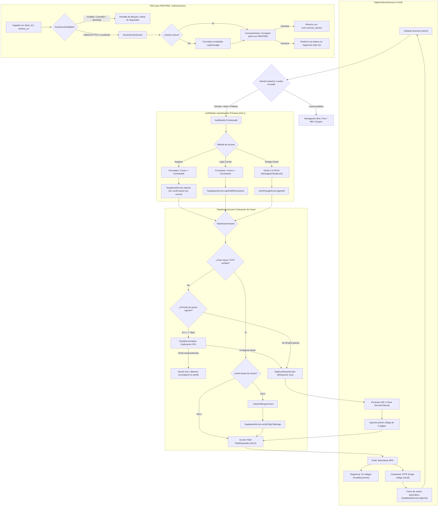

# 07 — Autenticación y Seguridad

> Especificación de requisitos de experiencia de usuario (UX) para el sistema de autenticación y seguridad de **Comunidad Universitaria USAC**: modo visitante, registro e inicio de sesión con correo/contraseña sin OTP de correo, Google OAuth con PKCE, autenticación multifactor TOTP, período de gracia y servidor SSO para PEMTREE. La app no envía códigos de confirmación de registro ni de recuperación de contraseña por correo. Convenciones, matriz de roles y plantilla en [`README.md`](README.md).

---

## 1. Visión y arquitectura de autenticación y seguridad

La seguridad en la plataforma **Comunidad Universitaria USAC** se fundamenta en un equilibrio indispensable entre **privacidad estudiantil**, **integridad comunitaria** y **prevención de abusos** ([ver `01-producto.md`](01-producto.md#11-pilares-de-valor)):

1. **Lectura libre sin barreras de entrada (Modo Visitante):** Todo estudiante o interesado debe poder consultar información académica, horarios, recomendaciones de cursos y ofertas del marketplace sin necesidad de crear una cuenta ni entregar sus datos de antemano.
2. **Escritura protegida bajo AAL2 (Authenticator Assurance Level 2):** Para erradicar la suplantación de identidad, la proliferación de bots, el spam comercial y la manipulación de encuestas estudiantiles, toda acción que altere el estado de la base de datos (publicar, comentar, votar, listar productos, compartir grupos o reportar) exige que la sesión cuente con un segundo factor criptográfico verificado por aplicación de códigos temporales (TOTP).
3. **Seguridad educativa y proporcional (No punitiva):** Las medidas de protección no deben alienar al alumnado. El enrolamiento de segundo factor debe explicar con claridad su propósito pedagógico y brindar un **período de gracia** de 7 días antes de volverse mandatario para la publicación, permitiendo al usuario explorar la herramienta sin fricciones artificiales.
4. **Federación académica soberana (SSO para PEMTREE):** La plataforma actúa como proveedor seguro de identidad OAuth 2.0 / PKCE para herramientas satélite creadas por y para estudiantes (como el visor de planes de estudio _PEMTREE_), salvaguardando los tokens de sesión en fragmentos hash de URL para impedir su filtración en servidores intermedios y aplicando listas blancas estrictas contra vulnerabilidades de redirección abierta (_Open Redirect_).

---

## 2. Relación con el inventario UX y mejoras estructurales

Este documento formaliza y eleva la experiencia analizada en el **Inventario UX**, abordando de manera directa:

- **Inventario 4.7 (`TotpEnrollmentScreen`):** Enrolamiento por QR, copia de secreto manual y desvinculación con reautenticación limpia. Los códigos de recuperación MFA están aplazados ([`totp_enrollment_screen.dart`](../../comunidad_universitaria/lib/features/profile/screens/totp_enrollment_screen.dart)).
- **Inventario 4.8 (`SsoAuthorizeScreen`):** Servidor de autorización OAuth 2.0, formulario de inicio de sesión embebido para visitantes, pantalla de consentimiento y transporte de credenciales ([`sso_authorize_screen.dart:1-901`](../../comunidad_universitaria/lib/features/sso/screens/sso_authorize_screen.dart)).
- **Inventario 4.10 (`AuthModal`):** Modal adaptativo (BottomSheet en móvil, Dialog en desktop) para login, registro sin OTP por correo y acceso Google ([`auth_modal.dart`](../../comunidad_universitaria/lib/features/shared/widgets/auth_modal.dart)).
- **Inventario 5.1, 5.2, 5.3 y 5.8:** Registro sin confirmación OTP por correo, activación obligatoria de MFA TOTP y flujo SSO. La recuperación de contraseña por correo está aplazada.
- **Inventario 8.1 / Vacío 1 `[Mejora]`:** Sustitución del bloqueo repentino y obligatorio de MFA en el primer registro por una inducción explicativa con período de gracia de 7 días ([`totp_session_guard.dart:90-96`](../../comunidad_universitaria/lib/features/shared/widgets/totp_session_guard.dart#L90-L96)).
- **Inventario 8.6 / Vacío 6 `[Mejora]`:** Eliminación de la sobreescritura arbitraria de la URI de redirección hacia `localhost:5173` cuando se ejecutan pruebas en hosts locales, respetando la URL legítima solicitada por PEMTREE ([`sso_authorize_screen.dart:188-194`](../../comunidad_universitaria/lib/features/sso/screens/sso_authorize_screen.dart#L188-L194)).

---

## 3. Matriz de capacidades de acceso y seguridad por rol

| Capacidad                                 |  Visitante (Sin sesión)  |  Estudiante en Gracia (AAL1)  | Estudiante Activo (AAL2) | Estudiante Verificado (AAL2) | Vendedor externo verificado (AAL2) | Moderador (AAL2) | Administrador (AAL2) |
| ----------------------------------------- | :----------------------: | :---------------------------: | :----------------------: | :--------------------------: | :--------------------------------: | :--------------: | :------------------: |
| Explorar foro, marketplace y grupos       |          Hecho           |             Hecho             |          Hecho           |            Hecho             |               Hecho                |      Hecho       |        Hecho         |
| Buscar contenidos y filtrar facultades    |          Hecho           |             Hecho             |          Hecho           |            Hecho             |               Hecho                |      Hecho       |        Hecho         |
| Iniciar sesión (Correo / Google)          |          Hecho           |              N/A              |           N/A            |             N/A              |                N/A                 |       N/A        |         N/A          |
| Crear nueva cuenta comunitaria            |          Hecho           |              N/A              |           N/A            |             N/A              |                N/A                 |       N/A        |         N/A          |
| Publicar temas y comentarios en el foro   |  Falta _(interceptado)_  | Hecho _(hasta vencer gracia)_ |          Hecho           |            Hecho             |            Falta / N-A             |      Hecho       |        Hecho         |
| Votar en encuestas y reacciones (_likes_) |  Falta _(interceptado)_  | Hecho _(hasta vencer gracia)_ |          Hecho           |            Hecho             |            Falta / N-A             |      Hecho       |        Hecho         |
| Publicar artículos en el marketplace      |  Falta _(interceptado)_  |    Falta _(requiere AAL2)_    | Falta _(requiere verificación)_ |     Hecho _(carné)_      |               Hecho                |      Hecho       |        Hecho         |
| Registrar nuevos grupos de WhatsApp       |  Falta _(interceptado)_  |    Falta _(requiere AAL2)_    |          Hecho           |            Hecho             |            Falta / N-A             |      Hecho       |        Hecho         |
| Votar reputación de grupos (_upvote_)     |  Falta _(interceptado)_  | Hecho _(hasta vencer gracia)_ |          Hecho           |            Hecho             |            Falta / N-A             |      Hecho       |        Hecho         |
| Códigos de recuperación MFA (aplazados)   |       No disponible      |        No disponible         |     No disponible       |       No disponible          |          No disponible            | No disponible    | No disponible        |
| Desactivar segundo factor TOTP            |          Falta           |             Falta             |          Hecho           |            Hecho             |               Hecho                |      Hecho       |        Hecho         |
| Autorizar accesos SSO (PEMTREE)           | Falta _(login embebido)_ |   Hecho _(AAL1 suficiente)_   |          Hecho           |            Hecho             |            Falta / N-A             |      Hecho       |        Hecho         |
| Acceder a funciones de moderación         |          Falta           |             Falta             |          Falta           |            Falta             |               Falta                |      Hecho       |        Hecho         |

*Nota: El acceso pleno al foro con correo personal exige la validación de carné (UX-AUTH-016). La admisión de vendedores externos no estudiantes está cubierta en UX-PRF-035.*

---

## 4. Diagrama de flujo de autenticación, ciclo de vida de sesión y MFA

---

## 5. Requisitos de experiencia de usuario (UX-AUTH)

### UX-AUTH-001 — Modo visitante con lectura pública y barrera contextual de autenticación

- **Actor / rol:** Visitante (Guest / Usuario no autenticado)
- **Prioridad:** Must
- **Estado objetivo:** La plataforma ofrece acceso abierto, instantáneo y completo en modo de solo lectura a todas las secciones de consulta pública (canales del foro estudiantil, árbol de comentarios, catálogo y detalle de productos en marketplace, directorio de grupos de estudio por facultad, normas de convivencia y perfiles públicos de estudiantes). Si el visitante intenta ejecutar cualquier acción de escritura o participación comunitaria (crear una publicación, comentar en un hilo, votar en una encuesta, dar me gusta, guardar un marcador, publicar un producto, solicitar patrocinio, registrar un grupo de estudio, votar reputación de un enlace o enviar un reporte), la interfaz no lo bloquea de forma abrupta ni lo redirige a una pantalla en blanco; en su lugar, despliega de forma contextual el componente `AuthModal`, preservando en memoria la acción que el usuario intentaba realizar para reanudarla automáticamente una vez completado el inicio de sesión.
- **Precondiciones:** La aplicación se ejecuta con la llave anónima de Supabase sin una sesión de usuario autenticada (`SupabaseService.currentUser == null` o `isAnonymous == true`).
- **UI / contenido:**
  - En la cabecera superior y en el sidebar del foro se exhibe el indicador de estado "Modo Visitante" junto con un botón visible "Iniciar Sesión" (`#004B87`).
  - Al presionar un botón de acción interactiva (p. ej. "Votar" en una encuesta o "Publicar Anuncio"), se abre `AuthModal` con un título contextual dinámico adaptado a la intención:
    - En foro: "Inicia sesión para participar en el debate".
    - En encuestas: "Inicia sesión para registrar tu voto estudiantil".
    - En marketplace: "Inicia sesión para publicar en el Marketplace".
    - En grupos: "Inicia sesión para compartir un grupo de estudio".
  - Subtítulo explicativo: "La lectura es libre para toda la comunidad USAC. Para publicar y votar protegemos las cuentas con autenticación estudiantil".
- **Interacciones:**
  - El usuario puede cerrar el modal de autenticación mediante el botón de cierre (icono `Icons.close`) o deslizando hacia abajo en móvil, permaneciendo exactamente en la pantalla y posición de scroll en la que se encontraba, sin perder ningún dato de visualización.
  - Al completar el inicio de sesión o registro con éxito dentro del modal, este se cierra de inmediato y se dispara el callback `onAuthenticated()`, ejecutando o abriendo automáticamente el formulario que motivó la intercepción (p. ej. abriendo `CreatePostDialog`).
- **Estados:**
  - _Inicial / Reposo:_ Navegación fluida por todas las pantallas públicas.
  - _Interceptado:_ Despliegue suave del modal con fondo oscurecido translúcido (scrim al 50%).
  - _Éxito:_ Autenticación consumada; transición animada hacia el estado autenticado reanudando la acción pendiente.
  - _Sin conexión:_ La lectura pública continúa funcionando a través de los datos persistidos en caché local (`CacheService`).
- **Validaciones y reglas de negocio:**
  - Respaldo técnico: [`supabase_service.dart:44-49`](../../comunidad_universitaria/lib/core/services/supabase_service.dart#L44-L49) y [`auth_modal.dart:23-57`](../../comunidad_universitaria/lib/features/shared/widgets/auth_modal.dart#L23-L57).
  - Las políticas de seguridad a nivel de fila (RLS) en PostgreSQL deniegan cualquier operación `INSERT`, `UPDATE` o `DELETE` proveniente del rol anónimo de Supabase (`anon`).
- **Accesibilidad:**
  - El foco semántico se transfiere automáticamente al modal cuando se abre y regresa al elemento disparador cuando se cancela.
  - Los lectores de pantalla anuncian claramente: "Diálogo de autenticación: Inicia sesión para continuar".
- **Responsive:**
  - En móvil (`< 700px`): Se presenta como un `showModalBottomSheet` deslizable con esquinas redondeadas superiores de 20px y ajuste automático al teclado virtual (`useSafeArea: true`).
  - En tablet y desktop (`>= 700px`): Se renderiza como un `showDialog` centrado de 440px de ancho fijo.
- **Criterios de aceptación (Gherkin):**
  - **Given** un visitante anónimo que navega por el canal `# dudas-y-pensum` del foro, **When** pulsa el botón "Votar" en una encuesta activa, **Then** se abre `AuthModal` con el título "Inicia sesión para registrar tu voto estudiantil" y el contenido de fondo permanece visible pero inactivo.
  - **Given** un visitante que fue interceptado por `AuthModal` al intentar publicar en el Marketplace, **When** pulsa el icono de cerrar o el botón retroceder de su dispositivo, **Then** el modal se descarta, el usuario permanece en el catálogo de marketplace y no se produce ninguna redirección de pantalla.

---

### UX-AUTH-002 — Registro de cuenta estudiantil con correo y contraseña

- **Actor / rol:** Visitante (Estudiante no registrado)
- **Prioridad:** Must
- **Estado objetivo:** El estudiante puede crear una cuenta en la plataforma ingresando su correo electrónico y una contraseña robusta. La interfaz asiste al usuario validando el formato de correo en tiempo real, permitiendo alternar la visibilidad de la contraseña con un toque, evaluando la longitud mínima (al menos 6 caracteres requeridos por Supabase Auth) y presentando un enlace directo a las normas de convivencia y al descargo de responsabilidad institucional antes de enviar la solicitud.
- **Precondiciones:** Acceso a `AuthModal` en modo de registro (`_isSignUp = true`).
- **UI / contenido:**
  - Encabezado: Título "Crear Cuenta Estudiantil" e icono de birrete universitario (`Icons.school_outlined`).
  - Subtítulo: "Únete a la plataforma colaborativa e independiente de la comunidad USAC".
  - Campo de texto para Correo: Etiqueta "Correo electrónico", texto de ayuda "tu_correo@ejemplo.com", icono prefijo `Icons.email_outlined`. Se admiten correos institucionales de la lista USAC configurable por administradores (otorgan acceso directo al foro) y correos personales (exigirán validación de carné para acceso, ver UX-AUTH-016).
  - Campo de texto para Contraseña: Etiqueta "Contraseña (mínimo 6 caracteres)", icono prefijo `Icons.lock_outline`, botón sufijo interactivo para alternar entre ver/ocultar caracteres (`Icons.visibility` / `Icons.visibility_off`).
  - Indicador visual de seguridad de contraseña: Barra delgada reactiva que pasa de rojo (débil: < 6 caracteres), amarillo (aceptable: 6-8 caracteres) a verde (fuerte: > 8 caracteres con combinación de números y letras).
  - Texto legal al pie: "Al registrarte aceptas las [Normas de Convivencia](rules) de la Comunidad USAC".
  - Botón principal de acción: `ElevatedButton` ancho completo con fondo azul institucional USAC (`#004B87`), texto blanco en negrita "Registrarme".
  - Enlace de conmutación: Botón de texto inferior "¿Ya tienes cuenta? Inicia sesión aquí".
- **Interacciones:**
  - Al escribir en los campos, la validación sintáctica (`_formKey.currentState!.validate()`) proporciona retroalimentación sin bloquear la escritura.
  - Al presionar "Registrarme", el botón deshabilita clics subsecuentes y muestra un indicador de progreso circular blanco (`CircularProgressIndicator`, 18px).
  - Se invoca `SupabaseService.signUp(email, password)`. La cuenta y sesión se crean sin enviar OTP por correo; el guard TOTP gestiona el segundo factor.
- **Estados:**
  - _Inicial:_ Formulario vacío con foco disponible en el campo de correo.
  - _Carga:_ Botón en estado de carga con spinner activo.
  - _Error de validación inline:_ Mensajes de error en rojo bajo cada campo ("Ingresa un correo válido", "La contraseña debe tener al menos 6 caracteres").
  - _Error del servidor:_ Tarjeta destacada roja superior con mensaje humanizado (p. ej. "Este correo ya se encuentra registrado. Inicia sesión o usa Google si corresponde").
  - _Éxito:_ Se crea la cuenta y continúa al guard de sesión TOTP.
- **Validaciones y reglas de negocio:**
  - Respaldo técnico: [`auth_modal.dart:175-210`](../../comunidad_universitaria/lib/features/shared/widgets/auth_modal.dart#L175-L210) y [`supabase_service.dart:185-215`](../../comunidad_universitaria/lib/core/services/supabase_service.dart#L185-L215).
  - El correo es normalizado (recorte de espacios y minúsculas) antes del envío.
  - La contraseña no puede contener espacios en blanco iniciales o finales.
  - El sistema clasifica el correo ingresado como institucional o personal comparando su dominio contra la lista configurable gestionada por administradores.
- **Accesibilidad:**
  - Contraste superior a 4.5:1 en todos los textos e iconos.
  - La alternancia de visibilidad de contraseña anuncia: "Contraseña visible" o "Contraseña oculta".
- **Responsive:**
  - En móvil, se adapta a la aparición del teclado virtual mediante `viewInsets.bottom` para evitar que el botón quede oculto.
- **Criterios de aceptación (Gherkin):**
  - **Given** un visitante en `AuthModal` con el formulario de registro visible, **When** ingresa un correo con formato válido y una contraseña de 8 caracteres y pulsa "Registrarme", **Then** el sistema crea la cuenta e inicia sesión sin enviar OTP por correo, y continúa al flujo de seguridad TOTP.
  - **Given** un visitante que intenta registrarse con una contraseña de 4 caracteres, **When** pulsa "Registrarme", **Then** el formulario no se envía, se muestra el mensaje de error inline "La contraseña debe tener al menos 6 caracteres" y el foco se sitúa en dicho campo.

---

### UX-AUTH-003 — Confirmación OTP por correo [Retirada]

La app ya no solicita ni verifica códigos OTP enviados por correo durante el
registro. La configuración local establece `auth.email.enable_confirmations =
false`; el proyecto remoto debe tener también **Confirm email** desactivado en
Authentication > Sign In / Providers > Email. El registro sin confirmación no
verifica que la persona controle la dirección de correo; TOTP es un segundo
factor y no sustituye esa comprobación.

---

### UX-AUTH-004 — Inicio de sesión con credenciales de correo y contraseña

- **Actor / rol:** Estudiante registrado, Estudiante verificado, Moderador, Administrador
- **Prioridad:** Must
- **Estado objetivo:** El estudiante con cuenta existente puede autenticarse ingresando su correo y contraseña. La pantalla maneja con empatía los errores de autenticación. La confirmación de correo está desactivada para este proyecto; si la instancia remota aún la exige, la interfaz indica que se desactive `Confirm email` en la configuración de Auth.
- **Precondiciones:** Acceso a `AuthModal` en modo de acceso tradicional (`_isSignUp = false`).
- **UI / contenido:**
  - Título principal: "Iniciar Sesión en Comunidad USAC".
  - Subtítulo: "Ingresa tus credenciales para acceder a tus publicaciones y preferencias".
  - Campo Correo electrónico con validación de sintaxis básica.
  - Campo Contraseña con botón interactivo para mostrar u ocultar caracteres.

  - Botón primario de envío: "Iniciar Sesión" (`ElevatedButton` azul USAC `#004B87`).
  - Separador horizontal visual con el texto "O continúa con".
  - Botón oficial de acceso con Google OAuth (`UX-AUTH-006`).
  - Enlace inferior de registro: "¿No tienes una cuenta aún? Regístrate gratis".
- **Interacciones:**
  - Al presionar "Iniciar Sesión", se ejecuta `SupabaseService.signInWithEmail(email, password)`.
  - Si el inicio de sesión es exitoso, el modal se descarta de inmediato. El guardián de seguridad `TotpSessionGuard` evalúa el nivel de aseguramiento de la sesión:
    - Si el usuario ya tiene TOTP activado pero la sesión está en AAL1, se despliega el desafío de seguridad `_TotpChallengeScreen` (`UX-AUTH-011`).
    - Si el usuario no tiene TOTP configurado, se evalúa el período de gracia o se presenta la inducción MFA (`UX-AUTH-008`).
  - Si el backend devuelve `email_not_confirmed`, se informa que debe desactivarse `Confirm email` en Supabase; no se ofrece envío ni verificación de OTP.
- **Estados:**
  - _Inicial:_ Formulario listo para ingreso de credenciales.
  - _Cargando:_ Botón con spinner de progreso; campos de texto inhabilitados para evitar envíos duplicados.
  - _Error de credenciales:_ Tarjeta roja inline con el texto: "Credenciales inválidas. Verifica tu correo y contraseña".
  - _Error de configuración remota:_ Instrucción para desactivar `Confirm email` en Supabase; no se solicita código.
  - _Éxito:_ Cierre del modal y actualización del estado de sesión global.
- **Validaciones y reglas de negocio:**
  - Respaldo técnico: [`auth_modal.dart:150-173`](../../comunidad_universitaria/lib/features/shared/widgets/auth_modal.dart#L150-L173) y [`supabase_service.dart:155-180`](../../comunidad_universitaria/lib/core/services/supabase_service.dart#L155-L180).
  - La función `_friendlyAuthError` mapea sistemáticamente los códigos de error internos de Supabase a mensajes comprensibles para el usuario.
- **Accesibilidad:**
  - Navegación lógica mediante tecla Tab entre campos y botón de envío.
  - Mensajes de error anunciados automáticamente a lectores de pantalla con rol de alerta.
- **Responsive:**
  - Modal adaptativo a pantalla completa con scroll seguro en pantallas móviles de baja resolución.
- **Criterios de aceptación (Gherkin):**
  - **Given** un estudiante registrado que ingresa su correo y contraseña correctos, **When** pulsa "Iniciar Sesión", **Then** el sistema autentica la cuenta, descarta el modal y continúa al flujo correspondiente según su estado de MFA.
  - **Given** un usuario que introduce una contraseña equivocada, **When** pulsa "Iniciar Sesión", **Then** el formulario no se borra, se presenta el mensaje de error en tarjeta destacada "Credenciales inválidas. Verifica tu correo y contraseña" y el campo de contraseña queda seleccionado para su corrección.

---

### UX-AUTH-005 — Recuperación de contraseña por correo [Aplazada]

- **Estado:** No disponible en la app. Se retiraron la solicitud, el envío y el
  flujo de restablecimiento por correo.
- **Motivo:** No se configuró un proveedor de correo con límites adecuados.
- **Alcance:** El registro tampoco envía OTP ni solicita confirmación por
  correo. TOTP es un segundo factor; no valida la dirección ni recupera una
  contraseña.

---

### UX-AUTH-006 — Autenticación federada mediante Google OAuth con PKCE

- **Actor / rol:** Todos los roles (Visitante, Estudiante, Moderador, Administrador)
- **Prioridad:** Must
- **Estado objetivo:** La plataforma permite acceder de forma ágil mediante cuentas de Google institucionales o personales, utilizando el estándar seguro OAuth 2.0 con Proof Key for Code Exchange (PKCE). La experiencia es completamente reactiva: en navegadores web captura la redirección mediante el origen de la ventana (`window.location.origin`), mientras que en dispositivos móviles Android e iOS gestiona el retorno mediante esquemas de enlaces profundos (_Deep Links_ / `comunidadusac://login-callback/`). Durante la interacción con el proveedor externo, la interfaz local exhibe un estado de espera comprensible con opción de cancelación manual.
- **Precondiciones:** Acceso a `AuthModal` o a la pantalla de autorización SSO.
- **UI / contenido:**
  - Botón prominente de Google: Fondo en superficie blanca/clara con borde sutil, icono oficial de Google ("G" multicolor), tipografía en peso semi-negrito: `"Continuar con Google"`.
  - Estado de espera activo: Si el usuario pulsa el botón y la ventana externa está abierta, el modal se transforma en una tarjeta de sincronización con:
    - Indicador de progreso circular suave (`CircularProgressIndicator`).
    - Texto explicativo: "Esperando confirmación en tu navegador...".
    - Subtítulo: "Completa el inicio de sesión en la ventana de Google para regresar a Comunidad USAC".
    - Botón secundario: "Cancelar y volver".
- **Interacciones:**
  - Pulsar el botón ejecuta `SupabaseService.signInWithGoogle(redirectTo)`.
  - La aplicación suscribe un listener a `client.auth.onAuthStateChange`. Al recibir el evento `AuthChangeEvent.signedIn`, la suscripción se cancela limpiamente, el modal se cierra y se notifica a la pantalla invocadora.
  - Si el usuario cierra o cancela la ventana emergente de Google en su navegador, puede pulsar "Cancelar y volver" para restablecer el formulario sin que la app quede congelada.
- **Estados:**
  - _Reposo:_ Botón listo para ser presionado.
  - _Conectando:_ Lanzamiento del flujo OAuth en el navegador del sistema.
  - _Esperando retorno:_ Modal en espera con spinner y botón de cancelación.
  - _Error de conexión:_ Tarjeta roja "Error al conectar con Google: [mensaje]".
  - _Éxito:_ Cierre del modal y paso al guardián de sesión `TotpSessionGuard`.
- **Validaciones y reglas de negocio:**
  - Respaldo técnico: [`auth_modal.dart:100-148`](../../comunidad_universitaria/lib/features/shared/widgets/auth_modal.dart#L100-L148) y configuraciones en `android/app/src/main/AndroidManifest.xml` e `ios/Runner/Info.plist`.
  - Manejo de plataforma: En web utiliza `Uri.base.toString()`, en móvil utiliza el esquema URL `comunidadusac`.
- **Accesibilidad:**
  - El botón posee etiqueta semántica: "Iniciar sesión con cuenta de Google mediante autenticación segura".
- **Responsive:**
  - El botón ocupa el 100% del ancho del modal manteniendo una altura táctil óptima de 48px.
- **Criterios de aceptación (Gherkin):**
  - **Given** un estudiante en la aplicación móvil que pulsa "Continuar con Google", **When** autoriza su cuenta en el navegador del dispositivo y el deep link retorna a la app, **Then** el sistema detecta el inicio de sesión, cierra el diálogo de espera y activa la sesión del usuario.
  - **Given** un estudiante que abre el flujo de Google pero decide cerrar la pestaña externa, **When** regresa a la app y pulsa "Cancelar y volver", **Then** el modal cancela la espera y vuelve a presentar los botones de acceso tradicionales.

---

### UX-AUTH-007 — Cierre de sesión seguro y revocación local de credenciales

- **Actor / rol:** Estudiante registrado, Estudiante verificado, Moderador, Administrador
- **Prioridad:** Must
- **Estado objetivo:** El estudiante puede cerrar su sesión de manera voluntaria y segura en cualquier momento desde la sección de "Cuenta y Preferencias" en su perfil (`ProfileScreen`), o como vía de escape garantizada desde las pantallas de desafío o bloqueo de seguridad (`TotpSessionGuard`). Al ejecutar el cierre, el sistema revoca los tokens de refresco en los servidores de Supabase, limpia todas las credenciales cacheadas en memoria y almacenamiento seguro, revoca el estado AAL2 activo y devuelve al usuario al cascarón principal en modo visitante, restableciendo su seudónimo local sin dejar rastros de información personal de la cuenta saliente.
- **Precondiciones:** Sesión de usuario autenticada activa en Supabase.
- **UI / contenido:**
  - En `ProfileScreen`: Botón estilizado con borde rojo suave o icono `Icons.logout`, con etiqueta `"Cerrar Sesión"`.
  - En pantallas de desafío (`_TotpChallengeScreen` y pantallas de error de seguridad): Botón permanente en la barra superior (`AppBar`) con etiqueta de texto `"Cerrar sesión"`, ofreciendo siempre una salida para usuarios que hayan perdido sus factores de autenticación.
  - Diálogo de confirmación modal (`AlertDialog`):
    - Título: "Cerrar Sesión".
    - Contenido: "¿Estás seguro de que deseas cerrar tu sesión en este dispositivo? Deberás ingresar tus credenciales y tu factor de autenticación la próxima vez que ingreses".
    - Botones: "Cancelar" (estilo neutro) y "Cerrar Sesión" (estilo destructivo rojo `#DC2626`).
- **Interacciones:**
  - Al confirmar en el diálogo, se ejecuta `SupabaseService.signOut()`.
  - El guardián `TotpSessionGuard` recibe el evento `AuthChangeEvent.signedOut` mediante su listener y ejecuta `_clearGate()`, disolviendo cualquier pantalla de bloqueo.
  - La aplicación redirige al usuario a la vista principal del foro en modo visitante y muestra un SnackBar informativo: "Has cerrado sesión correctamente".
- **Estados:**
  - _Reposo:_ Botón disponible en la interfaz.
  - _Cerrando sesión:_ Botón con indicador de carga deshabilitado.
  - _Éxito:_ Transición limpia al modo visitante.
- **Validaciones y reglas de negocio:**
  - Respaldo técnico: [`totp_session_guard.dart:114-120`](../../comunidad_universitaria/lib/features/shared/widgets/totp_session_guard.dart#L114-L120) y [`profile_screen.dart:1463-1469`](../../comunidad_universitaria/lib/features/profile/screens/profile_screen.dart#L1463-L1469).
  - La invocación a `signOut()` invalida el token de refresco en la base de datos de autenticación de Supabase.
- **Accesibilidad:**
  - El diálogo de confirmación captura el foco e impide clics accidentales fuera del área de decisión.
- **Responsive:**
  - Diálogo centrado en todas las resoluciones.
- **Criterios de aceptación (Gherkin):**
  - **Given** un estudiante autenticado en su pantalla de perfil que pulsa "Cerrar Sesión", **When** confirma la acción en el diálogo de alerta, **Then** la sesión se cancela en Supabase, la app pasa a modo visitante y el perfil muestra el avatar genérico local.
  - **Given** un usuario que se encuentra en la pantalla de desafío de seguridad TOTP y no tiene su autenticador a mano, **When** pulsa el botón "Cerrar sesión" de la barra superior, **Then** el sistema cancela la sesión y lo regresa a la navegación libre del foro sin quedar atrapado en el bloqueo.

---

### UX-AUTH-008 — Onboarding de MFA TOTP con explicación formativa y período de gracia `[Mejora]`

- **Actor / rol:** Estudiante recién registrado o ingresado con Google por primera vez (Nivel AAL1 sin MFA previo)
- **Prioridad:** Must
- **Estado objetivo:** Tras autenticarse por primera vez, el estudiante no es sometido a un bloqueo repentino de la aplicación; en su lugar, se le presenta una pantalla de bienvenida e inducción pedagógica que explica en lenguaje amigable el propósito de la autenticación en dos pasos (proteger su identidad universitaria, blindar la confianza en el marketplace y evitar secuestro de seudónimos). Se implementa un **período de gracia de 7 días naturales** (contados a partir de la creación de la cuenta) durante el cual el alumno puede elegir "Configurar más tarde" para familiarizarse con la plataforma y realizar sus primeras lecturas y aportes antes de que el enrolamiento sea de cumplimiento estricto. Durante la vigencia de la gracia, un banner informativo no intrusivo en su perfil le recuerda los días restantes.
- **Problema actual [Mejora]:** En la implementación actual ([`totp_session_guard.dart:90-96`](../../comunidad_universitaria/lib/features/shared/widgets/totp_session_guard.dart#L90-L96)), `TotpSessionGuard` envuelve la app entera en `main.dart` y en el instante exacto en que un estudiante se registra o ingresa con Google, bloquea inmediatamente toda la interfaz con `TotpEnrollmentScreen(isRequired: true)` (`PopScope(canPop: false)`). La app no ofrece período de gracia alguno ni una explicación previa de por qué una herramienta universitaria exige instalar apps como Google Authenticator, provocando una tasa de abandono masiva de nuevos usuarios (detectado en Inventario UX 8.1 / Vacío 1).
- **Precondiciones:** Sesión activa recién creada en nivel AAL1 donde la lista de factores TOTP verificados está vacía (`verifiedFactors.isEmpty`).
- **UI / contenido:**
  - Ilustración o icono destacado de seguridad comunitaria (`Icons.security_update_good`, 56px, en azul institucional `#004B87`).
  - Título principal: "Protege tu identidad en la Comunidad USAC".
  - Subtítulo: "Tu cuenta utiliza verificación en dos pasos (TOTP) para garantizar que nadie suplante tu seudónimo ni manipule tus publicaciones".
  - Tarjeta con 3 pilares formativos:
    1. _Privacidad blindada:_ Tus aportes y votos en el foro están asegurados frente a accesos indebidos.
    2. _Confianza en Marketplace:_ Compradores y vendedores interactúan sabiendo que las cuentas son legítimas.
    3. _Independencia total:_ Funciona con cualquier app de autenticación estándar (Google Authenticator, Microsoft Authenticator o Authy) sin depender de SMS ni datos de terceros.
  - Botón primario de acción: "Configurar autenticador ahora" (`ElevatedButton` azul con icono `Icons.qr_code_2`).
  - Botón secundario con período de gracia: `"Configurar más tarde (Te quedan [N] días de prueba)"` (`TextButton` con icono `Icons.access_time`).
  - En `ProfileScreen` (durante el período de gracia): Banner informativo de tono ámbar suave en la parte superior: "Protección pendiente: Te quedan [N] días para activar tu autenticador en dos pasos antes de que sea obligatorio para publicar. [Configurar ahora]".
- **Interacciones:**
  - Si el alumno pulsa "Configurar autenticador ahora", la interfaz avanza al asistente de enrolamiento por QR (`UX-AUTH-009`).
  - Si el alumno pulsa "Configurar más tarde", se registra la marca de gracia en el cliente y el guardián libera la pantalla (`_clearGate()`), permitiéndole utilizar la aplicación de inmediato.
  - Al expirar los 7 días de gracia: Si el alumno intenta realizar cualquier acción de publicación o escritura, `TotpSessionGuard` intercepta la acción y exige completar el enrolamiento de forma mandataria sin posibilidad de postergación adicional.
- **Estados:**
  - _Inducción inicial:_ Presentación formativa con ambas opciones.
  - _Período de gracia activo:_ Navegación habilitada con banner recordatorio visible en el perfil.
  - _Período de gracia expirado:_ Requerimiento estricto de enrolamiento al intentar mutaciones.
- **Validaciones y reglas de negocio:**
  - Respaldo técnico: Modificación conceptual sobre [`totp_session_guard.dart:61-102`](../../comunidad_universitaria/lib/features/shared/widgets/totp_session_guard.dart#L61-L102).
  - La fecha de gracia se calcula como `user.createdAt + 7 días`. Durante este lapso, el usuario puede operar con nivel de aseguramiento AAL1.
- **Accesibilidad:**
  - Los pilares formativos se agrupan en una lista semántica con contraste superior a 4.5:1.
  - Botones táctiles con altura mínima de 48px y espaciado generoso.
- **Responsive:**
  - En móviles, la tarjeta se adapta a desplazamiento vertical fluido dentro de un contenedor centrado (`maxWidth: 480px`).
- **Criterios de aceptación (Gherkin):**
  - **Given** un estudiante que acaba de registrarse por primera vez en la app, **When** culmina la verificación de su correo, **Then** visualiza la pantalla pedagógica que explica la seguridad comunitaria y exhibe el botón "Configurar más tarde" con el contador de 7 días de gracia.
  - **Given** un estudiante que pulsa "Configurar más tarde", **When** navega hacia su perfil, **Then** la app le permite utilizar el sistema y muestra un banner informativo con los días restantes del período de gracia y un botón para activarlo cuando lo desee.
  - **Given** un estudiante cuyo período de gracia de 7 días ha finalizado sin enrolar TOTP, **When** intenta crear una publicación en el foro, **Then** el sistema bloquea la acción y lo conduce obligatoriamente al enrolamiento de TOTP.

---

### UX-AUTH-009 — Enrolamiento de MFA TOTP mediante código QR y clave secreta manual

- **Actor / rol:** Estudiante registrado configurando su segundo factor
- **Prioridad:** Must
- **Estado objetivo:** Asistente paso a paso para la vinculación de un factor de autenticación TOTP. El sistema genera un nuevo secreto criptográfico emitido a nombre de "Comunidad USAC" y presenta simultáneamente: (1) Un código QR nítido de alto contraste generado localmente mediante `qr_flutter` para escaneo rápido con otro dispositivo; (2) La clave secreta alfanumérica visible en tipografía monoespaciada con botón de copiado en un clic para estudiantes que configuran el autenticador en el mismo teléfono móvil; (3) Campo para ingresar el primer código de 6 dígitos emitido por la app autenticadora para verificar la sincronización y elevar la sesión de inmediato a nivel AAL2.
- **Precondiciones:** Sesión AAL1 activa; acceso a `TotpEnrollmentScreen`.
- **UI / contenido:**
  - Título: "Configurar autenticador en dos pasos (TOTP)".
  - Paso 1 ("Escanea el código con tu app autenticadora"):
    - Contenedor con fondo blanco puro y esquinas redondeadas alojando el widget `QrImageView` (tamaño de 220x220px).
    - Texto explicativo: "Abre Google Authenticator, Microsoft Authenticator o tu app preferida y escanea este código".
    - Alternativa manual: Contenedor destacado con etiqueta "O ingresa esta clave manualmente:", texto seleccionable de la clave secreta (`SelectableText`, estilo monoespaciado negrita con espaciado amplio) y botón `IconButton(Icons.copy)` con tooltip "Copiar clave secreta".
  - Paso 2 ("Confirma el código generado"):
    - Campo de texto centrado para 6 dígitos numéricos con icono `Icons.password_outlined`.
    - Botón primario: "Verificar y activar" (`ElevatedButton`), con spinner cuando se procesa la validación.
  - Banners de error amigables en caso de código incorrecto o desfase horario en el dispositivo.
- **Interacciones:**
  - Pulsar el botón de copiar copia el secreto al portapapeles y despliega un SnackBar breve: "Clave secreta copiada al portapapeles".
  - Al ingresar los 6 dígitos y pulsar "Verificar y activar", se invoca `SupabaseService.verifyTotpEnrollment(factorId, code)`.
  - Si el código es correcto, el factor se marca como verificado en Supabase y la sesión se eleva a nivel AAL2. La generación de códigos de recuperación MFA está aplazada (`UX-AUTH-010`).
- **Estados:**
  - _Generando secreto:_ Indicador circular mientras se ejecuta `beginTotpEnrollment()`.
  - _Listo para enrolar:_ QR visible, clave disponible y campo de confirmación habilitado.
  - _Verificando:_ Botón con spinner de progreso activo.
  - _Error de código:_ Notificación roja "El código no es válido o ya venció. Revisa tu app autenticadora".
  - _Éxito:_ Factor verificado; se completa el enrolamiento TOTP.
- **Validaciones y reglas de negocio:**
  - Respaldo técnico: [`totp_enrollment_screen.dart:85-155`](../../comunidad_universitaria/lib/features/profile/screens/totp_enrollment_screen.dart#L85-L155) y [`supabase_service.dart:310-345`](../../comunidad_universitaria/lib/core/services/supabase_service.dart#L310-L345).
  - Antes de generar un nuevo secreto, la función limpia factores previos en estado no verificado para evitar factores huérfanos que impidan enrolamientos futuros.
- **Accesibilidad:**
  - El código QR incluye etiqueta semántica descriptiva para usuarios con baja visión indicando que existe una alternativa manual de copiado de clave.
  - La clave alfanumérica cuenta con espaciado de letras ampliado para facilitar su lectura carácter por carácter.
- **Responsive:**
  - En pantallas de escritorio, el QR y las instrucciones se presentan en una tarjeta espaciosa de 520px; en móvil, se adapta verticalmente con scroll fluido.
- **Criterios de aceptación (Gherkin):**
  - **Given** un estudiante que inicia el enrolamiento de TOTP, **When** la pantalla carga el secreto, **Then** se renderiza el código QR y simultáneamente la clave alfanumérica con un botón que permite copiarla al portapapeles.
  - **Given** un estudiante que introduce el código de 6 dígitos generado por su app autenticadora, **When** pulsa "Verificar y activar", **Then** el sistema confirma la vinculación del factor, eleva la sesión y completa el enrolamiento.

---

### UX-AUTH-010 — Códigos de recuperación MFA [Aplazado]

- **Estado:** No implementado en la app. El servicio Auth alojado del proyecto
  no ofrece el soporte de códigos de recuperación que requeriría este flujo.
- **Alcance aplazado:** Generación, visualización, copia, regeneración,
  verificación y almacenamiento de códigos propios. No se debe asumir que la
  configuración de Auth local habilita esta capacidad en el proyecto alojado.
- **Comportamiento actual:** El enrolamiento y los desafíos usan TOTP. Si la
  persona pierde acceso a su autenticador, no existe un mecanismo de
  recuperación MFA dentro de la app y se requiere asistencia administrativa.

---

### UX-AUTH-011 — Desafío de sesión MFA TOTP (Session Challenge) y mitigación de bloqueo

- **Actor / rol:** Estudiante, Moderador o Administrador con TOTP activo en sesión AAL1
- **Prioridad:** Must
- **Estado objetivo:** Cuando un usuario que tiene configurada la autenticación en dos pasos inicia sesión desde un nuevo navegador, dispositivo o tras haber expirado su token AAL2, `TotpSessionGuard` presenta la pantalla de desafío `_TotpChallengeScreen` y solicita el código numérico de 6 dígitos de su app autenticadora. Los códigos de recuperación MFA no están disponibles en el Auth alojado del proyecto y quedan aplazados.
- **Precondiciones:** Cuenta autenticada con al menos un factor TOTP verificado, pero con la sesión actual en nivel AAL1 (`assurance.currentLevel == AuthenticatorAssuranceLevels.aal1`).
- **UI / contenido:**
  - Encabezado: Barra superior limpia sin flecha de regreso (para no eludir el guardián), pero con un botón explícito "Cerrar sesión" en la esquina derecha para permitir cancelar el intento.
  - Icono central de escudo protegido (`Icons.security_outlined`, 48px).
  - Título: "Confirma que eres tú".
  - Subtítulo: "Ingresa el código actual de 6 dígitos generado por tu app autenticadora".
  - Campo numérico de texto centrado con límite de 6 dígitos.
  - Botón primario: "Verificar código TOTP".
  - Tarjeta de error inline para retroalimentación inmediata.
- **Interacciones:**
  - Al introducir el código y pulsar "Verificar código TOTP", llama a `SupabaseService.verifyTotpChallenge(factorId, code)`.
  - Si la verificación tiene éxito, el guardián ejecuta `_clearGate()`, la pantalla de bloqueo desaparece sin recargar la app y se restaura el acceso completo en nivel AAL2.
  - Si la verificación falla, se muestra un mensaje para comprobar el código y la app autenticadora.
- **Estados:**

  - _Verificando:_ Spinner en botón con campos deshabilitados.
  - _Error de código inválido:_ "El código no es válido o venció. Revisa tu app autenticadora".
  - _Éxito:_ Elevación inmediata a AAL2 y desbloqueo total.
- **Validaciones y reglas de negocio:**
  - Respaldo técnico: [`totp_session_guard.dart`](../../comunidad_universitaria/lib/features/shared/widgets/totp_session_guard.dart) y `SupabaseService.verifyTotpChallenge`.
- **Accesibilidad:**
  - El campo de texto toma el foco inmediatamente al montar la pantalla.

- **Responsive:**
  - Diseño centrado con ancho restringido a 440px en desktop y padding de 24px en móviles.
- **Criterios de aceptación (Gherkin):**
  - **Given** un estudiante con TOTP activo que inicia sesión en un equipo nuevo, **When** ingresa el código de 6 dígitos de su autenticador y pulsa verificar, **Then** la app eleva la sesión a AAL2 y desbloquea la interfaz sin fricciones.

---

### UX-AUTH-012 — Desactivación voluntaria de MFA TOTP con reautenticación limpia

- **Actor / rol:** Estudiante con TOTP activo que desea remover el factor
- **Prioridad:** Should
- **Estado objetivo:** El estudiante tiene la facultad de desactivar la autenticación en dos pasos desde la configuración de su perfil (`TotpEnrollmentScreen`). Para impedir que terceros desactiven la seguridad aprovechando una sesión desatendida, el sistema exige ingresar obligatoriamente el código actual de 6 dígitos del autenticador y presenta una advertencia transparente: al dar de baja el factor, la sesión actual se cerrará automáticamente en Supabase para obligar a un reingreso limpio con las credenciales primarias, y las capacidades de publicación en la plataforma quedarán suspendidas hasta que vuelva a configurar un factor de protección.
- **Precondiciones:** Sesión activa en nivel AAL2 con factor TOTP en estado verificado.
- **UI / contenido:**
  - En `TotpEnrollmentScreen`: Botón con estilo secundario e icono de eliminación (`Icons.delete_outline`), etiqueta `"Desactivar TOTP"`.
  - Diálogo modal de confirmación crítica (`AlertDialog`):
    - Título: "Desactivar autenticación en dos pasos".
    - Contenido:
      - Mensaje de advertencia: "Tu cuenta perderá el escudo de seguridad adicional y no podrás publicar temas ni vender en Marketplace hasta que configures un nuevo factor. **Tu sesión se cerrará de inmediato** para confirmar los cambios".
      - Campo de texto para ingresar el código actual de 6 dígitos de la app autenticadora (con teclado numérico y centrado).
    - Botones de acción: "Cancelar" y "Confirmar desactivación" (`FilledButton` rojo destructivo).
- **Interacciones:**
  - Al ingresar el código y pulsar "Confirmar desactivación", la app valida que el código tenga 6 dígitos numéricos y ejecuta `SupabaseService.unenrollTotpFactor(factorId)`.
  - El backend elimina el factor y anula todos los códigos de recuperación asociados.
  - De forma atómica, la app ejecuta `SupabaseService.signOut()`, cerrando la sesión y redirigiendo al usuario a la pantalla principal en modo visitante.
  - Se despliega un SnackBar informativo: "La autenticación en dos pasos ha sido desactivada. Inicia sesión nuevamente para continuar".
- **Estados:**
  - _Reposo:_ Botón disponible en la pantalla de gestión TOTP.
  - _Diálogo abierto:_ Campo de 6 dígitos listo para validación.
  - _Desactivando:_ Botón con spinner de carga; controles inhabilitados.
  - _Error:_ Mensaje inline dentro del diálogo si el código de 6 dígitos es incorrecto ("Código inválido. Introduce el código actual de tu autenticador").
  - _Éxito:_ Cierre total de sesión y retorno a modo visitante.
- **Validaciones y reglas de negocio:**
  - Respaldo técnico: [`totp_enrollment_screen.dart:511-526`](../../comunidad_universitaria/lib/features/profile/screens/totp_enrollment_screen.dart#L511-L526) y [`supabase_service.dart:363-368`](../../comunidad_universitaria/lib/core/services/supabase_service.dart#L363-L368).
  - La desactivación de TOTP revoca el nivel de aseguramiento AAL2 en Supabase Auth.
- **Accesibilidad:**
  - El diálogo captura el foco e impide cerrar accidentalmente al tocar fuera de él (`barrierDismissible: false`).
- **Responsive:**
  - Diálogo adaptado a cualquier tamaño de pantalla.
- **Criterios de aceptación (Gherkin):**
  - **Given** un estudiante con TOTP activo que abre el diálogo de desactivación e introduce su código actual de 6 dígitos, **When** pulsa "Confirmar desactivación", **Then** el factor se desvincula en Supabase, la app cierra la sesión automáticamente y el usuario regresa al inicio en modo visitante.
  - **Given** un usuario que introduce un código incorrecto en el diálogo de desactivación, **When** pulsa "Confirmar desactivación", **Then** el factor permanece activo, la sesión no se cierra y se muestra un mensaje de error dentro del diálogo.

---

### UX-AUTH-013 — Servidor de autorización SSO PEMTREE con validación estricta de redirección

- **Actor / rol:** Estudiante utilizando herramientas satélite universitarias (PEMTREE)
- **Prioridad:** Must
- **Estado objetivo:** La plataforma opera como servidor de identidad federada OAuth 2.0 para la aplicación satélite de pensums _PEMTREE_. Cuando una solicitud externa llega a la ruta `/auth/authorize`, el motor de seguridad `SsoSecurityValidator` inspecciona rigurosamente los parámetros antes de renderizar la pantalla: valida que `client_id` sea estrictamente `"pemtree"` y verifica que la URI de retorno (`redirect_uri`) pertenezca a la lista blanca de orígenes autorizados (dominios bajo HTTPS en `netlify.app`, `pemtree.com`, `pemtree.app`, `pemtree.org`, o `localhost`/`127.0.0.1` en desarrollo local). Si la solicitud incluye comodines (`*`), suplantación de usuario en URI (_userInfo spoofing_ como `https://evil.com@pemtree.com`), o dominios no reconocidos, el sistema aborta de inmediato la redirección desplegando una pantalla de alerta de seguridad inquebrantable para proteger las credenciales del alumno contra ataques de redirección abierta (_Open Redirect_).
- **Precondiciones:** Navegación hacia la ruta `/auth/authorize` con parámetros en URL (`client_id`, `redirect_uri`, `state`, `response_type`).
- **UI / contenido:**
  - En caso de solicitud legítima aprobada: La interfaz transiciona sin demoras hacia la pantalla de consentimiento informado (`UX-AUTH-014`).
  - En caso de violación de seguridad o URI no permitida:
    - Tarjeta central de alerta con icono de escudo vulnerado (`Icons.gpp_bad_outlined`, 64px, color rojo `#DC2626`).
    - Título: "Solicitud de acceso no segura".
    - Explicación para el estudiante: "La aplicación que intenta conectarse solicitó enviarte a una dirección web no autorizada por la Comunidad USAC. Para evitar que tu cuenta o datos sean interceptados, hemos bloqueado la conexión".
    - Sección colapsable técnica: "Detalles de seguridad: Destino rechazado [URI_detectada]".
    - Botón primario de rescate: "Volver a la Comunidad USAC" (`ElevatedButton` azul que redirige al inicio seguro del foro).
- **Interacciones:**
  - En el estado de error de seguridad, ningún botón ni enlace permite continuar hacia la URI sospechosa.
  - La validación es síncrona y ocurre en memoria antes de evaluar cualquier sesión de usuario.
- **Estados:**
  - _Validando:_ Evaluación de parámetros en milisegundos.
  - _Rechazado (Cliente inválido):_ Alerta si `client_id` no coincide con las apps satélite registradas.
  - _Rechazado (Open Redirect detectado):_ Alerta de seguridad si la URI contiene comodines, userInfo o dominios no autorizados.
  - _Aprobado:_ Paso a la pantalla de consentimiento.
- **Validaciones y reglas de negocio:**
  - Respaldo técnico: [`sso_security_validator.dart:21-54`](../../comunidad_universitaria/lib/features/sso/sso_security_validator.dart#L21-L54).
  - Reglas estrictas:
    1. Rechazo de comodines (`effectiveUri.contains('*') == false`).
    2. Prohibición de user info (`uri.userInfo.isEmpty`).
    3. Exigencia de HTTPS para dominios externos (`scheme == 'https'`).
    4. HTTP permitido exclusivamente en `localhost` y `127.0.0.1`.
- **Accesibilidad:**
  - La pantalla de advertencia declara `role="alert"` y el lector de pantalla lee de inmediato la causa del bloqueo de seguridad.
- **Responsive:**
  - Tarjeta centrada con ancho máximo de 500px y márgenes adecuados en cualquier pantalla.
- **Criterios de aceptación (Gherkin):**
  - **Given** una petición a `/auth/authorize` proveniente de PEMTREE con `redirect_uri` apuntando a `https://pemtree.netlify.app/auth/callback`, **When** `SsoSecurityValidator` evalúa la solicitud, **Then** la valida exitosamente y despliega la pantalla de consentimiento de autorización.
  - **Given** una petición maliciosa con `redirect_uri` conteniendo un comodín `https://*.pemtree.com` o un dominio extraño, **When** el sistema la analiza, **Then** bloquea la navegación, presenta la pantalla "Solicitud de acceso no segura" y no permite continuar bajo ninguna circunstancia.

---

### UX-AUTH-014 — Pantalla de consentimiento de autorización SSO y emisión de tokens en fragmento hash

- **Actor / rol:** Estudiante autorizando el acceso a PEMTREE
- **Prioridad:** Must
- **Estado objetivo:** Pantalla de consentimiento visual con diseño institucional que expone con claridad los alcances de la integración: muestra los logos de Comunidad USAC y PEMTREE enlazados, detalla los datos específicos que se compartirán con la app satélite (identidad básica, seudónimo comunitario y correo para sincronización de materias), e identifica la cuenta del estudiante que está otorgando el acceso. Si el usuario no tiene una sesión iniciada al llegar, se ofrece un formulario embebido de inicio de sesión (correo/contraseña o Google) sin abandonar la pantalla. Al pulsar "Autorizar y Continuar", los tokens generados (`access_token`, `refresh_token`, `state`) se transmiten de vuelta a PEMTREE exclusivamente en el **fragmento hash (`#`)** de la URL para garantizar que nunca queden registrados en historiales de servidores intermedios, incluyendo además un enlace manual de rescate si el navegador bloquea ventanas emergentes.
- **Precondiciones:** Solicitud con parámetros válidos validados por `SsoSecurityValidator`.
- **UI / contenido:**
  - Encabezado con branding conjunto: Escudo Comunidad USAC e Isotipo de PEMTREE unidos por icono de vinculación (`Icons.sync_alt`).
  - Título: "PEMTREE solicita acceso a tu cuenta".
  - Subtítulo: "Esta herramienta satélite de pensums y cursos utilizará tu identidad de Comunidad USAC".
  - Lista de permisos solicitados con distintivos de verificación verdes:
    - _Identidad y seudónimo:_ Para mostrar tu perfil en PEMTREE.
    - _Correo electrónico:_ Para asociar tus avances de pensum y materias aprobadas.
  - Tarjeta de usuario activo: Muestra el avatar circular, el seudónimo público y el correo de la sesión conectada.
  - Si el usuario es visitante (no autenticado): En lugar de un rebote, se despliega una pestaña embebida compacta con opciones de acceso ("Continuar con Google" o campos de correo y contraseña).
  - Botones de decisión:
    - "Autorizar y Continuar" (`ElevatedButton` verde institucional `#16A34A`, con texto en negrita).
    - "Cancelar" (`OutlinedButton` neutro).
  - Vista de redirección en progreso: Spinner circular, texto "Redirigiendo a PEMTREE..." y enlace accesible de emergencia: "¿No fuiste redirigido automáticamente? [Haz clic aquí para continuar]".
- **Interacciones:**
  - Si el usuario pulsa "Autorizar y Continuar":
    - La app obtiene los tokens de la sesión actual de Supabase Auth.
    - Construye la URL de retorno mediante `SsoSecurityValidator.buildSuccessRedirectUrl()`.
    - Redirige mediante `html.window.location.href` (en web) o `url_launcher` (en móvil/desktop).
  - Si el usuario pulsa "Cancelar":
    - Se genera una redirección hacia la `redirect_uri` incorporando en el fragmento hash el error estándar OAuth: `#error=access_denied&error_description=User+declined+authorization&state=[state]`.
- **Estados:**
  - _Cargando estado:_ Comprobación de sesión activa.
  - _Login embebido:_ Para visitantes que llegan a través del enlace de PEMTREE.
  - _Consentimiento listo:_ Usuario autenticado listo para decidir.
  - _Autorizando / Redirigiendo:_ Spinner y enlace de rescate.
  - _Cancelado:_ Retorno seguro con código de cancelación.
- **Validaciones y reglas de negocio:**
  - Respaldo técnico: [`sso_authorize_screen.dart:73-93`](../../comunidad_universitaria/lib/features/sso/screens/sso_authorize_screen.dart#L73-L93) y [`sso_security_validator.dart:56-70`](../../comunidad_universitaria/lib/features/sso/sso_security_validator.dart#L56-L70).
  - Los tokens viajan en el fragmento hash (`#access_token=...&refresh_token=...&token_type=bearer&expires_in=...&state=...`). De acuerdo al estándar RFC 6749, los navegadores no envían los datos del fragmento hash en las peticiones HTTP al servidor web de destino, resguardando las credenciales contra filtraciones en logs de proxies o firewalls.
- **Accesibilidad:**
  - Lectura estructurada de los permisos solicitados mediante roles de lista accesibles.
  - Botón de rescate con contraste superior a 4.5:1.
- **Responsive:**
  - Tarjeta responsiva centrada con ancho máximo de 520px.
- **Criterios de aceptación (Gherkin):**
  - **Given** un estudiante con sesión activa que abre la URL de autorización de PEMTREE, **When** visualiza el consentimiento y pulsa "Autorizar y Continuar", **Then** el sistema lo redirige a la URL de PEMTREE llevando los tokens encapsulados exclusivamente en el fragmento `#` y conservando el parámetro `state`.
  - **Given** un estudiante que decide pulsar "Cancelar", **When** el sistema procesa la respuesta, **Then** es devuelto a PEMTREE con el parámetro `#error=access_denied` sin compartir ningún token de sesión.

---

### UX-AUTH-015 — Respeto transparente de URI de redirección local en desarrollo `[Mejora]`

- **Actor / rol:** Desarrollador, Tester, Estudiante en entorno de desarrollo o staging de PEMTREE
- **Prioridad:** Should
- **Estado objetivo:** Cuando la plataforma de Comunidad USAC se ejecuta en un host de desarrollo local (`localhost` o `127.0.0.1`), la pantalla de autorización SSO respeta la `redirect_uri` especificada por la aplicación cliente siempre que cumpla con los criterios de seguridad permitidos (por ejemplo, permitiendo que apunte a un entorno de preview en Netlify o a un puerto local específico), en lugar de sobreescribirla de manera forzada y silenciosa por `http://localhost:5173/auth/callback`. Si la aplicación detecta que se está ejecutando en un entorno local y que el destino solicitado pertenece a la nube, despliega un banner informativo transparente en el pie de la tarjeta indicando el destino exacto y ofreciendo un conmutador explícito para alternar el destino entre el servidor local Vite (`localhost:5173`) y la URL de preview, garantizando total previsibilidad al probar integraciones.
- **Problema actual [Mejora]:** En la implementación actual ([`sso_authorize_screen.dart:188-194`](../../comunidad_universitaria/lib/features/sso/screens/sso_authorize_screen.dart#L188-L194)), la propiedad `_effectiveRedirectUri` verifica si la aplicación corre en `localhost` y, si la `redirect_uri` enviada por PEMTREE contiene `netlify.app` o `pemtree.`, sobreescribe unilateralmente la URL enviando al usuario siempre a `http://localhost:5173/auth/callback`. Si un desarrollador o colaborador realiza pruebas contra un deploy de staging en Netlify desde su máquina local, la redirección falla de forma silenciosa y confusa sin retroalimentación visual alguna (detectado en Inventario UX 8.6 / Vacío 6).
- **Precondiciones:** La aplicación Comunidad USAC se ejecuta en un navegador web local (`kIsWeb && (host == 'localhost' || host == '127.0.0.1')`) en la pantalla `SsoAuthorizeScreen`.
- **UI / contenido:**
  - Banner inferior informativo de depuración/desarrollo (con estilo de tarjeta sutil con borde punteado ámbar e icono `Icons.developer_mode_outlined`):
    - Texto explicativo: "Modo de desarrollo local detectado".
    - Indicador de destino: "Retornará a: **[URI_efectiva]**".
  - Chip conmutador de entorno interactivo:
    - Si la petición provino de una URL en Netlify: Botón chip "Cambiar retorno a Localhost (puerto 5173)" o "Mantener retorno a Netlify".
  - En entornos de producción (fuera de localhost): El banner y los conmutadores no se renderizan, operando con la validación estándar estricta.
- **Interacciones:**
  - El usuario puede verificar exactamente a qué dirección URL y puerto será devuelto antes de presionar "Autorizar y Continuar".
  - Si pulsa el chip conmutador, la URI efectiva se actualiza en tiempo real en la tarjeta sin recargar la página.
- **Estados:**
  - _Localhost estándar:_ Destino local explícito.
  - _Localhost con destino de nube:_ Banner visible con selector de entorno transparente.
  - _Producción:_ Comportamiento transparente estándar sin controles de desarrollo.
- **Validaciones y reglas de negocio:**
  - Respaldo técnico: Corrección sobre [`sso_authorize_screen.dart:188-194`](../../comunidad_universitaria/lib/features/sso/screens/sso_authorize_screen.dart#L188-L194) y uso de `SsoSecurityValidator.isValidRedirectUri()`.
  - Ninguna opción del conmutador permite destinos fuera de la lista blanca autorizada en `SsoSecurityValidator`.
- **Accesibilidad:**
  - El banner informativo posee etiqueta de texto plano sin interferir con la navegación del formulario principal.
- **Responsive:**
  - El banner se integra en la parte inferior de la tarjeta central sin desbordar el contenedor.
- **Criterios de aceptación (Gherkin):**
  - **Given** un desarrollador ejecutando Comunidad USAC en `localhost` que recibe una solicitud SSO con `redirect_uri=https://pemtree-staging.netlify.app/auth/callback`, **When** se presenta la pantalla de consentimiento, **Then** el sistema respeta la URL de Netlify y muestra un banner informativo con la opción explícita de mantener dicho destino o conmutar al puerto 5173 local.
  - **Given** que el desarrollador elige conmutar a `http://localhost:5173/auth/callback` y pulsa "Autorizar y Continuar", **Then** la redirección se efectúa al puerto local con total retroalimentación visual previa.

---

### UX-AUTH-016 — Acceso según dominio de correo (institucional o personal) y lista configurable (nuevo)

- **Actor/rol:** Visitante (aspirante a registro o inicio de sesión).
- **Estado objetivo:** al registrar o iniciar sesión, el sistema clasifica el dominio del correo contra la lista institucional USAC configurable por administradores: (a) institucional: crea la cuenta y concede acceso al foro y a la lectura general sin exigir carné (la verificación de carné sigue siendo necesaria para vender); (b) personal: la verificación de carné es obligatoria para acceder y la cuenta queda "pendiente de verificación" hasta validarla (UX-PRF-013).
- **UI/contenido:** aviso contextual "Correo institucional detectado" o "Correo personal: requiere verificación de carné para acceder"; sección de administración de la lista de dominios institucionales para administradores (nuevo).
- **Interacciones:** institucional -> entra a la app; personal -> se abre CarneValidationModal (UX-PRF-013); si el usuario cancela, permanece en modo visitante (solo lectura) con opción de reintentar.
- **Validaciones y reglas de negocio:** dominio normalizado en minúsculas; la lista de dominios la gestionan los administradores; el dominio personal nunca otorga acceso pleno sin carné.
- **Criterios de aceptación (Gherkin):**
  - **Given** un registro con correo institucional, **When** completa el proceso, **Then** crea la cuenta y accede al foro.
  - **Given** un registro con correo personal sin verificar, **When** intenta acceder, **Then** queda bloqueado en modo visitante.
  - **Given** un registro con correo personal, **When** valida su carné, **Then** accede plenamente a la app.

---

## 6. Matriz de trazabilidad técnica y reglas de seguridad

### 6.1 Mapeo de Requisitos a Código y Mecanismos de Seguridad

| ID Requisito    | Componente / Archivo Dart                                  | Servicio / Trigger Supabase                                  | Nivel AAL | Tipo de Prueba                                 |
| --------------- | ---------------------------------------------------------- | ------------------------------------------------------------ | :-------: | ---------------------------------------------- |
| **UX-AUTH-001** | `lib/features/shared/widgets/auth_modal.dart`              | RLS Deny en Postgres para rol `anon`                         |   AAL0    | Widget test de intercepción contextual         |
| **UX-AUTH-002** | `lib/features/shared/widgets/auth_modal.dart`              | `SupabaseService.signUp` + Trigger `handle_new_user_profile` |   AAL1    | Integration test de registro                   |
| **UX-AUTH-003** | Retirado                                                  | Sin verificación ni envío de OTP por correo                   |   N/A     | No aplica                                      |
| **UX-AUTH-004** | `lib/features/shared/widgets/auth_modal.dart`              | `SupabaseService.signInWithPassword`                         |   AAL1    | Unit test de mapeo de errores amigables        |
| **UX-AUTH-005** | Aplazado                                                  | Sin recuperación de contraseña por correo                     |   N/A     | No implementado                                |
| **UX-AUTH-006** | `lib/features/shared/widgets/auth_modal.dart`              | `SupabaseService.signInWithGoogle` (PKCE)                    |   AAL1    | Integration test de callback y deep links      |
| **UX-AUTH-007** | `lib/features/profile/screens/profile_screen.dart`         | `SupabaseService.signOut`                                    |   AAL0    | Widget test de diálogo y revocación            |
| **UX-AUTH-008** | `lib/features/shared/widgets/totp_session_guard.dart`      | Lógica de gracia de 7 días (`created_at + 7d`)               |   AAL1    | Widget test de pantalla formativa e inducción  |
| **UX-AUTH-009** | `lib/features/profile/screens/totp_enrollment_screen.dart` | `beginTotpEnrollment` + `verifyTotpEnrollment`               |   AAL2    | Widget test de renderizado QR y copia manual   |
| **UX-AUTH-010** | Aplazado                                                  | Códigos de recuperación no disponibles en Auth alojado       |   N/A     | No implementado                                |
| **UX-AUTH-011** | `lib/features/shared/widgets/totp_session_guard.dart`      | `verifyTotpChallenge`                                        |   AAL2    | Integration test de elevación y desafío        |
| **UX-AUTH-012** | `lib/features/profile/screens/totp_enrollment_screen.dart` | `unenrollTotpFactor` + `signOut` atómico                     |   AAL0    | Widget test de diálogo con código y baja       |
| **UX-AUTH-013** | `lib/features/sso/sso_security_validator.dart`             | `SsoSecurityValidator.isValidRedirectUri`                    |    N/A    | Unit test exhaustivo de vectores Open Redirect |
| **UX-AUTH-014** | `lib/features/sso/screens/sso_authorize_screen.dart`       | `buildSuccessRedirectUrl` (Tokens en fragmento `#`)          | AAL1/AAL2 | Widget test de pantalla de consentimiento      |
| **UX-AUTH-015** | `lib/features/sso/screens/sso_authorize_screen.dart`       | Getter configurable de `effectiveRedirectUri`                |    N/A    | Widget test de banner y selector de entorno    |
| **UX-AUTH-016** | `lib/features/shared/widgets/auth_modal.dart` (clasificación por dominio, nuevo) | Lista configurable de dominios institucionales (nuevo) | AAL1 | Widget test de acceso por dominio |

---

### 6.2 Diccionario de errores amigables de autenticación

Para garantizar que el estudiante no enfrente tecnicismos crípticos o mensajes en inglés, la capa de presentación implementa la siguiente correspondencia canónica de errores:

| Mensaje / Excepción interna de Supabase           | Mensaje visual presentado al estudiante                                                     | Solución sugerida en interfaz                                                     |
| ------------------------------------------------- | ------------------------------------------------------------------------------------------- | --------------------------------------------------------------------------------- |
| `Invalid login credentials`                       | "Credenciales inválidas. Verifica tu correo y contraseña."                                  | Permite reintentar o usar Google si la cuenta está vinculada.                     |
| `Email not confirmed`                             | "La confirmación de correo sigue activa en Supabase."                                       | Desactiva `Confirm email` en Authentication > Sign In / Providers > Email.          |
| `429 Too Many Requests`                        | "Se alcanzó el límite de intentos. Por favor espera un momento antes de volver a probar."   | Muestra el tiempo de espera indicado por el servicio y bloquea temporalmente la acción. |

| `User already registered`                         | "Este correo ya está registrado en la comunidad. Inicia sesión o usa Google si corresponde." | Ofrece botón directo para conmutar a la pestaña de inicio de sesión.              |
| `Password should be at least 6 characters`        | "La contraseña debe tener al menos 6 caracteres."                                           | Validación preventiva inline antes de realizar la petición de red.                |
| `Invalid redirect uri` (SSO)                      | "Solicitud de acceso no segura: El enlace de retorno no está autorizado."                   | Despliega pantalla de advertencia roja impidiendo la redirección.                 |
