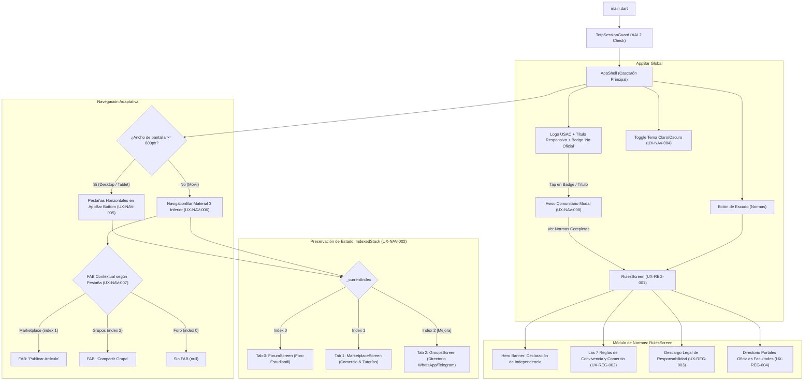

# 08 — Cascarón de Navegación, Tema, Normas y Descargos

> Especificación de requisitos de experiencia de usuario (UX) para el Cascarón de Navegación Global (`AppShell`), el Selector de Tema Visual, el Diálogo de Aviso Comunitario y la Pantalla de Normas y Descargo Legal (`RulesScreen`) de la plataforma **Comunidad Universitaria USAC**. Convenciones, matriz de roles y plantilla de especificación en [`README.md`](README.md).

---

## 1. Visión y propósito del área

El **Cascarón de Navegación y Reglas** constituye el marco arquitectónico y jurídico sobre el cual se sustenta la totalidad de la experiencia de usuario en **Comunidad Universitaria USAC**. Cumple dos misiones críticas y complementarias:

1. **Marco de Navegación Unificado y Preservación de Estado (`AppShell`):**
   Proveer un contenedor visual cohesivo, ergonómico y reactivo que albergue los módulos centrales de la plataforma (**Foro Estudiantil**, **Marketplace & Tutorías** y **Directorio de Grupos de Estudio**). El cascarón garantiza transiciones instantáneas y fluidas entre secciones sin recargas destructivas de pantalla mediante `IndexedStack`, adaptando su interfaz según el factor de forma del dispositivo (pestañas superiores en escritorio y barra inferior Material 3 con botón flotante contextual en dispositivos móviles).

2. **Transparencia Jurídica, Seguridad y Cultura Estudiantil (`RulesScreen` y Avisos):**
   Establecer una delimitación transparente e inequívoca respecto a la autonomía e independencia institucional de la plataforma frente a las autoridades de la Universidad de San Carlos de Guatemala (USAC). A través de distintivos visibles como el badge `"No Oficial"`, el diálogo modal de aviso comunitario, el descargo de responsabilidad legal y la consagración de las 7 reglas fundamentales de convivencia y comercio, la aplicación protege a la comunidad estudiantil de fraudes, acoso y contingencias legales.

---

## 2. Relación con el inventario y mejoras estructurales

Este documento formaliza los requisitos del área a partir del análisis del **Inventario UX**, implementando directamente las siguientes correcciones de diseño:

- **Inventario 4.1 (`AppShell`):** Formalización de los componentes de la barra de aplicación superior (`AppBar`), el distintivo de título responsivo, el selector de tema claro/oscuro en caliente, la barra de pestañas en escritorio contenida en `MaxWidthContainer`, la `NavigationBar` móvil y el botón de acción flotante contextual (`FAB`).
- **Inventario 4.9 (`RulesScreen`):** Estructuración de la pantalla de normas comunitarias, desglosando las 7 reglas cardinales de fraternidad, enlaces limpios, probidad académica, privacidad de seudónimos, trato directo, prohibición de ilícitos y seguridad física, junto con el bloque de descargo de responsabilidad y el directorio de portales web oficiales de las unidades académicas.
- **Inventario 8.4 (Mejora Crítica de Descubrimiento de Grupos de Estudio):** Corrección del vacío arquitectónico donde el Directorio de Grupos (`GroupsScreen`) se encontraba oculto dentro del foro estudiantil como un pseudo-servidor de Discord. El cascarón eleva `Grupos` a un destino canónico de primer nivel tanto en la barra de navegación de escritorio como en la barra inferior móvil, incorporando además un botón flotante contextual (`FAB`) para compartir grupos de estudio.

---

## 3. Matriz de capacidades del área

| Capacidad                                        |       Visitante        | Estudiante Registrado | Estudiante Verificado |   Moderador    | Administrador  |
| ------------------------------------------------ | :--------------------: | :-------------------: | :-------------------: | :------------: | :------------: |
| Alternar entre Foro, Marketplace y Grupos        |         Hecho          |         Hecho         |         Hecho         |     Hecho      |     Hecho      |
| Preservar estado y scroll entre pestañas         |         Hecho          |         Hecho         |         Hecho         |     Hecho      |     Hecho      |
| Abrir modal de aviso comunitario                 |         Hecho          |         Hecho         |         Hecho         |     Hecho      |     Hecho      |
| Conmutar tema claro/oscuro en AppBar             |         Hecho          |         Hecho         |         Hecho         |     Hecho      |     Hecho      |
| Consultar Normas Comunitarias y Descargo         |         Hecho          |         Hecho         |         Hecho         |     Hecho      |     Hecho      |
| Abrir enlaces externos a portales de facultades  |         Hecho          |         Hecho         |         Hecho         |     Hecho      |     Hecho      |
| Usar FAB contextual para publicar en Marketplace | Falta _(interceptado)_ |    Hecho _(AAL2)_     |    Hecho _(AAL2)_     | Hecho _(AAL2)_ | Hecho _(AAL2)_ |
| Usar FAB contextual para compartir Grupo         | Falta _(interceptado)_ |    Hecho _(AAL2)_     |    Hecho _(AAL2)_     | Hecho _(AAL2)_ | Hecho _(AAL2)_ |

> **Nota de seguridad y autenticación:** La navegación por el cascarón y la lectura de normas y descargos es pública e irrestricta. Si un visitante pulsa un botón de acción flotante (`FAB`) contextual, el sistema despliega el diálogo de autenticación (`AuthModal`) y, tras autenticarse con nivel **AAL2**, procede con el formulario de publicación [ver [`07-autenticacion.md`](07-autenticacion.md)].

---

## 4. Requisitos del cascarón de navegación (UX-NAV)

### UX-NAV-001 — Acceso directo a tres destinos canónicos en la navegación principal [Mejora]

- **Actor / rol:** Visitante, Estudiante Registrado, Estudiante Verificado, Moderador, Administrador
- **Prioridad:** Must
- **Estado objetivo:** La navegación principal del cascarón expone de forma directa, visible e inmediata tres destinos principales de primer nivel: **Foro Estudiantil**, **Marketplace & Tutorías** y **Directorio de Grupos de Estudio**, permitiendo a cualquier estudiante acceder a cualquiera de ellos en un solo toque o clic desde la vista raíz tanto en móvil como en escritorio.
- **Problema actual [Mejora]:** En la implementación actual ([`app_shell.dart:169-215`](../../comunidad_universitaria/lib/features/navigation/app_shell.dart#L169-L215)), el menú principal solo expone dos pestañas: `"Foro Estudiantil"` y `"Marketplace & Tutorías"`. La funcionalidad de Grupos de Estudio está escondida como si fuera un servidor interno dentro del foro estudiantil ([`forum_server_rail.dart:28-60`](../../comunidad_universitaria/lib/features/forum/widgets/discord/forum_server_rail.dart#L28-L60)), generando un vacío de descubribilidad (Inventario UX 8.4) para alumnos que ingresan exclusivamente en busca de grupos de WhatsApp de sus asignaturas.
- **Precondiciones:** La aplicación se encuentra en ejecución en cualquier dispositivo o plataforma soportada; `AppShell` montado en pantalla.
- **UI / contenido:**
  - En escritorio (ancho >= 800px): Tres pestañas horizontales en el AppBar inferior: `"Foro Estudiantil"` (`Icons.forum_outlined`), `"Marketplace & Tutorías"` (`Icons.storefront_outlined`) y `"Grupos de Estudio"` (`Icons.groups_outlined`).
  - En móvil (ancho < 800px): Tres destinos en la `NavigationBar` inferior: `"Foro"`, `"Marketplace"` y `"Grupos"`, con iconos lineales en reposo e iconos rellenos al seleccionarse.
- **Interacciones:**
  - Tocar o hacer clic en cualquiera de las pestañas conmuta el índice activo `_currentIndex` de forma instantánea.
  - El destino seleccionado se destaca visualmente mediante el color primario de acento (`#004B87` o `#2563EB`) y cambio de peso tipográfico a negrita.
- **Estados:**
  - _Inicial:_ Pestaña 0 (`Foro Estudiantil`) activa por defecto al abrir la app.
  - _Activo:_ Destino seleccionado resaltado con indicador visual claro.
  - _Transición:_ Conmutación inmediata en memoria sin pantallas intermedias ni parpadeos.
- **Validaciones y reglas de negocio:**
  - La exploración entre los tres módulos es completamente libre y no requiere sesión iniciada.
  - Si el usuario accede a través de un enlace contextual interno (ej. botón de grupos en el rail del foro), el cascarón conmuta automáticamente el índice a la pestaña de Grupos sincronizando la unidad académica activa.
- **Accesibilidad:**
  - Atributos de accesibilidad `Semantics` en cada destino (`"Pestaña Foro Estudiantil"`, `"Pestaña Marketplace y Tutorías"`, `"Pestaña Grupos de Estudio"`).
  - Destinos táctiles móviles de al menos 48x48 dp.
  - Navegación por teclado con tabulador y flechas direccionales en entorno de escritorio [ver [`10-transversales.md`](10-transversales.md)].
- **Responsive:**
  - Pantallas móviles (< 800px): `NavigationBar` inferior Material 3.
  - Pantallas desktop y tablet (>= 800px): Pestañas horizontales integradas en la parte inferior del AppBar.
- **Criterios de aceptación (Gherkin):**
  - **Given** un estudiante que abre la aplicación desde un teléfono móvil, **When** observa la barra inferior de navegación, **Then** visualiza claramente tres destinos etiquetados "Foro", "Marketplace" y "Grupos", y al presionar "Grupos" accede inmediatamente al catálogo de enlaces de mensajería académica.
  - **Given** un usuario navegando en una computadora de escritorio con ancho de ventana de 1280px, **When** hace clic en la pestaña "Grupos de Estudio", **Then** el cascarón conmuta la vista al directorio de grupos sin recargar la página, destacando la pestaña con el indicador inferior de acento.

---

### UX-NAV-002 — Preservación integral de estado entre módulos mediante IndexedStack

- **Actor / rol:** Visitante, Estudiante Registrado, Estudiante Verificado, Moderador, Administrador
- **Prioridad:** Must
- **Estado objetivo:** El cascarón de navegación preserva el árbol de widgets y el estado interno en memoria de cada uno de los tres módulos principales utilizando un contenedor `IndexedStack`, garantizando que al cambiar de pestaña no se destruyan las vistas activas, no se pierda la posición de scroll, no se descarten formularios a medio completar y no se repitan peticiones de red redundantes.
- **Problema actual [Mejora]:** En la implementación actual ([`app_shell.dart:180-194`](../../comunidad_universitaria/lib/features/navigation/app_shell.dart#L180-L194)), el `IndexedStack` solo contiene dos hijos: `ForumScreen` y `MarketplaceScreen`. Para soportar el acceso directo a Grupos de Estudio [UX-NAV-001], se debe incorporar `GroupsScreen` como tercer hijo en el `IndexedStack`.
- **Precondiciones:** Las pantallas hijas han sido instanciadas en el cascarón con sus parámetros de alias y tema.
- **UI / contenido:**
  - Contenedor `IndexedStack` en el cuerpo (`body`) del `Scaffold` con `index: _currentIndex`.
  - Tres hijos indexados:
    1. Índice 0: `ForumScreen` (foro con arquitectura Discord, canales y feeds).
    2. Índice 1: `MarketplaceScreen` (catálogo comercial, filtros y carrusel de patrocinadores).
    3. Índice 2: `GroupsScreen` (directorio de grupos de WhatsApp, Telegram y Drive).
- **Interacciones:**
  - Al cambiar de pestaña, el widget anterior se oculta de la vista visual pero permanece montado en memoria.
  - Al regresar a una pestaña previa, el usuario encuentra exactamente el mismo canal seleccionado, la posición del scroll y el texto introducido en filtros o barras de búsqueda.
- **Estados:**
  - _Montado inicial:_ Carga inicial diferida o en segundo plano según la política de ciclo de vida.
  - _Oculto en stack:_ Mantenimiento de estado en reposo con consumo controlado de memoria.
  - _Visible en stack:_ Reactivación visual instantánea (0 ms de latencia percibida).
- **Validaciones y reglas de negocio:**
  - No se deben disparar peticiones de red automáticas a Supabase por el mero hecho de alternar pestañas.
  - La actualización de datos solo ocurre mediante acciones explícitas del usuario (ej. pull-to-refresh) o eventos en tiempo real suscritos.
- **Accesibilidad:**
  - Las pantallas inactivas en el `IndexedStack` se ocultan a los lectores de pantalla mediante exclusión semántica (`ExcludeSemantics`), enfocando únicamente la pantalla que ostenta el índice activo.
- **Responsive:**
  - Comportamiento idéntico y consistente en todas las resoluciones y plataformas (Web, Android, iOS, Linux, Windows, macOS).
- **Criterios de aceptación (Gherkin):**
  - **Given** un estudiante que navega en el Foro hasta la posición de scroll 1800px dentro del canal "# apuntes-y-examenes", **When** cambia a la pestaña Marketplace para consultar un producto y regresa posteriormente a la pestaña Foro, **Then** la vista del foro mantiene exactamente el canal "# apuntes-y-examenes", el scroll en 1800px y no presenta ningún indicador de carga ni parpadeo.
  - **Given** un usuario que escribió "Física 1" en el buscador de Grupos de Estudio, **When** conmuta a Marketplace y vuelve a Grupos, **Then** el campo de texto conserva "Física 1", los resultados filtrados continúan en pantalla y no se reejecuta la consulta a la base de datos.

---

### UX-NAV-003 — Cabecera global (AppBar): Logotipo, título adaptativo y distintivo "No Oficial"

- **Actor / rol:** Visitante, Estudiante Registrado, Estudiante Verificado, Moderador, Administrador
- **Prioridad:** Must
- **Estado objetivo:** La barra superior (`AppBar`) de la aplicación exhibe una identidad visual universitaria digna y reconocible pero jurídicamente diferenciada, integrando el logotipo de graduación USAC en azul institucional (`#004B87`), un título responsivo adaptado al espacio de pantalla y un distintivo permanente `"No Oficial"` interactivo que evita cualquier confusión sobre el carácter no gubernamental de la plataforma.
- **Precondiciones:** `AppShell` activo en la vista raíz.
- **UI / contenido:**
  - Logotipo: Contenedor con esquinas redondeadas (8px), fondo azul `#004B87`, con icono `Icons.school` en blanco (20px).
  - Título principal adaptativo:
    - En pantallas de escritorio y tablets (ancho >= 800px): `"Comunidad Universitaria"`.
    - En pantallas móviles (ancho < 800px): `"Comunidad USAC"`.
  - Distintivo `"No Oficial"`:
    - Etiqueta tipo cápsula con bordes redondeados (4px) y padding horizontal de 4px y vertical de 1px.
    - Fondo con 12% de opacidad del color primario y tipografía de 9px en negrita con el color primario institucional.
  - Contenedor táctil: Todo el bloque de título y badge envuelto en un `InkWell` interactivo.
- **Interacciones:**
  - Al pulsar o hacer clic en el título o en el badge `"No Oficial"`, el sistema despliega el diálogo modal de aviso comunitario [ver `UX-NAV-008`].
  - Efecto visual sutil de resaltado al posar el cursor del ratón en desktop o presionar en móvil.
- **Estados:**
  - _Reposo:_ Visualización nítida y estable.
  - _Hover / Tap:_ Retroalimentación visual interactiva en el área del título.
- **Validaciones y reglas de negocio:**
  - El distintivo `"No Oficial"` es permanente y no puede ser ocultado ni alterado por ninguna configuración de usuario o rol administrativo ([`app_shell.dart:109-124`](../../comunidad_universitaria/lib/features/navigation/app_shell.dart#L109-L124)).
- **Accesibilidad:**
  - Etiqueta semántica integral: `"Comunidad Universitaria, plataforma estudiantil no oficial. Pulsa para ver aviso legal y normas"`.
  - Contraste de color entre el badge y el fondo superior a 4.5:1 conforme a WCAG 2.2 AA.
- **Responsive:**
  - Conmutación automática del texto de título a 800px para garantizar que los botones de acción derechos nunca se desborden ni se solapen en pantallas móviles angostas.
- **Criterios de aceptación (Gherkin):**
  - **Given** un visitante que ingresa a la aplicación desde un teléfono móvil con pantalla de 375px, **When** observa el AppBar superior, **Then** lee el título "Comunidad USAC" junto con el distintivo "No Oficial", y al tocarlo se abre el diálogo de aviso comunitario.
  - **Given** un estudiante que redimensiona la ventana de su navegador de 1024px a 750px de ancho, **When** cruza el umbral de 800px, **Then** el título conmuta fluidamente de "Comunidad Universitaria" a "Comunidad USAC" sin generar ningún desbordamiento de píxeles (overflow) en el AppBar.

---

### UX-NAV-004 — Acciones rápidas de cabecera: Acceso a Normas y alternador de tema visual

- **Actor / rol:** Visitante, Estudiante Registrado, Estudiante Verificado, Moderador, Administrador
- **Prioridad:** Must
- **Estado objetivo:** El extremo derecho del AppBar aloja dos botones de acción universales y siempre visibles: un botón de escudo (`Icons.shield_outlined`) para acceder directamente a la pantalla de Normas Comunitarias y Descargo Legal (`RulesScreen`), y un botón interactivo de tema (`Icons.dark_mode_outlined` / `Icons.light_mode_outlined`) que alterna de forma instantánea entre modo claro y modo oscuro.
- **Precondiciones:** `AppShell` recibe `onToggleTheme` y el estado booleano `isDarkMode` desde el gestor global de estado de la aplicación.
- **UI / contenido:**
  - Botón de normas: `IconButton` con icono `Icons.shield_outlined` (20px), tooltip `"Normas y Descargo"`.
  - Botón de tema: `IconButton` con icono dinámico según estado:
    - En modo claro: `Icons.dark_mode_outlined` (20px), tooltip `"Cambiar tema"`.
    - En modo oscuro: `Icons.light_mode_outlined` (20px), tooltip `"Cambiar tema"`.
  - Espaciado horizontal de 4px entre ambos botones y margen de 8px respecto al borde derecho de la pantalla ([`app_shell.dart:133-148`](../../comunidad_universitaria/lib/features/navigation/app_shell.dart#L133-L148)).
- **Interacciones:**
  - Al pulsar el botón de normas, se ejecuta una navegación tipo push hacia `RulesScreen` [ver `UX-REG-001`].
  - Al pulsar el botón de tema, se invoca `onToggleTheme`, re-renderizando la paleta visual de la app en caliente y persistiendo el valor en el almacenamiento local.
- **Estados:**
  - _Modo claro:_ Fondo blanco/grisáceo, icono de luna para cambiar a oscuro.
  - _Modo oscuro:_ Fondo azul oscuro/antracita, icono de sol para cambiar a claro.
  - _Transición:_ Conmutación de colores fluida sin recargar las pantallas activas.
- **Validaciones y reglas de negocio:**
  - La preferencia de tema se persiste localmente en `SharedPreferences` bajo la clave `usac_theme_mode` para conservarse entre sesiones futuras [ver [`09-sistema-diseno.md`](09-sistema-diseno.md)].
  - Navegar a normas no destruye el estado de las pestañas alojadas en `IndexedStack`.
- **Accesibilidad:**
  - Tooltips nativos accesibles para tecnologías de asistencia en ambos botones.
  - Área táctil efectiva de al menos 48x48 dp.
- **Responsive:**
  - Ambos botones permanecen fijos y accesibles en la cabecera en todos los factores de forma (móvil, tablet y escritorio).
- **Criterios de aceptación (Gherkin):**
  - **Given** un estudiante navegando en cualquier sección de la plataforma en modo claro, **When** presiona el icono de luna en el AppBar, **Then** toda la aplicación cambia inmediatamente a la paleta oscura (fondo `#0B132B`, tarjetas `#1C2541`) y el icono se transforma en un sol.
  - **Given** un usuario que desea consultar los términos de uso, **When** presiona el icono de escudo en el AppBar, **Then** la app realiza una navegación fluida hacia RulesScreen, mostrando el botón de retroceso para volver a la pantalla previa.

---

### UX-NAV-005 — Barra de pestañas horizontales superiores en escritorio

- **Actor / rol:** Visitante, Estudiante Registrado, Estudiante Verificado, Moderador, Administrador
- **Prioridad:** Must
- **Estado objetivo:** En pantallas de escritorio y tablets en modo horizontal (ancho >= 800px), el cascarón despliega una barra de navegación por pestañas en la base del AppBar (`bottom`), acotada por un contenedor `MaxWidthContainer(maxWidth: 1200)` para preservar la ergonomía visual, con tres pestañas accesibles: `"Foro Estudiantil"`, `"Marketplace & Tutorías"` y `"Grupos de Estudio"`.
- **Problema actual [Mejora]:** En la implementación actual ([`app_shell.dart:167-172`](../../comunidad_universitaria/lib/features/navigation/app_shell.dart#L167-L172)), la barra de pestañas en escritorio únicamente renderiza dos pestañas: Foro y Marketplace. Se debe añadir la tercera pestaña `_buildNavTab(index: 2, label: 'Grupos de Estudio', icon: Icons.groups_outlined)` para otorgar visibilidad y paridad funcional en escritorio.
- **Precondiciones:** Ancho de pantalla `>= 800px`.
- **UI / contenido:**
  - Altura fija de 48px en el área `bottom` del `AppBar`.
  - Contenedor con borde inferior de separación de 1.5px (`#E2E8F0` en claro, `#2B2D31` en oscuro).
  - Fondo `#FFFFFF` en modo claro y `#1E1F22` en modo oscuro.
  - Contenedor centralizado `MaxWidthContainer(maxWidth: 1200)` con soporte de scroll horizontal preventivo (`SingleChildScrollView`).
  - Estructura de cada pestaña (`_buildNavTab`):
    - Padding horizontal de 20px y vertical de 12px.
    - Icono de 18px y texto de 13px con separación de 8px.
    - Indicador inferior de pestaña activa: línea inferior sólida de 3px con el color primario de acento (`theme.colorScheme.primary`).
    - Pestaña inactiva: texto e icono en gris `#64748B` (claro) o `#949BA4` (oscuro), borde inferior transparente.
- **Interacciones:**
  - Clic en cualquier pestaña actualiza el índice `_currentIndex`, trasladando el indicador inferior y trayendo al frente la pantalla correspondiente del `IndexedStack`.
- **Estados:**
  - _Inactiva:_ Texto e icono atenuados.
  - _Activa:_ Texto e icono en color primario o blanco, línea inferior destacada.
  - _Hover:_ Cambio de cursor a `SystemMouseCursors.click` con realce sutil.
- **Validaciones y reglas de negocio:**
  - El ancho máximo de 1200px alinea la barra de navegación con las columnas principales de contenido de Foro y Marketplace [ver [`09-sistema-diseno.md`](09-sistema-diseno.md)].
- **Accesibilidad:**
  - Soporte de navegación por teclado mediante teclas Tab, flechas izquierda/derecha y activación con Enter o barra espaciadora.
  - Semántica de rol `tab` y `tablist` para lectores de pantalla.
- **Responsive:**
  - Se muestra exclusivamente cuando `width >= 800px`. Si la ventana se reduce por debajo de dicho valor, el `bottom` del AppBar se evalúa como `null` y la navegación pasa a la barra inferior móvil.
- **Criterios de aceptación (Gherkin):**
  - **Given** un estudiante en su laptop con ventana de 1280px de ancho, When hace clic en la pestaña "Grupos de Estudio", Then la línea de acento azul se sitúa bajo dicha pestaña y la pantalla central cambia al directorio de grupos de estudio.
  - **Given** una ventana de escritorio con zoom del navegador al 150%, When el ancho disponible para las tres pestañas se ve reducido, Then la barra permite desplazamiento horizontal suave con la rueda del ratón sin generar desbordamientos de interfaz.

---

### UX-NAV-006 — Barra de navegación inferior móvil (NavigationBar Material 3)

- **Actor / rol:** Visitante, Estudiante Registrado, Estudiante Verificado, Moderador, Administrador
- **Prioridad:** Must
- **Estado objetivo:** En dispositivos móviles (ancho < 800px), el cascarón fija una barra de navegación inferior (`NavigationBar` Material 3) accesible con una sola mano, que proporciona acceso cómodo al alcance del pulgar a los tres destinos canónicos de la plataforma: `"Foro"`, `"Marketplace"` y `"Grupos"`.
- **Problema actual [Mejora]:** En la implementación actual ([`app_shell.dart:203-214`](../../comunidad_universitaria/lib/features/navigation/app_shell.dart#L203-L214)), `NavigationBar` solo cuenta con dos destinos: Foro y Marketplace. Se debe agregar el tercer destino: `NavigationDestination(icon: Icon(Icons.groups_outlined), selectedIcon: Icon(Icons.groups), label: 'Grupos')`.
- **Precondiciones:** Ancho de pantalla `< 800px`.
- **UI / contenido:**
  - `NavigationBar` Material 3 con tres destinos equiespaciados:
    1. `"Foro"`: `Icon(Icons.forum_outlined)` en reposo; `Icon(Icons.forum)` seleccionado.
    2. `"Marketplace"`: `Icon(Icons.storefront_outlined)` en reposo; `Icon(Icons.storefront)` seleccionado.
    3. `"Grupos"`: `Icon(Icons.groups_outlined)` en reposo; `Icon(Icons.groups)` seleccionado.
  - Píldora de selección activa con tonalidad primaria translúcida.
  - Tipografía de etiqueta compacta y legible en una sola línea.
- **Interacciones:**
  - Toque en cualquier icono activa el callback `onDestinationSelected`, actualizando `_currentIndex` con respuesta táctil y animación de píldora nativa.
- **Estados:**
  - _Destino inactivo:_ Icono outline con etiqueta en gris neutro.
  - _Destino activo:_ Píldora de color de acento, icono filled y etiqueta destacada.
- **Validaciones y reglas de negocio:**
  - La barra se ubica dentro de un área segura (`SafeArea`) para respetar la barra de gestos de navegación y botones nativos en iOS y Android.
- **Accesibilidad:**
  - Altura táctil estándar de 80dp cumpliendo las pautas ergonómicas de Material 3.
  - Etiquetas descriptivas para TalkBack y VoiceOver (`"Foro, pestaña 1 de 3"`, etc.).
- **Responsive:**
  - Se activa únicamente cuando `width < 800px`. En pantallas de escritorio se asigna `bottomNavigationBar: null`.
- **Criterios de aceptación (Gherkin):**
  - **Given** un estudiante navegando en la app desde su teléfono inteligente, When pulsa el destino "Grupos" en la barra inferior, Then la píldora de selección resalta el icono de grupos y la vista cambia de inmediato al directorio de grupos.
  - **Given** un dispositivo móvil de gama baja con pantalla angosta de 320dp, When se presenta la barra inferior, Then los tres destinos se distribuyen simétricamente sin recortar sus etiquetas de texto.

---

### UX-NAV-007 — Botón de acción flotante (FAB) contextual en navegación móvil [Mejora]

- **Actor / rol:** Estudiante Registrado, Estudiante Verificado, Moderador, Administrador (Visitante con intercepción de autenticación)
- **Prioridad:** Should
- **Estado objetivo:** En navegación móvil (< 800px), el cascarón expone un botón de acción flotante contextual (`FloatingActionButton.extended`) adaptado al módulo activo: en Marketplace permite `"Publicar Artículo"` (dorado `#EAB308`), en Grupos de Estudio permite `"Compartir Grupo"` (verde `#16A34A`), y en Foro permanece oculto para no obstruir el feed ni la redacción interna.
- **Problema actual [Mejora]:** En la implementación actual ([`app_shell.dart:264-286`](../../comunidad_universitaria/lib/features/navigation/app_shell.dart#L264-L286)), el método `_buildContextualFloatingActionButton()` solo contempla el `case 1:` (Marketplace), retornando `null` para el resto de pestañas. Al incluir Grupos como pestaña 2, debe incorporarse el `case 2:` con el FAB para compartir grupos, resolviendo la carencia de acceso rápido a la creación de grupos en móvil (Inventario UX 8.4).
- **Precondiciones:** Ancho de pantalla `< 800px`.
- **UI / contenido:**
  - Pestaña 1 (Marketplace):
    - `FloatingActionButton.extended` con `heroTag: 'shell_market_fab'`.
    - Fondo dorado universitario `#EAB308`, texto e icono en negro `#1E293B`.
    - Icono `Icons.add_shopping_cart` (22px) y etiqueta `"Publicar Artículo"`.
  - Pestaña 2 (Grupos):
    - `FloatingActionButton.extended` con `heroTag: 'shell_groups_fab'`.
    - Fondo verde esmeralda `#16A34A`, texto e icono en blanco `#FFFFFF`.
    - Icono `Icons.group_add` (22px) y etiqueta `"Compartir Grupo"`.
  - Pestaña 0 (Foro): Retorna `null` (la creación de posts se gestiona en la barra superior del feed para no tapar los hilos de debate).
- **Interacciones:**
  - Al pulsar el FAB en Marketplace, se abre `CreateListingDialog.show(...)` [ver [`04-marketplace.md`](04-marketplace.md)].
  - Al pulsar el FAB en Grupos, se abre `CreateGroupDialog.show(...)` [ver [`05-grupos.md`](05-grupos.md)].
  - Si el usuario es un Visitante sin sesión activa, la pulsación despliega `AuthModal` interceptando la acción de forma no destructiva [ver [`07-autenticacion.md`](07-autenticacion.md)].
- **Estados:**
  - _Oculto:_ En Foro (`index == 0`) y en modo escritorio (ancho >= 800px).
  - _Visible Marketplace:_ FAB dorado en esquina inferior derecha.
  - _Visible Grupos:_ FAB verde en esquina inferior derecha con transición animada.
- **Validaciones y reglas de negocio:**
  - Los FABs utilizan `heroTag` independientes para prevenir excepciones de tags duplicados en Flutter.
  - Si la vista conmuta a escritorio, el FAB se oculta automáticamente porque las pantallas integran sus propios botones de acción en cabecera.
- **Accesibilidad:**
  - Etiquetas auditivas claras: `"Publicar artículo en marketplace"` y `"Compartir nuevo grupo de estudio"`.
  - Elevación y contraste cromático conforme a WCAG 2.2 AA.
- **Responsive:**
  - Se posiciona sobre la barra `NavigationBar` móvil con margen de separación suficiente para evitar pulsaciones erróneas.
- **Criterios de aceptación (Gherkin):**
  - **Given** un estudiante navegando en la pestaña Grupos desde su teléfono móvil, When observa la esquina inferior derecha, Then visualiza el botón flotante verde "Compartir Grupo", y al pulsarlo se abre el diálogo para registrar un enlace de WhatsApp.
  - **Given** un estudiante navegando en la pestaña Foro en móvil, When examina la pantalla, Then no se muestra ningún botón flotante sobre el feed de publicaciones, manteniendo despejada la lectura de los debates.

---

### UX-NAV-008 — Diálogo modal de aviso comunitario y descargo institucional rápido

- **Actor / rol:** Visitante, Estudiante Registrado, Estudiante Verificado, Moderador, Administrador
- **Prioridad:** Must
- **Estado objetivo:** Al pulsar sobre el título del AppBar o sobre el badge `"No Oficial"`, el cascarón despliega un diálogo informativo modal (`AlertDialog`) que expone con total transparencia la naturaleza estudiantil independiente, autónoma y sin fines de lucro de la plataforma, ofreciendo enlaces directos para revisar las normas completas o descartar el aviso.
- **Precondiciones:** `AppShell` activo en pantalla.
- **UI / contenido:**
  - Diálogo centrado con esquinas redondeadas (16px).
  - Encabezado con icono `Icons.info_outline` en azul `#004B87` y título `"Aviso Comunitario"` en negrita (16px).
  - Cuerpo textual en 13px con interlineado 1.4:
    > _"Comunidad Universitaria es una plataforma estudiantil colaborativa, autónoma y sin fines de lucro. No representa formalmente a la administración ni a las autoridades de la Universidad de San Carlos de Guatemala. Los datos académicos, pensums y directorios son informativos y compartidos entre compañeros."_ ([`app_shell.dart:51-54`](../../comunidad_universitaria/lib/features/navigation/app_shell.dart#L51-L54)).
  - Botones de acción:
    1. `"Ver Normas Completas"` (`TextButton`): Cierra el diálogo y navega a `RulesScreen`.
    2. `"Entendido"` (`TextButton`): Cierra el diálogo y retorna a la vista actual.
- **Interacciones:**
  - Pulsar "Ver Normas Completas" ejecuta `Navigator.of(ctx).pop()` seguido de `_navigateToRules()`.
  - Pulsar "Entendido" o fuera del cuadro modal cierra el diálogo sin navegación adicional.
- **Estados:**
  - _Cerrado:_ Estado por defecto.
  - _Abierto:_ Superpuesto sobre la pantalla con barrera modal atenuada.
- **Validaciones y reglas de negocio:**
  - El modal es de carácter puramente informativo; no bloquea la navegación de la app ni exige confirmaciones forzadas.
- **Accesibilidad:**
  - Foco inicial en el botón `"Entendido"` para facilitar cierre rápido con teclado o lector de pantalla.
  - Soporte de cierre con tecla Escape en entorno web y desktop.
- **Responsive:**
  - En móvil, se dimensiona respetando márgenes laterales de 24px; en desktop, limita su ancho a 480px centrado.
- **Criterios de aceptación (Gherkin):**
  - **Given** un estudiante que toca la insignia "No Oficial" en la barra superior, When aparece el modal "Aviso Comunitario", Then lee la aclaración de independencia y al presionar "Ver Normas Completas" es transferido a RulesScreen.
  - **Given** un usuario en navegador desktop con el modal de aviso comunitario abierto, When presiona la tecla Escape o hace clic en la zona sombreada exterior, Then el diálogo se cierra inmediatamente sin alterar la pestaña activa.

---

## 5. Requisitos de normas comunitarias y descargos (UX-REG)

### UX-REG-001 — Pantalla principal de normas comunitarias y convivencia estudiantil (RulesScreen)

- **Actor / rol:** Visitante, Estudiante Registrado, Estudiante Verificado, Moderador, Administrador
- **Prioridad:** Must
- **Estado objetivo:** La plataforma cuenta con una pantalla dedicada e integral (`RulesScreen`) que consolida los lineamientos éticos de fraternidad estudiantil, las reglas del marketplace, el descargo legal de responsabilidad y el directorio de portales institucionales de la USAC, accesible desde cualquier punto de la app.
- **Precondiciones:** Navegación invocada desde AppBar, diálogo de aviso comunitario, o perfil de usuario.
- **UI / contenido:**
  - `Scaffold` con `AppBar` que presenta el título `"Normas Comunitarias y Descargo"` y botón de retroceso (`Icons.arrow_back`, tooltip `"Regresar"`) condicionado a `Navigator.canPop(context)` ([`rules_screen.dart:15-24`](../../comunidad_universitaria/lib/features/rules/screens/rules_screen.dart#L15-L24)).
  - Contenedor con límite de ancho `MaxWidthContainer(maxWidth: 900)` con padding horizontal de 16px y vertical de 20px.
  - Tarjeta superior destacada (Hero Banner):
    - Fondo `#F1F5F9` (claro) o `#1E293B` (oscuro), con borde redondeado de 16px.
    - Icono de escudo `Icons.shield_outlined` (28px) en contenedor tonal con color primario.
    - Título `"Normas Comunitarias & Descargo Legal"` (estilo `titleLarge` en negrita).
    - Subtítulo descriptivo: _"Comunidad Universitaria es una iniciativa estudiantil independiente, libre y sin fines de lucro entre compañeros universitarios."_
- **Interacciones:**
  - Desplazamiento vertical continuo y suave (`SingleChildScrollView`).
  - Toque en la flecha de regreso retorna a la pantalla de origen preservando el estado previo del usuario.
- **Estados:**
  - _Renderizado estático:_ Carga inmediata y local sin latencia de red.
  - _Modo claro / Modo oscuro:_ Adaptación cromática según la paleta activa.
- **Validaciones y reglas de negocio:**
  - La pantalla no depende de peticiones a base de datos para mostrar las reglas y descargos; los textos residen compilados localmente para garantizar disponibilidad offline permanente.
- **Accesibilidad:**
  - Jerarquía tipográfica accesible con títulos de sección bien estructurados (`H1` y `H2`).
  - Contraste de texto conforme a WCAG 2.2 AA en ambos modos visuales.
- **Responsive:**
  - En pantallas móviles (< 700px), los bloques ocupan el ancho total con 16px de margen. En monitores de escritorio (>= 700px), el contenido se centra en un bloque de 900px máximo para evitar líneas de lectura excesivamente largas.
- **Criterios de aceptación (Gherkin):**
  - **Given** cualquier usuario en la aplicación, When accede a RulesScreen desde el menú o el perfil, Then la pantalla se despliega de inmediato mostrando el encabezado con el icono de escudo y las secciones de normas sin pantallas de carga.
  - **Given** un estudiante sin conexión a internet que abre las normas de convivencia, When se monta la pantalla, Then todo el texto de las reglas, el descargo y la lista de unidades académicas se lee de forma completa e ininterrumpida.

---

### UX-REG-002 — Las 7 reglas fundamentales de convivencia, foro, marketplace y seguridad física

- **Actor / rol:** Visitante, Estudiante Registrado, Estudiante Verificado, Moderador, Administrador
- **Prioridad:** Must
- **Estado objetivo:** `RulesScreen` presenta las 7 reglas inviolables de convivencia y participación en la comunidad universitaria, estructuradas en tarjetas numeradas con iconos representativos, divididas en dos bloques temáticos: Convivencia Estudiantil (Reglas 1 a 4) y Marketplace & Servicios (Reglas 5 a 7).
- **Precondiciones:** `RulesScreen` activa en pantalla.
- **UI / contenido:**
  - Sección 1: Encabezado `"Reglas de Convivencia Estudiantil"`.
    - **Regla 1 — Respeto mutuo y fraternidad universitaria** (`Icons.favorite_outline`): Prohibido acoso, faltas de respeto, discriminación o difamación entre compañeros o hacia catedráticos ([`rules_screen.dart:101-106`](../../comunidad_universitaria/lib/features/rules/screens/rules_screen.dart#L101-L106)).
    - **Regla 2 — Veracidad y enlaces limpios** (`Icons.link_outlined`): Compartir únicamente enlaces legítimos de grupos académicos; cero acortadores con publicidad ni enlaces maliciosos ([`rules_screen.dart:109-114`](../../comunidad_universitaria/lib/features/rules/screens/rules_screen.dart#L109-L114)).
    - **Regla 3 — Prohibición de venta de exámenes o fraude académico** (`Icons.block_outlined`): Plataforma concebida para apoyo académico mutuo; prohibición estricta de comercio de notas, parciales filtrados o suplantación ([`rules_screen.dart:117-122`](../../comunidad_universitaria/lib/features/rules/screens/rules_screen.dart#L117-L122)).
    - **Regla 4 — Protección de Privacidad y Seudónimos** (`Icons.lock_outline`): Uso de seudónimos estudiantiles para participar con confianza; prohibido publicar datos sensibles como DPI, números privados o direcciones ([`rules_screen.dart:125-130`](../../comunidad_universitaria/lib/features/rules/screens/rules_screen.dart#L125-L130)).
  - Sección 2: Encabezado `"Normas del Marketplace & Servicios Estudiantiles"`.
    - **Regla 5 — Trato directo y sin intermediación financiera** (`Icons.handshake_outlined`): La plataforma no intermedia pagos, no custodia dinero ni cobra comisiones; coordinación voluntaria directa entre estudiantes ([`rules_screen.dart:146-151`](../../comunidad_universitaria/lib/features/rules/screens/rules_screen.dart#L146-L151)).
    - **Regla 6 — Prohibición estricta de sustancias y productos ilegales** (`Icons.gavel_outlined`): Prohibido publicar bebidas alcohólicas, drogas, fármacos bajo receta, armas o artículos ilícitos ([`rules_screen.dart:154-159`](../../comunidad_universitaria/lib/features/rules/screens/rules_screen.dart#L154-L159)).
    - **Regla 7 — Seguridad en puntos de encuentro** (`Icons.place_outlined`): Recomendación de realizar entregas y tutorías en áreas comunes y transitadas del campus o sede durante jornadas diurnas ([`rules_screen.dart:163-168`](../../comunidad_universitaria/lib/features/rules/screens/rules_screen.dart#L163-L168)).
  - Tarjetas de regla (`_buildRuleTile`): Contenedor con borde redondeado (12px), badge numérico circular destacado con color primario, icono temático, título en negrita y descripción detallada ([`rules_screen.dart:260-327`](../../comunidad_universitaria/lib/features/rules/screens/rules_screen.dart#L260-L327)).
- **Interacciones:** Lectura secuencial y clara; las reglas sirven de base para las opciones del diálogo de denuncia comunitaria (`ReportDialog`) [ver [`03-foro.md`](03-foro.md) y [`04-marketplace.md`](04-marketplace.md)].
- **Estados:** Visualización estática en lista scrollable.
- **Validaciones y reglas de negocio:**
  - La infracción comprobada de las reglas 1, 3 o 6 faculta al equipo de moderación a suspender la cuenta del infractor o dar de baja las publicaciones involucradas.
- **Accesibilidad:**
  - Cada tarjeta comunica su número ordinal y contenido completo de forma unificada para lectores de pantalla.
- **Responsive:**
  - Las tarjetas se apilan verticalmente con margen inferior de 10px, adaptando su altura al contenido textual.
- **Criterios de aceptación (Gherkin):**
  - **Given** un estudiante que consulta las normas comunitarias, When revisa la pantalla RulesScreen, Then visualiza las 7 reglas numeradas del 1 al 7 con sus respectivos iconos, títulos y descripciones.
  - **Given** un usuario que sospecha de una publicación de venta de un examen parcial, When compara el contenido contra la Regla 3, Then confirma que la venta de exámenes está terminantemente prohibida y procede a reportar el post.

---

### UX-REG-003 — Tarjeta destacada de descargo de responsabilidad legal e independencia institucional

- **Actor / rol:** Visitante, Estudiante Registrado, Estudiante Verificado, Moderador, Administrador
- **Prioridad:** Must
- **Estado objetivo:** `RulesScreen` incorpora una tarjeta de aviso legal destacada en tonos ámbar y dorados que formaliza el descargo de responsabilidad (_Legal Disclaimer_) y la absoluta independencia institucional frente a la Universidad de San Carlos de Guatemala.
- **Precondiciones:** `RulesScreen` en pantalla.
- **UI / contenido:**
  - Contenedor con esquinas redondeadas (14px), fondo ámbar suave (`#FFFBEB`) y borde delimitador ámbar (`#FDE68A`) ([`rules_screen.dart:173-214`](../../comunidad_universitaria/lib/features/rules/screens/rules_screen.dart#L173-L214)).
  - Encabezado con icono `Icons.info_outline` en ámbar oscuro (`#B45309`, 20px) y título `"Descargo de Responsabilidad Legal e Independencia"` en negrita (`#92400E`, 14px).
  - Texto legal en 12px con interlineado 1.45:
    > _"Comunidad Universitaria es una plataforma y directorio estudiantil independiente y sin fines de lucro. No representa, no forma parte ni actúa en nombre de las autoridades de la Universidad de San Carlos de Guatemala. Los datos de pensums, materias y facultades se basan en publicaciones de libre acceso con carácter exclusivamente informativo._
    >
    > _El proyecto se financia mediante patrocinios y donaciones; no vende datos, no utiliza rastreadores publicitarios y no reporta información a las autoridades de la USAC, salvo que lo exija una obligación legal._
    >
    > _Los administradores de la plataforma no se hacen responsables de los acuerdos particulares, compras, ventas o contenidos intercambiados en enlaces de terceros."_
- **Interacciones:** Lectura del descargo legal; no requiere acciones de aceptación forzada en esta pantalla.
- **Estados:** Fijo e inalterable en la sección inferior de la pantalla.
- **Validaciones y reglas de negocio:**
  - Este texto protege legalmente a los desarrolladores y moderadores estudiantiles frente a reclamaciones institucionales o disputas mercantiles entre particulares en Guatemala.
  - La declaración de no lucro, financiamiento por patrocinios y donaciones, no venta de datos, no rastreadores publicitarios y no reporte a las autoridades de la USAC (salvo obligación legal) es canónica en UX-PRD-026 ([`01-producto.md`](01-producto.md)).
- **Accesibilidad:**
  - Contraste cromático de texto ámbar oscuro `#92400E` sobre fondo `#FFFBEB` que supera 7:1 (nivel AAA de WCAG 2.2).
  - Semántica de bloque de aviso legal prioritario.
- **Responsive:**
  - Se adapta fluidamente a lo ancho del contenedor central (hasta 900px en escritorio).
- **Criterios de aceptación (Gherkin):**
  - **Given** una autoridad académica o estudiante que lee el marco legal de la aplicación, When examina el recuadro de descargo en RulesScreen, Then verifica que la plataforma declara explícitamente no representar a la administración de la USAC, no custodiar dinero de transacciones, no vender datos ni usar rastreadores publicitarios y no reportar a las autoridades salvo obligación legal, financiándose por patrocinios y donaciones.
  - **Given** un usuario navegando en modo oscuro en RulesScreen, When llega a la tarjeta de descargo, Then el contenedor mantiene tonalidades cálidas calibradas para una lectura descansada y de alto contraste.

---

### UX-REG-004 — Directorio interactivo de enlaces a portales oficiales de unidades académicas

- **Actor / rol:** Visitante, Estudiante Registrado, Estudiante Verificado, Moderador, Administrador
- **Prioridad:** Should
- **Estado objetivo:** Para orientar a los estudiantes sin suplantar los canales oficiales de la universidad, `RulesScreen` ofrece un directorio interactivo de enlaces directos mediante `ActionChip` a los portales web oficiales de las 10 facultades y escuelas de la USAC, abriéndolos en el navegador externo del dispositivo.
- **Precondiciones:** Directorio de unidades académicas cargado desde `USACConstants.facultades` en [`categories.dart:27-140`](../../comunidad_universitaria/lib/core/constants/categories.dart#L27-L140).
- **UI / contenido:**
  - Título de sección: `"Portales Oficiales de Unidades Académicas"` (16px, negrita).
  - Subtítulo descriptivo: _"Los siguientes enlaces conducen a los sitios web institucionales externos de cada facultad:"_.
  - Disposición en cuadrícula fluida `Wrap` con separación horizontal y vertical de 10px ([`rules_screen.dart:233-250`](../../comunidad_universitaria/lib/features/rules/screens/rules_screen.dart#L233-L250)).
  - Componentes `ActionChip` para cada facultad (excluyendo el filtro comodín `'todas'`):
    - Icono de enlace externo: `Icon(Icons.open_in_new, size: 14)`.
    - Etiqueta con el nombre oficial de la facultad (ej. _"Facultad de Ingeniería"_, _"Facultad de Ciencias Médicas"_, _"Facultad de Ciencias Químicas y Farmacia"_, etc.).
- **Interacciones:**
  - Al pulsar o hacer clic en cualquier chip, se ejecuta `UrlUtils.openUrl(context, f['sitio'].toString())`, lanzando el navegador web del sistema con el portal oficial.
- **Estados:**
  - _Reposo:_ Chip con borde y fondo suave.
  - _Presionado / Abriendo:_ Efecto de clic y apertura de navegador externo.
  - _Fallo:_ Notificación discreta con `SnackBar` si el sistema no puede resolver la URL externa.
- **Validaciones y reglas de negocio:**
  - Todos los enlaces apuntan a URLs institucionales oficiales seguras y verificadas con protocolo HTTPS.
- **Accesibilidad:**
  - Cada chip expone semántica de apertura externa: `"Abrir sitio web oficial de la [Facultad] en una nueva pestaña"`.
- **Responsive:**
  - El layout `Wrap` distribuye los chips dinámicamente en múltiples filas según el ancho del dispositivo sin generar desbordamientos horizontales.
- **Criterios de aceptación (Gherkin):**
  - **Given** un estudiante de ingeniería en RulesScreen que necesita verificar una fecha de exámenes oficiales, When pulsa el chip "Facultad de Ingeniería", Then el navegador web abre la página oficial institucional (https://ingenieria.usac.edu.gt).
  - **Given** un dispositivo móvil sin aplicación predeterminada para gestionar URLs, When se presiona un chip institucional y falla la invocación del sistema, Then la app captura el evento e informa al usuario mediante un SnackBar amigable sin cerrarse abruptamente.

---

### UX-REG-005 — Puntos universales de acceso y retorno coherente hacia las normas comunitarias

- **Actor / rol:** Visitante, Estudiante Registrado, Estudiante Verificado, Moderador, Administrador
- **Prioridad:** Must
- **Estado objetivo:** El acceso a `RulesScreen` está garantizado desde múltiples puntos estables, visibles y lógicos de la plataforma (AppBar de `AppShell`, diálogo de aviso comunitario, sección de cuenta en `ProfileScreen`, y enlaces en modales de reporte y publicación), asegurando que el botón de retroceso devuelva al usuario al punto exacto de origen sin alterar su contexto previo.
- **Precondiciones:** Navegación invocada mediante el enrutador estándar de Flutter.
- **UI / contenido:**
  - Puntos de entrada señalizados:
    1. Icono de escudo en AppBar de `AppShell` [UX-NAV-004].
    2. Botón `"Ver Normas Completas"` en modal de aviso comunitario [UX-NAV-008].
    3. Fila interactiva `"Normas de Convivencia y Descargo"` en `ProfileScreen` ([`profile_screen.dart:1373`](../../comunidad_universitaria/lib/features/profile/screens/profile_screen.dart#L1373)).
    4. Enlaces de referencia en modales de publicación y reportes (`ReportDialog`).
  - Botón de retroceso en AppBar de `RulesScreen`: Renderizado condicional mediante `Navigator.of(context).canPop() ? IconButton(icon: Icon(Icons.arrow_back), tooltip: 'Regresar', ...) : null`.
- **Interacciones:**
  - Al pulsar la flecha de regreso o ejecutar el gesto nativo de retorno del sistema operativo, se ejecuta `Navigator.pop(context)` volviendo a la pantalla anterior.
- **Estados:**
  - _Navegación push:_ Apertura de la vista sobre la pila de rutas.
  - _Navegación pop:_ Retorno limpio a la vista previa.
- **Validaciones y reglas de negocio:**
  - La navegación a normas nunca borra la memoria del `IndexedStack` del cascarón ni resetea campos de formularios abiertos.
- **Accesibilidad:**
  - Flecha de retroceso con tooltip accesible `"Regresar"`.
- **Responsive:**
  - Soporte completo de gestos táctiles de deslizamiento lateral en iOS/Android y teclas Alt+Flecha Izquierda / Backspace en entorno web y desktop.
- **Criterios de aceptación (Gherkin):**
  - **Given** un estudiante que se encuentra editando su alias en ProfileScreen, When pulsa "Normas de Convivencia y Descargo" para consultar un lineamiento y luego presiona la flecha de retroceso, Then regresa a ProfileScreen encontrando el texto de su alias intacto.
  - **Given** un usuario que accede a RulesScreen mediante un enlace directo web o deep link sin historial previo (`canPop == false`), When se renderiza la cabecera, Then el AppBar no muestra una flecha de regreso inútil y ofrece en su lugar un botón para dirigirse al inicio de la aplicación.

---

## 6. Diagrama de arquitectura y flujo del cascarón

---

## 7. Trazabilidad y referencias cruzadas

- **Visión y roles del producto:** [`01-producto.md`](01-producto.md)
- **Mapa de navegación global:** [`02-navegacion.md`](02-navegacion.md)
- **Foro estudiantil y canales:** [`03-foro.md`](03-foro.md)
- **Marketplace y comercio seguro:** [`04-marketplace.md`](04-marketplace.md)
- **Directorio de grupos de estudio:** [`05-grupos.md`](05-grupos.md)
- **Perfil, alias y configuración:** [`06-perfil-y-cuenta.md`](06-perfil-y-cuenta.md)
- **Autenticación y guard AAL2:** [`07-autenticacion.md`](07-autenticacion.md)
- **Tokens de diseño y paletas de color:** [`09-sistema-diseno.md`](09-sistema-diseno.md)
- **Accesibilidad y responsividad transversal:** [`10-transversales.md`](10-transversales.md)
- **Matriz de trazabilidad y métricas de adopción:** [`11-metricas-y-trazabilidad.md`](11-metricas-y-trazabilidad.md)
